# XML and Gradle

Many of you have used virtual machines such as VMware Workstation Player or VirtualBox where one can setup several virtual operating systems in parallel on a single 'real' machine. In fact, the Android system uses some similar technologies. In Android, each app runs within its own virtual machine a.k.a. sandbox. The Android system treats different apps as different 'users', hence they need permissions to access sensors etc. 

In order to produce functional apps, we need to design front-end GUI layouts and back-end actions. We also need to define app-level entry point and permissions etc. Eventually, all these are packed into an apk archive that goes to Google Play store, and then onto your users' screens:

**XML (.XML) ==> Java (.JAVA) ==> ByteCode (.DEX) ==> App (.APK) ==> Runtime (DVM ) ==> Screen**

## Lab 1 XML

First, we look at how to provide and access resources such as layouts and strings using XML. You have used XML to design your apps previously, now we'll examine again in more details.

### Import existing projects

The current exercise is based on a previous project called 'My Car'. If that project is not available on your hard drive anymore, you need to do the following to download:

1. There're two ways to checkout a Git repository:
    * Open a terminal window and navigate to the location where you want to save it. Then issue the following command to clone the whole repository into your hard drive `git clone https://github.com/covcom/300CEM.git`. Alternatively, go to https://github.com/covcom/300CEM, click 'Download Zip' to download the whole repository. 
        
        Once downloaded, unzip and location the 'My Car' project under 'Week_02' folder. You might want to copy the project to somewhere handy for you.
        
        
        
    * Alternatively, open a terminal window and navigate to the location where you want to save the project. Then issue the following command `svn checkout https://github.com/covcom/300CEM/trunk/Week_02_The_Java_language/MyCar`. You'll see that the project is downloaded into the folder you have chosen.
        
        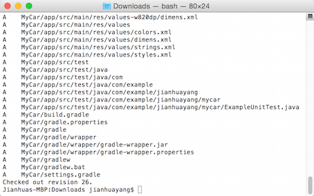
        
2. Rename the folder from 'MyCar' to 'MyXml', and then open it using Android Studio. When opening existing projects in Android Studio, first click 'Open an existing Android Studio project', navigate to where you saved the project and select file 'build.gradle', then click OK.
    
3. Right-click on 'app' within the Project tool window, click Open Module Settings. Go to the Flavors tab, change Application Id from 'com.example.jianhuayang.mycar' to 'com.example.jianhuayang.myxml'
4. Double click to open the string resource file, change app_name from 'My Car' to 'My Xml'.
    
    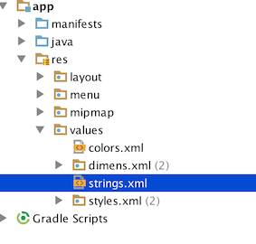
    
5. Locate the long package name 'com.example.jianhuayang.mycar' under Java folder, right-click on it, select Refactor ==> Rename. In the small window that pops up, type in 'myxml'. A tool windows called 'Find Preview' will show, click 'Do Refactor'.
6. From the menu bar, select Build ==> Clean Project, and then from the menu bar select File ==> Synchronize. This should clear out traces of the old project.
7. To verify that you don't have anything in this current projects that relate to 'mycar' or 'my car', in the project tool window, right-click on app, then select Find in Path. Type in mycar, and hit enter. You'll see that indeed there're two occurrences of 'MyCar' and one occurrence of 'My Car'. Change them all to 'MyXml' or 'My Xml'.
    Instead of using 'Find in Path', what you could do is to use 'Search Everywhere'. This is available if you hit 'shift' key twice.
    
    

### XML basics - layouts

Open activity_main.xml under app ==> res ==> layout folder and switch to Text view mode. You have seen this layout file quite a few times already. Now let's have a closer examination of it.

1. The very first line of the file i.e. `<?xml version="1.0" encoding="utf-8"?>` is called a prolog. It defines xml version and encoding. The prolog is optional. If it exists, it must come first in the document. This is automatically generated by Android Studio and you don't need to touch it.
2. The second line of the xml defines a container layout called LinearLayout. This corresponds to a class called LinearLayout. In fact, all we do here in the xml file can be done in Java source codes. But probably xml is easier as it's more visual. 
3. In xml, all tags come in pairs. If you look down the file, you'll see the closing tab of LinearLayout i.e. `</LinearLayout>` towards the end of the file. This is for container layouts where other elements can be contained in it. For layouts such as Button, you'll need to close the tag using `/>`.
4. xml is case-sensitive. If you use linearLayout at where LinearLayout is expected, the system will complain.
5. xmlns stands for xml namespace. The purpose of a namespace in xml standard is to avoid conflicts. For example, in the current file, the word 'android' is set to be 'http://schemas.android.com/apk/res/android'. When the system parses the file, where it sees the word android it'll  replace it with this long string. 
6. For Android, the namespace refers to http://schemas.android.com/apk/res/android, which is a URI (NOT URL). This cannot be changed.
7. Attributes are required by the Java class to initialize the GUI on your screen. Note here although you use words such as 'wrap_content' or 'match_parent', these will, later on, be substituted with constants. For example wrap_content is equal to -1.
    
    > Click [here](http://developer.android.com/reference/android/view/ViewGroup.LayoutParams.html) for a list of layout parameters.
    
8. In the project tool window, under 'res' folder there're several different sub-folders apart from layouts, such as mipmap and values. We'll have a look at these during the rest of this week's lab.
    
    > [XML Syntax Rules from w3school](http://www.w3schools.com/xml/xml_syntax.asp). Note this is for xml in general.

### More xml - Dimensions, strings, images

First, we need to re-design the interface by removing some 'hard-coded' values, and we'll add some more elements onto the UI.

1. In activity_main.xml locate one occurrence of 800dp and double click on it. This word should now be highlighted. On the menu bar, click Edit ==> Find ==> Replace. A small window will pop up that has already had 800dp filled in on the upper text field. In the lower text field type 'match_parent', and then hit Replace all.
2. Open dimens.xml, insert the following into the file.
    
    ```xml
    <dimen name="margin_left">19dp</dimen>
    <dimen name="margin_top">5dp</dimen>
    <dimen name="margin_right">20dp</dimen>
    ```
    Here dp stands for density-independent pixels, which is a unit of measurement for UI elements. We typically use sp (scale-independent pixels) for font sizes, and dp for everything else. Refer to [here](http://developer.android.com/guide/topics/resources/more-resources.html#Dimension) for a thorough explanation of different units avaiable in Android.
3. Go back to activity_main.xml, replace '19dp' with '@dimen/margin_left', '20dp' with '@dimen/margin_right', '10dp' with '@dimen/margin_top'. There're still two 'hard-coded' dp values in this layout file. Locat these two and substitute with '@dimen/margin_top'. Your screen should look similar to the following right now:
    
    
    
4. Open strings.xml, insert the following in between `<resources>` tags.
    
    ```xml
    <string name="button_car">Create car</string>
    <string name="button_diesel">Create diesel</string>
    ```
    Go back to activity_main.xml, replace `android:text="Run Petrol"` with `android:text="@string/button_car"`. In the same way, replace `android:text="Run Diesel"` with `android:text="@string/button_diesel"`.
5. Insert the following into the activity_main.xml file, just before the inner LinearLayout. Now that you have two more EditTexts on your screen.
    
    ```xml
    <TextView
    android:id="@+id/labelValue"
    android:layout_width="wrap_content"
    android:layout_height="wrap_content"
    android:layout_marginLeft="@dimen/margin_left"
    android:layout_marginTop="@dimen/margin_top"
    android:text="Puchase price (£):"
    android:textAppearance="?android:attr/textAppearanceSmall" />
    
    <EditText
    android:id="@+id/inputPrice"
    android:layout_width="match_parent"
    android:layout_height="wrap_content"
    android:layout_marginLeft="@dimen/margin_left"
    android:layout_marginRight="@dimen/margin_right"
    android:ems="10"
    android:hint="e.g. 35,000"
    android:inputType="number" />
    
    <TextView
    android:id="@+id/labelEngine"
    android:layout_width="wrap_content"
    android:layout_height="wrap_content"
    android:layout_marginLeft="@dimen/margin_left"
    android:layout_marginTop="@dimen/margin_top"
    android:text="Engine size (litre):"
    android:textAppearance="?android:attr/textAppearanceSmall" />
    
    <EditText
    android:id="@+id/inputEngine"
    android:layout_width="match_parent"
    android:layout_height="wrap_content"
    android:layout_marginLeft="@dimen/margin_left"
    android:layout_marginRight="@dimen/margin_right"
    android:ems="10"
    android:hint="e.g. 1.4"
    android:inputType="numberDecimal" />
    ```
    
    Insert the following TextView just after the inner LinearLayout.
    
    ```xml
    <TextView
    android:id="@+id/textBlock"
    android:layout_width="match_parent"
    android:layout_height="0dp"
    android:layout_marginBottom="10dp"
    android:layout_marginTop="@dimen/margin_top"
    android:layout_weight="1"
    android:background="?android:attr/colorActivatedHighlight"
    android:scrollbars="vertical" />
    ```
    At this point your layout should look like this
    
    
    
6. Go to the following address https://www.google.com/design/icons/index.html#ic_add, and click PNGS to download the 'plus' icon. In the same way, download the 'minus' icon at https://www.google.com/design/icons/index.html#ic_remove.
    
    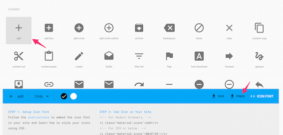
    
7. Extract the zip file you just downloaded, go into the android folder in it. You'll see a set of folders whose names begin with 'drawable'. Copy all drawable folders and paste into MyXml/app/src/main/res. Repeat for both icons you downloaded. If the system asks whether you want to merge file, just merge.
    
    Now your res folder should look like this
    
    
    
    If you go back to Android Studio, in the project tool window, the two icons have been added automatically
    
    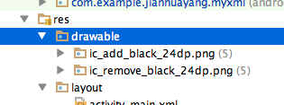

### Xml again - menus

All apps we have created so far are single-page apps, and app titles always appear in the top left corner. The area where the title stays is called 'App Bar', we can also put some more useful things in it.

1. Make sure that the MainActivity class is a subclass of AppCompatActivity. If you downloaded from module Github, it should be the case. If you're using the project you created earlier yourself, you'll need to double check this.
    
    ```java
    public class MainActivity extends AppCompatActivity {
    ```
    
2. Open AndroidManifest.xml, replace `android:theme="@style/AppTheme"` with `android:theme="@style/Theme.AppCompat.Light.NoActionBar"`. Open activity_main.xml, in the preview tool window click the Them button to bring up the Theme selector. Then select AppCompat.Light.NoActionBar and click OK.
    
    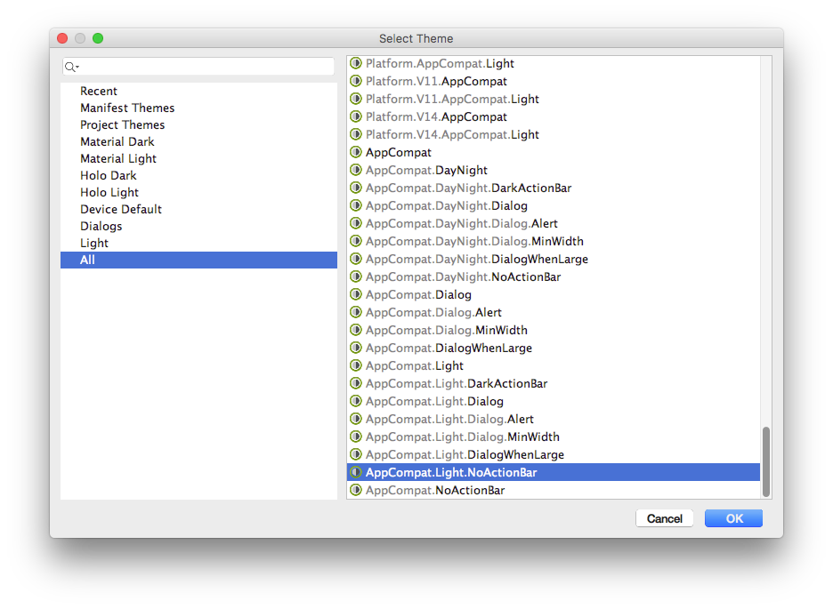
    
3. Insert the following into activity_main.xml, just before the first TextView
    
    ```xml
    <android.support.v7.widget.Toolbar
        android:id="@+id/toolbar"
        android:layout_width="match_parent"
        android:layout_height="80dp"
        android:background="?attr/colorAccent"
        android:elevation="4dp"
        android:paddingBottom="@dimen/activity_vertical_margin"
        android:paddingTop="@dimen/activity_vertical_margin"
        android:theme="@style/ThemeOverlay.AppCompat.ActionBar"
        app:popupTheme="@style/ThemeOverlay.AppCompat.Light" />
    ```
    This will create a toolbar floating below the title bar. It doensn't look very nice at the moment, but we'll change it in a minute.
    
4. In the containing LinearLayout, remove all padding attributes and insert the following line `xmlns:app="http://schemas.android.com/apk/res-auto"`. Now your opening tag of LinearLayout should look like
    
    ```xml
    <LinearLayout xmlns:android="http://schemas.android.com/apk/res/android"
    xmlns:app="http://schemas.android.com/apk/res-auto"
    xmlns:tools="http://schemas.android.com/tools"
    android:id="@+id/activity_main"
    android:layout_width="match_parent"
    android:layout_height="match_parent"
    android:orientation="vertical"
    tools:context="com.example.jianhuayang.myxml.MainActivity">
    ```
    
5. Open MainActivity.java and insert the toolbar initialization code into the `onCreate()` callback function, so it looks like below
    
    ```java
    @Override
    protected void onCreate(Bundle savedInstanceState) {
        super.onCreate(savedInstanceState);
        setContentView(R.layout.activity_main);
        Toolbar myToolbar = (Toolbar) findViewById(R.id.toolbar);
        setSupportActionBar(myToolbar);
    }
    ```
    Now if you run the app you'll have something similar to below. Can you put some paddings around 'Type and Run' to make it look nicer?
    
    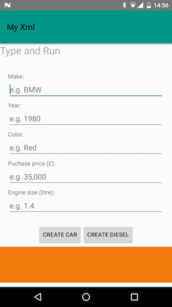
    
    > It is possible to get the toolbar in Java and do some customizations such as `getSupportActionBar().setDisplayShowTitleEnabled(false)`. Have a look at [Code Path tutorial on Using the App ToolBar](https://guides.codepath.com/android/Using-the-App-ToolBar).
    
6. Under Android view, right-click on the res folder and select New ==> Android resource file. In the window that pops up, fill out info as below and click OK. You'll notice that in the Project tool window a new file called menu_main.xml is created in a folder named menu.
    
    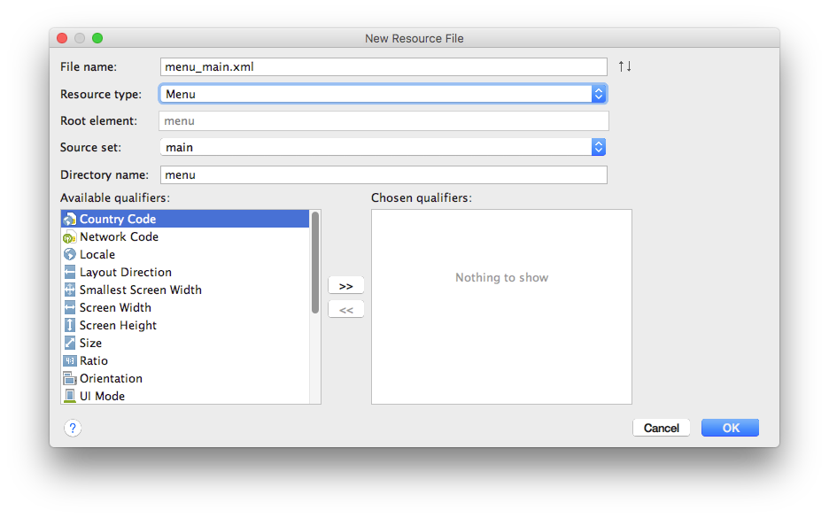
    
7. Open menu_main.xml, insert the following attribute into the opening tag of menu `xmlns:app="http://schemas.android.com/apk/res-auto"`. Insert the following tags in between `<menu>` tags:
    
    ```xml
    <item
        android:id="@+id/menu_add"
        android:icon="@drawable/ic_add_black_24dp"
        android:orderInCategory="1"
        android:title="@string/menu_add"
        app:showAsAction="always|withText" />
    <item
        android:id="@+id/menu_clear"
        android:icon="@drawable/ic_remove_black_24dp"
        android:orderInCategory="10"
        android:title="@string/menu_clear"
        app:showAsAction="ifRoom" />
    <item
        android:id="@+id/action_settings"
        android:orderInCategory="100"
        android:title="@string/action_settings"
        app:showAsAction="never" />
    ```
    You'll see immediately that some texts are highlighted in red. This is because the two string resources we are refering to are not available. Add the following to the string resource file.
    
    ```xml
    <string name="action_settings">Settings</string>
    <string name="menu_add">Add to list</string>
    <string name="menu_clear">Clear list</string>
    ```
    There're several things to note on the menu item attributes above:
    * oderInCategory set the appearance order of that menu item -- smaller values appear first. For English apps (left to right languages) that is on the left handside. 
    * namespace app is for older versions of Android, as showAsAction is not available on those systems. Click [here](http://developer.android.com/training/basics/actionbar/adding-buttons.html) for more info on this. 
        
    Also, insert the following into strings.xml in between `<resources>` tags. We'll need it for later.
    
    ```xml
    <integer name="depreciation">80</integer>
    ```
    
8. Open MainActivity.java and insert the following two methods into the class
    
    ```java
    @Override
    public boolean onCreateOptionsMenu(Menu menu) {
        // Inflate the menu; this adds items to the action bar if it is present.
        getMenuInflater().inflate(R.menu.menu_main, menu);
        return true;
    }
    
    @Override
    public boolean onOptionsItemSelected(MenuItem item) {
        // Handle action bar item clicks here. The action bar will
        // automatically handle clicks on the Home/Up button, so long
        // as you specify a parent activity in AndroidManifest.xml.
        int id = item.getItemId();

        //noinspection SimplifiableIfStatement
        if (id == R.id.action_settings) {
            return true;
        }
        
        return super.onOptionsItemSelected(item);
    }
    
    ```
    
    These two are callback functions that belong to Activity class, as indicated by the `@Override` notation. The first method inflates the menu using menu resource 'R.menu.menu_main' which indicates the folder and xml file name. In the second method, we can define different actions according to which icon is being clicked. This is similar to our previous example where one method is capable of responding to several different button clicks.
    
    > ['The onCreate method is called first, and before it finishes onCreateOptionsMenu is called.'](http://stackoverflow.com/questions/7705927/android-when-is-oncreateoptionsmenu-called-during-activity-lifecycle). Activity has a method [`invalidateOptionsMenu()`](https://developer.android.com/reference/android/app/Activity.html#invalidateOptionsMenu()) which declares that the 'options menu has changed, so should be recreated' i.e. the `onCreateOptionsMenu()`method will be called the next time it needs to be displayed.
    
    At this point, if you run the app you should have something similar to below:
    
    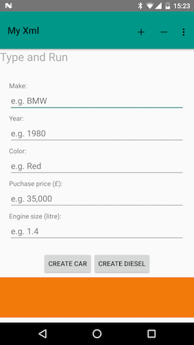


### Some house keeping tasks

Make the following changes to the MainActivity classes to accommodate the UI change.

1. Open Vehicle.java and insert two new member variables and generate getter methods for both.
    
    ```java
    private int price;
    private double engine;
    ```
2. Change the constructor that takes two input parameter, make it take all four instead.
    
    ```java
    public Vehicle(String make, int year, int price, double engine) {
    this.make = make;
    this.year = year;
    this.price = price;
    this.engine = engine;
    this.message = "Your car is a " + make + " built in " + year + ".";
    count();
    }
    ```
    
3. Generate a getter method for member variable 'make'.
4. Open Car.java, change Car constructor to
    
    ```java
    public Car(String make, int year, String color, int price, double engine){
    super(make, year, price, engine);
    this.color = color;
    setMessage(getMessage() + " I like your shining " + color + " color.");
    }
    ```
    
    Change Diesel constructor to 
    ```java
    public Diesel(String make, int year, int price, double engine){
    super(make, year, price, engine);
    this.type = "Diesel";
    }
    ```
5. Change Car and Diesel initialization methods in ActivityMain.java to accommodate new variables. Your switch block should now look like below. Don't worry about variables `price` and `engine` at the moment, we'll get those initialized in a minute. 
    
    ```java
    switch (view.getId()) {
        case R.id.buttonRunPetrol:
            vehicle = new Car(make, intYear, color, price, engine);
            break;
        case R.id.buttonRunDiesel:
            vehicle = new Diesel(make, intYear, price, engine);
            break;
        default:
            vehicle = new Vehicle();
            break;
    }
    ```
    
    Now both constructors are capable of handling the new fields in the UI.


### ArrayList, StringBuilder, Wrapper class, autoboxing

Next, we need to make some changes to MainActivity.java to handle menu button click and display a message back to our users.

1. Declare variables that correspond to new UI element. These should be put together with declarations that are already in the class.
    
    ```java
    private EditText editTextPrice;
    private EditText editTextEngine;
    private TextView textViewBlock;
    ```
    
    Declare a Vehicle object as a member variable of the class. This will be used for the current vehicle on the screen, remove the `vehicle` declaration in `onButtonClick()` function. Also, declare an ArrayList that holds Vehicles the user adds through the menu, and a couple of other helper variables.
    
    ```java
    private Vehicle vehicle;
    // the diamond syntax: because the empty angle brackets have the shape of a diamond, "core java for the impatient" C. Horstmann
    private ArrayList<Vehicle> vehicleList = new ArrayList<>();
    private StringBuilder outputs;
    private static Double depreciation;
    ```
    
    There're some new classes that you haven't seen before:
    
    * In Java, arrays are initialized with a fixed size. For example, `int[] aVariable = new int[10]` will declare an integer array called aVariable of size 10. But the problem is if later on you have more than 10 elements, it won't fit into this array, The way to get around this is to use the **ArrayList** class from java.util package. The ArrayList class extends AbstractList and implements the List interface. In the declaration above, in between angle brackets are types you want to hold using this ArrayList, in our case, this is the Vehicle class. 
    * In Java, String objects are immutable. 'Immutable' here means once assigned the string itself cannot be changed. For example, consider the code in the following figure, this is possible in Python but not in Java. To get around this, Java introduced **StringBuilder** class, which is effectively a String class with mutable strings. We'll see how to use it later on.
        
        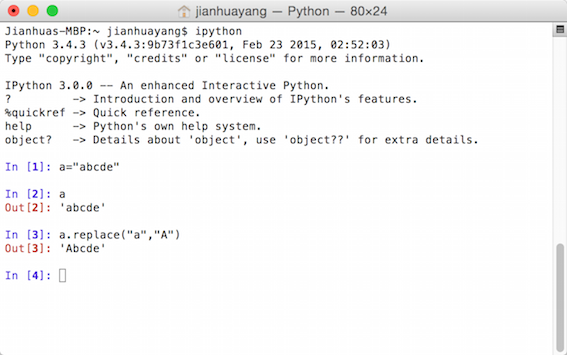
        
        > For discussions on when to use String and when to use StringBuilder, click [here](http://stackoverflow.com/questions/4645020/when-to-use-stringbuilder-in-java)
        
    * You have seen primitive data types such as int or double. In the codes above Double was used, which is not to be confused with double. Double here is a **wrapper class** for the primitive type double (there's also Integer for int etc.). The main reason that we need these wrapper classes is that these are objects, and primitive types are not. For example, we can declare `ArrayList<Double>` but we cannot declare `ArrayList<double>`.
        
        Wrapper class can be initialized using *proper* object initialization methods using keyword 'new'. For example, `Double  a = new Double(100.00)`. Or it can be initialized like an ordinary primitive type, e.g. `Double  a = 100.00`. This is called **autoboxing**. By definition, autoboxing refers to the automatic conversion that the Java compiler makes between the primitive types and their corresponding object wrapper classes.
    > For discussions on when to use primitive types and when to use wrapper classes, click [here](http://stackoverflow.com/questions/423704/int-or-integer/423718#423718)
    
2. Initialization of these variables are inside method `onButtonClick`, you need to move it into `onCreate`. Also, insert initialization of new UI element. Your `onCreate` method should now look like this
    
    ```java
    @Override
    protected void onCreate(Bundle savedInstanceState) {
        super.onCreate(savedInstanceState);
        setContentView(R.layout.activity_main);
        Toolbar toolbar = (Toolbar) findViewById(R.id.toolbar);
        setSupportActionBar(toolbar);

        editTextMake = (EditText) findViewById(R.id.inputMake);
        editTextYear = (EditText) findViewById(R.id.inputYear);
        editTextColor = (EditText) findViewById(R.id.inputColor);
        editTextPrice = (EditText) findViewById(R.id.inputPrice);
        editTextEngine = (EditText) findViewById(R.id.inputEngine);
        textViewBlock = (TextView) findViewById(R.id.textBlock);
        textViewBlock.setMovementMethod(new ScrollingMovementMethod());
        depreciation = getResources().getInteger(R.integer.depreciation) / 100.00;
    }
    ```
    
    There are several things to know in the code above:
    * By now you've seen how to use xml to provide system resources such as layouts, dimensions, strings, integers. In the codes above you see how to access them. For example, `R.layout.activity_main` refers to the layout xml file 'activity_main.xml', and `R.integer.depreciation` refers to the depreciation rate we added in strings.xml.
    * R is a class automatically generated by Android Studio by collecting system resources available. In the system resource folder, i.e. the 'res' folder, folder name matters but file name does not. For example, you can rename your 'strings.xml' as 'stringsForSql.xml' and it'll still work. But if you rename the folder 'valuesForSql' it'll stop working.
    * Line `textViewBlock.setMovementMethod(new ScrollingMovementMethod());` is to make TextView scrollable. This needs to work in pair with `android:scrollbars="vertical"` attribute in xml.
    * In Java, you need to be really careful with integer division. For example, 5/10 in Java will give you 0. This is because Java doesn't count decimal values if both operands are integers. To get around this, you can use 5/10.0, in which case both operands are automatically converted to higher precision (double) and will produce the desired output. 
    
3. Insert the following two lines into `onButtonClick` to initialize price and engine
    
    ```java
    Integer price = new Integer(editTextPrice.getText().toString());
    Double engine = new Double(editTextEngine.getText().toString());
    ```
    Now your `onButtonClick` should look like:
    
    ```java
    public void onButtonClick(View view) {
        String make = editTextMake.getText().toString();
        String strYear = editTextYear.getText().toString();
        int intYear = Integer.parseInt(strYear);
        String color = editTextColor.getText().toString();
        Integer price = new Integer(editTextPrice.getText().toString());
        Double engine = new Double(editTextEngine.getText().toString());

        switch (view.getId()) {
            case R.id.buttonRunPetrol:
                vehicle = new Car(make, intYear, color, price, engine);
                break;
            case R.id.buttonRunDiesel:
                vehicle = new Diesel(make, intYear, price, engine);
                break;
            default:
                vehicle = new Vehicle();
                break;
        }

        if (Vehicle.counter == 5) {
            vehicle = new Vehicle() {
                @Override
                public String getMessage() {
                    return "You have pressed 5 times, stop it!";
                }
            };
        }

        Toast.makeText(getApplicationContext(), vehicle.getMessage(), Toast.LENGTH_SHORT).show();
        Log.d(TAG, "User clicked " + Vehicle.counter + " times.");
        Log.d(TAG, "User message is \"" + vehicle + "\".");
    }
    ```
    
4. Change `onOptionsItemSelected(MenuItem item)` so it looks like the following
    
    ```java
    public boolean onOptionsItemSelected(MenuItem item) {
        int id = item.getItemId();

        switch (id) {
            case R.id.menu_add:
                addVehicle();
                return true;
            case R.id.menu_clear:
                return clearVehicleList();
            case R.id.action_settings:
                return true;
            default:
                return super.onOptionsItemSelected(item);
        }
    }
    ```
    The syntax looks familiar here - Depending on which button being clicked on the options menu, we choose to perform diffeernt actions. In the default case, we call the overridedn method in the super class.
    
5. Insert the following two methods to the class. These two methods respond to option menu clicks so that the current 'vehicle' object can be added to the list, or to clear the list. In addition, we update the outputs for our user to see.
    
    ```java
    private void addVehicle() {
        vehicleList.add(vehicle);
        resetOutputs();
    }

    private boolean clearVehicleList() {
        vehicleList.clear();
        resetOutputs();
        return true;
    }
    ```
    
6. Insert the following method into the class.
    
    ```java
    private void resetOutputs() {
        if (vehicleList.size() == 0) {
            outputs = new StringBuilder("Your vehicle list is currently empty.;");
        } else {
            outputs = new StringBuilder();
            for (Vehicle v : vehicleList) {
                outputs.append("This is vehicle No. " + (vehicleList.indexOf(v) + 1) + System.getProperty("line.separator"));
                outputs.append("Manufacturer: " + v.getMake());
                outputs.append("; Current value: " + depreciatePrice(v.getPrice()));
                outputs.append("; Effective engine size: " + depreciateEngine(v.getEngine()));
                outputs.append(System.getProperty("line.separator"));
                outputs.append(System.getProperty("line.separator"));
            }
        }
        textViewBlock.setText(outputs);
    }
    ```
    
    The idea of the code above is that once our use press the 'add' button on the options menu, we'll add the current vehicle to the list. Then we go through the list one by one to collect info of each vehicle. The info we collect will then be displayed back to our user in the big TextView area. There're several things to know in the code above:
    * `Vehicle v : vehicleList` is called **enhanced _for_ loop**. Normally what we do in Java is `for (int i = 0; i < vehicleList.size(); i++)`. But this enhanced for loop provides a handy shortcut.
    * `v.getPrice()` give us back variable of int type, while `v.getEngine()` gives us double.
    
7. Insert the following to handle depreciation of value and engine capability.
    
    ```java
    private int depreciatePrice(int price) {
        return (int) (price * depreciation);
    }

    private double depreciateEngine(double engine) {
        return (double) Math.round(engine * depreciation * 100) / 100 ;
    }
    ```
    
    What happens in the code above is that given the depreciation rate and original price, we calculate the vehicle's current value. You could use more sophisticated algorithms in your app. But in this simple example, we use a rate of 80%. Note for values of double type, we have to round it to a desired decimal place otherwise you'll be given a long decimal number. 
    
    > There's a good story for this called [Pentium FDIV bug](https://en.wikipedia.org/wiki/Pentium_FDIV_bug). Also, check this out [What Every Computer Scientist Should Know About Floating-Point Arithmetic](http://docs.oracle.com/cd/E19957-01/806-3568/ncg_goldberg.html).
    
    Now you can run the app to test. Fill **ALL** text fields and press 'plus' sign in the app bar, what do you see?
    
    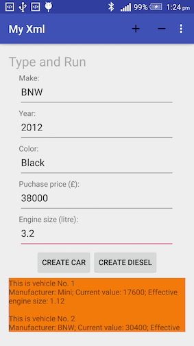
    
    
    
The app you just created contains several bugs:

* You probably have noticed that as you move to text boxes towards the bottom of the screen, they appear behind the keyboard. How do we resolve these using techniques you have just learned?
    
* The reason that you need to fill all text fields is that if you don't the app will crash. What can we do to get around this?
    
* If you continuously press 'add' button you'll see in the output window the list gets longer, but the serial number remains the same. Why?

## Lab 2 Gradle

In this second lab of the week, we will continue our exploration of Android resources and we'll see how these resources are built into apk files using Gradle.

### Styles, theme, densities, and screen sizes

Duplicate the project folder you created for the first lab, rename it 'MyXml2'. In Android Studio navigate to where 'MyXml2' is and open the project.

> You can continue working on 'MyXml' project if you wish.

We first look at styles.xml. Insert the following into the file in between `resources` tags

```xml
<style name="CodeFont" parent="@android:style/TextAppearance.Small">
    <item name="android:layout_width">fill_parent</item>
    <item name="android:layout_height">wrap_content</item>
    <item name="android:textColor">#00FF00</item>
    <item name="android:typeface">monospace</item>
</style>
```

In the code above:

* We define a new style called 'CodeFont', that inherits everything from Android system style TextAppearance.Small. This inheritance is the same as in CSS.

    > Unfortunately Google didn't document Android styles very well. This has now become a trial-and-error miracle. You can have a look at the source codes [here](https://android.googlesource.com/platform/frameworks/base/+/refs/heads/master/core/res/res/values/styles.xml) if you want to know more.

* System style TextAppearance.Small also inherits from another system style called TextAppearance. The full stop '.' indicates this inheritance. But you cannot inherit system style this way. You can only inherit your own styles using this notation, as you'll see later.
* 'item' tags define the attributes that we want to override from the parent style. In our case, we override textColor and typeface etc.
* Android Studio has a built-in theme editor where you can use palettes in a way similar to Photoshop.
    
    
    
Open activity_main.xml, insert `style="@style/CodeFont"` into the last TextView so it becomes
    
```xml
<TextView
    android:id="@+id/textBlock"
    style="@style/CodeFont"
    android:layout_width="match_parent"
    android:layout_height="match_parent"
    android:layout_marginBottom="10dp"
    android:layout_marginTop="@dimen/margin_top"
    android:background="?android:attr/colorActivatedHighlight"
    android:scrollbars="vertical" />
```

Note normally we use namespace for attributes, but for styles, we don't need to do that. (Don't ask me why).

In the preview tool window, in my example, it's currently Nexus 4 being used.


Click on the littler black triangle next to 'Nexus 4' and select 'Nexus 7'. If you look closely you'll see that the 'output' area is a bit too big on Nexus 7. (OK, this is subjective!).


When you clicked on the littler black triangle you probably noticed different screen resolutions for different phones . Also when you extracted 'plus' and 'minus' icons in the previous lab you probably noticed different versions of the same icon file. So what do those mean?

In Android, there're many ways to customize system resources for your users according to their languages, screen sizes, screen density, screen orientation etc. This is very important for user experience. Here dpi refers to screen density, mdpi is around ~160dpi. We also have a set of definitions for screen sizes such as normal, large etc.


These additional resource files are called *alternative resources*. They are named using the convention `<resources_name>-<config_qualifier>`. For example, for the options menu icons, we have drawable-hdpi, drawable-mdpi etc. We mentioned previously that folder name matters, this is why. 

In the project tool window, right-click on styles.xml folder icon, select New ==> Values resource file. In the window that comes up, select Smallest Screen Width as the qualifier,  click on the icon '>>' to add it to the selection window to the right, and then give it a value of 600. Name the file styles.xml and click OK. Now we just created an alternative style file for devices that has a width greater than 600dp e.g. Nexus 7.

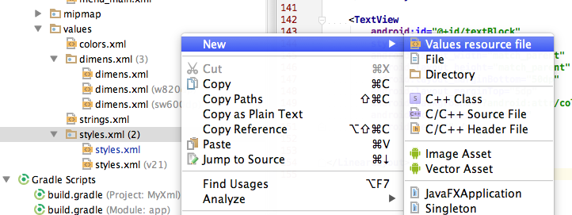

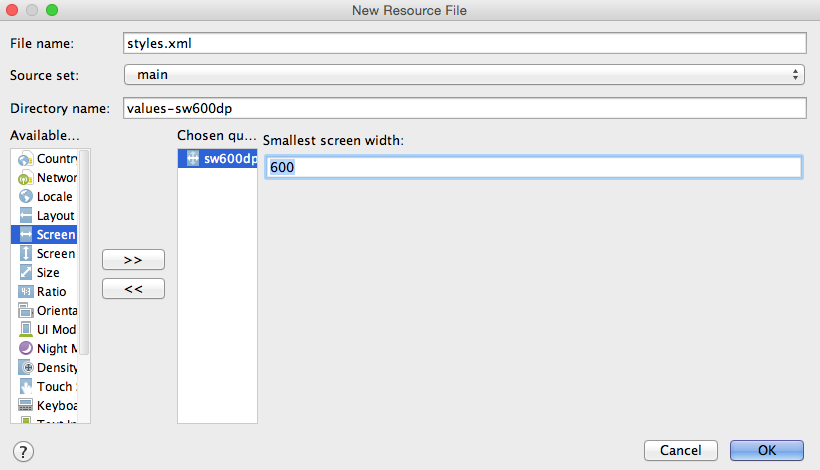

Copy the following lines from 'styles.xml' and paste into 'styles.xml (sw600dp)' `resources` tags. Change `TextAppearance.Small` to `TextAppearance.Large`.

```xml
<style name="CodeFont" parent="@android:style/TextAppearance.Small">
    <item name="android:layout_width">fill_parent</item>
    <item name="android:layout_height">wrap_content</item>
    <item name="android:textColor">#00FF00</item>
    <item name="android:typeface">monospace</item>
</style>
```
Now if we run the app on Nexus 7, in the output area the font size should be larger than on Nexus 4.

Following steps above, create a new dimens.xml for sw600dp devices. Insert the following values into the file:

```xml
<dimen name="margin_left">25dp</dimen>
<dimen name="margin_top">20dp</dimen>
<dimen name="margin_right">80dp</dimen>
```

Now if you look at the preview window, for Nexus 7 it looks much better. But there're still quite a bit of space at the bottom of the screen that hasn't been used. Let's do something for that!

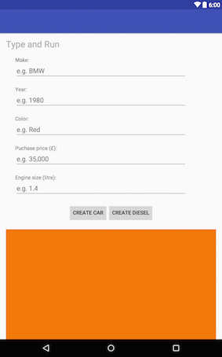

In the project tool window, right-click on the layout folder icon, select New ==> Layout resource file. Set it to be sw600dp, and give it a name 'activity_main.xml', click OK.

Copy contents in 'activity_main.xml' and paste into 'activity_main.xml (sw600dp)' to replace what's in there already. Delete the last `TextView` tag and all attributes within it. Insert the following instead

```xml
<ScrollView
    android:id="@+id/scrollView"
    android:layout_width="match_parent"
    android:layout_height="match_parent"
    android:layout_gravity="center_horizontal"
    android:layout_marginBottom="20dp"
    android:layout_marginTop="15dp"
    android:background="@color/colorPrimary"
    android:fillViewport="true">
    
    <RelativeLayout
        android:layout_width="match_parent"
        android:layout_height="match_parent"
        android:orientation="vertical">
        
        <TextView
            android:id="@+id/textBlock"
            style="@style/CodeFont"
            android:layout_width="match_parent"
            android:layout_height="wrap_content"
            android:scrollbars="vertical" />
        
        <Button
            android:id="@+id/buttonCearAll"
            android:layout_width="wrap_content"
            android:layout_height="wrap_content"
            android:layout_alignParentBottom="true"
            android:layout_alignParentRight="true"
            android:layout_marginBottom="10dp"
            android:layout_marginRight="10dp"
            android:background="@color/colorPrimaryDark"
            android:onClick="onClearClick"
            android:text="@string/menu_clear" />
    </RelativeLayout>
    
</ScrollView>
```

There're several things to note in the code above:

* We added a ScrollView to make the large area scrollable. In the previous lab, we used a scrollable TextView, but that's not ideal as it's not a container layout. Here we use ScrollView so that we can have a button at the bottom. This also answers one of the questions at the end of the previous lab.
* ScrollView can only contain one child element.
* `fillViewport="true"` makes the scroll view’s child expand to the height of the ScrollView. If this is set to 'false' the child element will stay at the very top of the layout.

Now the layout looks better on Nexus 7. 


### HashMap and Generic

Now we turn to MainActivity.java file. To add a listener to the 'Clear All' button above, we need to insert the following into MainActivity.java

```java
public void onClearClick(View v){
        clearVehicleList();
    }
```

In addition, it'll be good to show some information about car manufacturers in our app. We'll build a 'dictionary' for it.

Insert the following into strings.xml file

```xml
<string-array name="manufacturer_array">
    <item>Volvo</item>
    <item>Mini</item>
    <item>volkswagen</item>
</string-array>
<string-array name="description_array">
    <item>Volvo Car Corporation is a Swedish premium automobile manufacturer, headquartered in the VAK building in Gothenburg.</item>
    <item>The Mini is a small economy car made by the British Motor Corporation (BMC) and its successors from 1959 until 2000. The original is considered a British icon of the 1960s.</item>
    <item>Volkswagen is a German car manufacturer headquartered in Wolfsburg, Lower Saxony, Germany.</item>
</string-array>
```
In MainActivity.java declare a variable to hold car manufacturers information. This declaration goes together with the declaration of UI elements i.e. outside of any methods.

```java
private Map<String, String> mapCarMaker = new HashMap<>();
```

Similar to Python dictionary, the Java way of doing a dictionary is to use the **HashMap** class. HashMap allows key-value pairs to be stored and looked up quickly. In fact, both List and Map are interfaces. The declaration `Map<String, String>` but not `HashMap<String, String>` is an example of *programming to an interface* 

Insert the following lines into the `onCreate` method.

```java
    String[] manufacturers = getResources().getStringArray(R.array.manufacturer_array);
    String[] descriptions = getResources().getStringArray(R.array.description_array);
    for (int i = 0; i < manufacturers.length; i++ ){
        mapCarMaker.put(manufacturers[i], descriptions[i]);
        }
```

What the code above does is to read car manufacturer names and their info. These are then put into a dictionary for later use. Note in here:
* We use String array instead of ArrayList as the size of the array is fixed.
* For an array, it has a field (i.e. a member variable) called length for its size. But for ArrayList, to get its size we need to call the size() method.

Locate the `resetOutputs()` method, insert/rearrange the for loop so that it looks like below. What this code does is that it checks if a description is available for the manufacture. If yes, append the info to the output.

```java
for (Vehicle v : vehicleList) {
    String vehicleDescription = mapCarMaker.get(v.getMake());
    if (vehicleDescription == null){
        vehicleDescription = "No description available.";
    }
    outputs.append("This is vehicle No. " + (vehicleList.indexOf(v) + 1) + System.getProperty("line.separator"));
    outputs.append("Manufacturer: " + v.getMake());
    outputs.append("; Current value: " + depreciatePrice(v.getPrice()));
    outputs.append("; Effective engine size: " + depreciateEngine(v.getEngine()));
    outputs.append("; Desciption: " + vehicleDescription);
    outputs.append(System.getProperty("line.separator"));
    outputs.append(System.getProperty("line.separator"));
}
```

If you look at the MainActivity.java class, at the moment it's a bit redundant as it has two methods doing a similar job i.e. `depreciatePrice` and `depreciateEngine`. As Java is a type-safe language, it's necessary to have different methods for different different input types. But a more convenient way to do it is to use **Java Generics**.

Comment out the two methods mentioned above by selecting the two methods and then click `cmd` + `/`. Now insert the following line of codes instead

```java
private <T extends Number> Double depreciateAnything(T originalValue) {
    Double result;
    if (originalValue instanceof Double) {
        result = Math.round(originalValue.doubleValue() * 0.8 * 100) / 100.00;
    } else {
        result = originalValue.intValue() * 0.8;
    }
    return result;
}
```

The code above is called a generic method. What it does is that we declare a type parameter 'T' to represent input type. But this type must be subclasses of Number e.g. Integer or Double. We then check the type of input variable to see the actual type and perform calculations accordingly.

* `T extends Number` is called bounded type parameter. In this case, we require that the variable type passed into our method must be a subclass of Number.
* Type declaration goes before the return type i.e. Double
* `instanceof` is an operator in Java. This is equivalent to `type()` in Python.

Now replace `depreciatePrice` and `depreciateEngine` with this new generic method.

```java
outputs.append("; Current value: " + depreciateAnything(v.getPrice()));
outputs.append("; Effective engine size: " + depreciateAnything(v.getEngine()));
```

<!--
> I was going to show you how to use Java lambda expression to do the above calculation, but unfortunately, lambda is a feature of Java 8 and not yet supported by Android. Can you figure out how to do the 'depreciation' using lambda?
    Hint:
```java
interface depreciatable{
Double depreciate(Double d);
}
depreciatable depreciateCalculator = (Double x) -> x.doubleValue() * 0.8;
Double output = depreciateCalculator.depreciate(v.getPrice());
```
-->

Now if you run the app on Nexus 7, either a real device or AVD, you should see the following. Fill out the form, click 'create diesel' and then the '+' icon. You'll see the message pops up in the output area. The description for the car maker is also available.

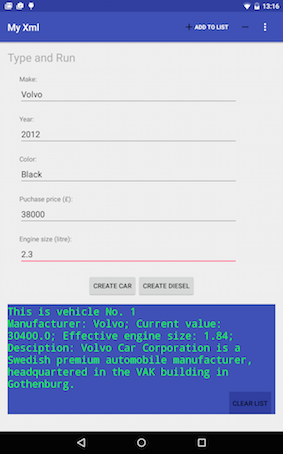

### App manifest

Every application must have an AndroidManifest.xml file (with precisely that name) in its root directory. Open the AndroidManifest.xml file in your editor. There're several things to note in this file:

1. The file defines 'metadata' of the app. There's one only one pair of `manifest` and `application` tag allowed.
2. The `application` tag has several attributes i.e. icon, label, theme. Here, the label is your application's name, and shouldn't be changed. The label attribute here is for the texts in the top left corner of the screen.
3. There can be more than one `activity` tags in your app.
4. Activity name can be shortened. For example, we can use `".MainActivity"` instead of `"com.example.jianhuayang.myxml.MainActivity"`. The leading dot '.' in the former denotes the package attribute in 'manifest' tag.
5. There can only be one launcher activity i.e. with tags `"android.intent.category.LAUNCHER"`. This denotes the entry point of the app.

As we go along, you'll know more about app manifest. The above is all for now.

### Gradle build system

The ultimate targets for Android application development are apk files. We need to provide resources in xml format and Java source codes to make it happen. But the problem is that, as you have seen already, the system is very complicated with such a lot of different packages/resources - We need a build tool that is powerful enough to handle all these, not just a `javac` or `make`. Fortunately, in Android Studio the build process is (almost!) automated. We don't normally interfere with it. But it's important you understand how the build system works. In particular, there're three things that you need to be aware of:

1. Files generated by Android Studio for build purposes. Among those files, the most important one is the R.java.
2. The build.gradle syntax.
3. Project dependencies


> Refer [here](https://developer.android.com/sdk/installing/studio-build.html) for explanation of different files/tools in the image above.

**IntelliJ build system**

When you first create your project, Android Studio generates a set of files/folders for you. All these are grouped under 'Gradle Scripts' in project tool window.


This is a bit confusing when you first look at them as there're so many different files. But fortunately, there are short descriptions next to file names i.e. those in brackets. For example, local.properties file contain configurations for SDK location.

To make things worse, there're two files with the same name - build.gradle - one for 'Project' and one for 'Module':

1. `build.gradle (Project: MyXml2)` defines Gradle itself, for example, repositories (jcenter) and dependencies.
2. `build.gradle (Module: app)` defines various aspects of module build settings. More on this later.

You have used many times `R.id.something` in your java source code, now it's the time to have a look at it. On your hard drive, navigate to app/build/generated/source/r/debug/com/example/jianhuayang/myxml file, open R.java file in a text editor. Try to locate 'id' class. Now you'll see different IDs available to you, either generated by the system or by yourself. Note that id itself is a class, and different IDs in it are actually integers.


**build.gradle**

The most important file is `build.gradle (Module: app)`. The basic structure of Gradle build scripts comprises configuration and task blocks. Task blocks are rare in our case `apply plugin: 'com.android.application'`, but ther're lots of configuration blocks in the form of

```xml
label {
//Configuration code...
}
```

Most of the configurations e.g. applicationId and targetSdkVersion have been explained already. There're two new configurations: buildTypes refers to whether it's 'release' or 'debug'. If it's release we'll apply a tool called ProGuard to it. productFlavors refers to, for example, if it's a free (lite) version or a paid (full) version. We could set up two different flavors here and Gradle will build both for us. Click [here](http://developer.android.com/tools/building/configuring-gradle.html#workBuildVariants) for an example app with build variants.

> What ProGuard does is 'shrinks, optimizes, and obfuscates your code by removing unused code and renaming classes, fields, and methods with semantically obscure names'. See [here](https://developer.android.com/tools/help/proguard.html) for details.

**Project dependencies**

```xml
dependencies {
    compile fileTree(include: ['*.jar'], dir: 'libs')
    testCompile 'junit:junit:4.12'
    compile 'com.android.support:appcompat-v7:23.0.1'
    compile 'com.android.support:design:23.0.1'
}
```

In the current file we have two types of dependencies:

* `compile fileTree(include: ['*.jar'], dir: 'libs')` is called 'local binary dependencies'. In case your Java needs some additional jar files, you'll have to create a folder called 'libs' under 'app' and put jar files there. 
* `testCompile 'junit:junit:4.12'` is called 'remote binary dependencies'. The resource we need is in the format of Maven coordinates i.e. group:name:version. 

There's one type of dependencies missing here, which is module dependency. An example of module dependency would be `compile project(":lib")`, where 'lib' is the module name our current module depends on.

Finally, remember Gradle works on conventions, you'll have to change the configurations if you change default file names/locations etc.


## Lab 3 Advanced topics

For those of you who haven't completed previous labs, you can work on it if you wish. For those who have finished, in this final lab, there are some challenging questions for you to explore. These questions are related to previous labs, and somehow involves more efforts to complete.

### Contextual action mode

You can customize menus displayed in the toolbar to suit your app contents. For an example, from Google Play Store download an app called keep and manually insert some notes. Once done, click and hold you finger on one of those notes. You'll notice that the menu has changed accordingly. This is done using the [Contextual action mode](https://developer.android.com/guide/topics/ui/menus.html#CAB). Click on this link and try to understand how CAB works and include in the exercise project above.

### Build from command line

If you look at the root folder of the project, there're a couple of files that we haven't mentioned yet e.g. gradlew and gradlew.bat. These are scripts that we can run to build our apps from the command line.

* Open 'gradlew' in a text editor, can you make sense of it?
* Can you guess what commands to use to build the system from command line?

> Hint: [Building and Running from the Command Line](http://developer.android.com/tools/building/building-cmdline.html)

### Gradle build tools

Instead of using generated wrapper scripts such as gradlew in the previous steps, you can download Gradle and build everything from scratch. Follow this tutorial [Building Android Projects with Gradle](https://spring.io/guides/gs/gradle-android/) from Spring to explore more of Gradle.

