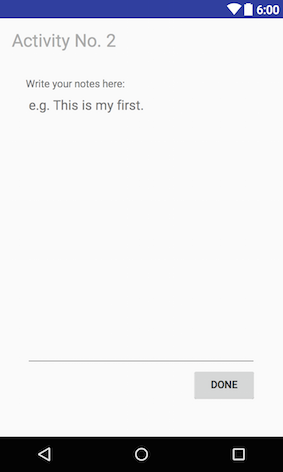
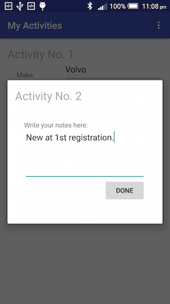
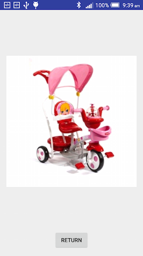

# Simple Views and Layouts

By now you should be familiar with a 'single-page application' in Android. That is an app that runs within a single Activity (capital 'A'). You should have some experience using LinearLayouts/RelativeLayouts, providing systems resources for different screen sizes etc. This week, we'll look at Activity lifecycle and how to pass data between Activities. Also, we'll examine some more layouts and widgets.

## Lab 1 UI design

Before we go into details of what each individual widget is capable of doing, we need to have a big picture of what Android has to offer. But even before we do that, let's have a look at a popular design pattern called MVC (Model-View-Controller).

### MVC pattern

The MVC pattern, which plays a vital role in modern application programming, assigns objects in an application one of three roles: model, view, or controller:

- *Model*: Model is your data structure. It holds the relationship within your data. Model objects encapsulate the data specific to an application and define the logic and computation that manipulate and process that data. 
- *View*: A view object is an object in an application that users can see. A view object knows how to draw itself and can respond to user actions.
- *Controller*: A controller object acts as an intermediary between one or more of an application’s view objects and one or more of its model objects. In Android, a controller is typically a subclass of Activity, Fragment, or Service.


In Android, especially for small-scale apps, it's often not easy to distinguish roles within the MVC pattern. But the benefits of MVC is obvious - it separates the front-end and back-end, and make it easier to reuse your classes.

### Design principles

On the [official Android website](http://developer.android.com/design/get-started/principles.html) Google lists following principles you need to follow when designing your app, but most of them boils down to common sense.

- *Enchant me*: 'your app should strive to combine beauty, simplicity and purpose to create a magical experience that is effortless and powerful' (quoted directly from Google).
- *Simplify my life*: make your app easy to navigate, easy to use, easy to understand.
- *Make me amazing*: provide visual hints and/or default values for your app, break big tasks into smaller steps.

Google released the new [Material Design](https://www.google.com/design/spec/material-design/introduction.html) with android 5.0 Lollipop, which provides detailed guidelines for visual, motion etc. and covers almost everything one can think of in app design. Here I list some common requirements that you should try to meet and pitfalls that you should try to avoid in your apps. Detailed requirements can be found in Material Design documentation.

- *Motion*: Changes in acceleration or deceleration should be smooth across the duration of an animation.
- *Style*: Use system recommended color, icons, meaningful and genuine images. Use concise and simple languages.
- *Layout*: Design to suit different devices and screen-sizes. Try to avoid slicing up the interface into too many regions like in the following
    
    
    
- *Components*: Requirements were laid in Material Design for different UI components such as buttons or menus. Some of these requirements are very specific, e.g. button height need to be 36dp in a dialog. Some other requirements tend to be more general, e.g the rule that states don't use flat buttons in UIs where they would be difficult to see.
- *Patterns*: Material Design has guidelines for different scenarios which is referred to as 'patterns'. For example, launch screens can be either placeholder UI or branded launch. Of course, you can implement anything you wish, but it'll be better if you go for one of these two for your apps.

The above is a really brief 'abstract' of the Material Design documentation. The important things to remember is, if in doubt, check the official documentation.

### Activity lifecycle

Now we'll start exploring the Activity lifecycle. As we know already, in Android each Activity is (normally) associated with a layout xml file. Before and after the layout becomes visible/invisible on the screen the system has to create or destroy the Activity object by calling some callback methods such as the `onCreate()` method. The whole process i.e. lifecycle of an Activity involves several different stages and callback methods.

Following steps below to create a new project and insert some overriding methods:

1. Create a new project called 'My Activities'.
2. Insert the following code into the class body of 'MainActivity.java'.
    
    ```java
    private static final String TAG_LIFECYCLE = "TagLifecycle";
    ```
3. Insert the following into the `onCreate` method
    
    ```java
    Log.d(TAG_LIFECYCLE, "In the onCreate() event");
    ```
4. Insert the following into the class body:
    
    ```java
    @Override
    public void onStart() {
        super.onStart();
        Log.d(TAG_LIFECYCLE, "In the onStart() event");
    }

    @Override
    public void onRestart() {
        super.onRestart();
        Log.d(TAG_LIFECYCLE, "In the onRestart() event");
    }

    @Override
    public void onResume() {
        super.onResume();
        Log.d(TAG_LIFECYCLE, "In the onResume() event");
    }

    @Override
    public void onPause() {
        super.onPause();
        Log.d(TAG_LIFECYCLE, "In the onPause() event");
    }

    @Override
    public void onStop() {
        super.onStop();
        Log.d(TAG_LIFECYCLE, "In the onStop() event");
    }

    @Override
    public void onDestroy() {
        super.onDestroy();
        Log.d(TAG_LIFECYCLE, "In the onDestroy() event");
    }
    ```
5. Start your AVD or connect you phone/tablet, and run the app. In logcat, use 'TagLifecycle' to filter the outputs. Now try to answer the following:
    
    * When you first start the app, which methods were called?
    * Press the 'home' (circle) button, which methods are called?
    * Press the 'overview' (square) button and bring back the app, which methods are called?
    * If you now press 'back' button, which methods are called?
    * Now, press the app icon on your phone to start again, what happened? What does it mean?

    > For button names, see [here](https://support.google.com/nexus/answer/6073614)

Talking about Activity lifecycle, there're two diagrams you have to know well:


`'. .'`'. .'`'. .'`'. .'`'. .'`'. .'`'. .'`'. .'`'. .'`'. .'
   `     `     `     `     `     `     `     `     `     `


The upper image depicts all callback methods an Activity has to go through from the start of its life until the end. Even though there're so many different callbacks, there're only three constant states, as shown in the lower image:

- *Resumed*: The activity is in the foreground of the screen and has user focus.
- *Paused*: Another activity is in the foreground and has focus, but this one is still visible.
- *Stopped*: The activity is completely obscured by another activity.

The other two states in the lower image above i.e. created and started are transient and the system quickly moves from them to the next state by calling the next lifecycle callback method.

Associated with these callback methods are what we need to implement them. For this, [the official guide](http://developer.android.com/guide/components/activities.html) is thorough and comprehensive. Please spend some time to read. The two most important things that often confuse our students are:

1. The 'home' button doesn't destroy your activity. The system will remember your app's current state. So press 'home' button and then press your app icon to restart your app is **NOT** a way to show data persistence.
2. If the system must recover memory in an emergency, `onStop()` and `onDestroy()` might not be called. Again, to save data for the sake of persistence you'll need to do it in `onPause()`.

### FrameLayout, ScrollView and TableLayouts

In this section, we'll continue working on the previous project and make it a 3-activity app. The idea is that in the main activity if you click 'write note' it'll take you to a second activity where you can take some notes. Once finished, if you click 'display', all the info you typed will be shown in a 3rd activity. 

Following steps below to insert two more activities and prepare the layout file for later use.

1. In the Project tool window, right-click app, select New ==> Activity ==> Empty Activity, name it 'NoteEditingActivity'.
2. Similarly, create another activity using the FullscreenActivity template and name it 'DispalyActivity'.
3. Open activity_display.xml, you'll see the root tag is **FrameLayout**. The FrameLayout is a placeholder on the screen that you can use to display a single view. Views that you add to a FrameLayout are always anchored to the top left of the layout.
4. Open activity_main.xml, replace RelativeLayout with ScrollView, and delete TextView.
5. On the graphical layout, drag and drop a TableLayout and a TableRow onto the activity. You'll notice that even though you drag/drop just one TableRow, the system has four inserted into TableLayout for you. Delete three of those, and keep just one. For the only TableRow you have, separate the closing tag i.e. replace `/>` with `></TableRow>`. The TableLayout at the moment should look like this:
    
    ```xml
    <TableLayout
        android:layout_width="match_parent"
        android:layout_height="wrap_content"
        android:stretchColumns="1">

        <TableRow>
        </TableRow>
    </TableLayout>
    ```
    
6. Duplicate the TableRow tags seven times. In other words, we're going to have a 7-row table. Add widgets and rearrange its attributes so it looks like the following:
    
    ```xml
    <TableLayout
        android:layout_width="match_parent"
        android:layout_height="match_parent"
        android:stretchColumns="1">

        <TableRow
            android:layout_width="match_parent"
            android:layout_height="match_parent">

            <TextView
                android:id="@+id/textView"
                android:layout_width="1900dp"
                android:layout_height="wrap_content"
                android:layout_column="0"
                android:layout_span="2"
                android:text="Activity No. 1"
                android:textColor="@android:color/darker_gray"
                android:textSize="24sp" />
        </TableRow>

        <TableRow>

            <TextView
                android:id="@+id/labelMake"
                android:layout_width="wrap_content"
                android:layout_height="wrap_content"
                android:layout_marginLeft="19dp"
                android:layout_marginTop="10dp"
                android:width="80dp"
                android:text="Make:"
                android:textAppearance="?android:attr/textAppearanceSmall" />

            <EditText
                android:id="@+id/inputMake"
                android:layout_width="match_parent"
                android:layout_height="wrap_content"
                android:layout_marginLeft="19dp"
                android:layout_marginRight="20dp"
                android:ems="10"
                android:hint="e.g. BMW" />
        </TableRow>

        <TableRow>

            <TextView
                android:id="@+id/labelYear"
                android:layout_width="wrap_content"
                android:layout_height="wrap_content"
                android:layout_marginLeft="19dp"
                android:layout_marginTop="10dp"
                android:text="Year:"
                android:textAppearance="?android:attr/textAppearanceSmall" />

            <EditText
                android:id="@+id/inputYear"
                android:layout_width="match_parent"
                android:layout_height="wrap_content"
                android:layout_marginLeft="19dp"
                android:layout_marginRight="20dp"
                android:ems="10"
                android:hint="e.g. 1980"
                android:inputType="number" />
        </TableRow>

        <TableRow>

            <TextView
                android:id="@+id/labelColor"
                android:layout_width="wrap_content"
                android:layout_height="wrap_content"
                android:layout_marginLeft="19dp"
                android:layout_marginTop="10dp"
                android:text="Color:"
                android:textAppearance="?android:attr/textAppearanceSmall" />

            <EditText
                android:id="@+id/inputColor"
                android:layout_width="match_parent"
                android:layout_height="wrap_content"
                android:layout_marginLeft="19dp"
                android:layout_marginRight="20dp"
                android:ems="10"
                android:hint="e.g. Red" />
        </TableRow>

        <TableRow>

            <TextView
                android:id="@+id/labelNote"
                android:layout_width="wrap_content"
                android:layout_height="wrap_content"
                android:layout_marginLeft="19dp"
                android:layout_marginTop="10dp"
                android:text="Note:"
                android:textAppearance="?android:attr/textAppearanceSmall" />

            <EditText
                android:id="@+id/inputNote"
                android:layout_width="match_parent"
                android:layout_height="wrap_content"
                android:layout_marginLeft="19dp"
                android:layout_marginRight="20dp"
                android:ems="10"
                android:hint="e.g. This is my first." />
        </TableRow>

        <TableRow>

            <TextView />

            <Button
                android:id="@+id/buttonNote"
                android:layout_width="wrap_content"
                android:layout_height="wrap_content"
                android:layout_column="1"
                android:layout_marginLeft="40dp"
                android:layout_marginRight="20dp"
                android:gravity="center"
                android:onClick="goEdit"
                android:text="Write notes"
                android:textAppearance="?android:attr/textAppearanceSmall" />
        </TableRow>

        <View
            android:layout_height="3dp"
            android:background="@color/colorPrimary" />

        <TableRow>

            <Button
                android:id="@+id/buttonDisplay"
                android:layout_width="match_parent"
                android:layout_height="wrap_content"
                android:layout_marginTop="5dp"
                android:layout_span="2"
                android:gravity="center"
                android:onClick="goDisplay"
                android:text="Display" />

        </TableRow>
    </TableLayout>

    </ScrollView>

    ```
    
    There're several things you need to know in this layout file:
    
    * A **ScrollView** is a subclass of FrameLayout. It's a layout container for a view hierarchy that can be scrolled by the user, allowing it to be larger than the physical display. The ScrollView can contain only one child view or ViewGroup. 
    * A **TableLayout** is like a table in spreadsheet i.e. it has columns and rows. In our example above, the first TextView i.e. with text 'Activity No.1' starts at column 1 `android:layout_column="0"` and spans for two columns `android:layout_span="2"`.
    * If you don't want to specify starting column number, you can put a placeholder such as an empty TextView before button 'buttonNote'.
    * It's your first time to see the 'View' tag. What we did here is basically to draw a divider line with height 3dp.
    
    Your screen should now look like the following:
    
    
    
7. Open activity_note_editing.xml and change the container layout from the default RelativeLayout to vertical LinearLayout. Insert the following widgets in it: 
    
    ```xml
    <TextView
        android:id="@+id/textView"
        android:layout_width="match_parent"
        android:layout_height="wrap_content"
        android:text="Activity No. 2"
        android:textColor="@android:color/darker_gray"
        android:textSize="24sp" />

    <TextView
        android:id="@+id/labelNote"
        android:layout_width="wrap_content"
        android:layout_height="wrap_content"
        android:layout_marginLeft="19dp"
        android:layout_marginTop="36dp"
        android:text="Write your notes here:"
        android:textAppearance="?android:attr/textAppearanceSmall" />

    <EditText
        android:id="@+id/inputNote"
        android:layout_width="match_parent"
        android:layout_height="0dp"
        android:layout_weight="1"
        android:layout_marginLeft="19dp"
        android:layout_marginRight="20dp"
        android:ems="10"
        android:gravity="top"
        android:hint="e.g. This is my first."
        android:minLines="4"
        />

    <Button
        android:id="@+id/buttonNoteDone"
        android:layout_width="wrap_content"
        android:layout_height="wrap_content"
        android:layout_marginLeft="19dp"
        android:layout_marginRight="20dp"
        android:layout_marginBottom="30dp"
        android:gravity="center"
        android:layout_gravity="right"
        android:onClick="onDoneClick"
        android:text="Done" />
    ```
    This is pretty easy to understand. Note line `android:layout_height="0dp"` and `android:layout_weight="1"`. This is basically telling the EditText to occupy all available pace in its parent view. Your screen now should look like:
    
    
    
8. For NoteEditingActivity, we want it to show a dialog style. In other words, it shows up as partially occupying the screen. So add the following to styles.xml
    
    ```xml
    <style name="MyDialog" parent="Theme.AppCompat.Light.Dialog">
        <item name="windowNoTitle">true</item>
    </style>
    ```
    Open AdroidManifest.xml, change the style of the activity to the one you just created 
    
    ```xml
    <activity
            android:name=".NoteEditingActivity"
            android:theme="@style/MyDialog" >
    </activity>
    ```
    
Now we have completed GUI design for your three activities. But we haven't looked at the DisplayActivity yet. If you open actvity_display.xml, it should look like the following


Change the text displayed in the Button to 'Return' by changing the following in strings.xml `<string name="dummy_button">Return</string>`.

### Intents

Next, we link all buttons with appropriate methods. We also link all three activities together.

Open MainActivity.java, follow steps below to insert several functions:

1. Open MainActivity.java, declare the following as class members:
    
    ```java
    public static final String KEY_MAKE = "keyMake";
    public static final String KEY_YEAR = "keyYear";
    public static final String KEY_COLOR = "keyColor";
    public static final String KEY_NOTE = "keyNote";
    private static final int REQUEST_EDIT = 1234;
    
    private EditText editTextMake;
    private EditText editTextYear;
    private EditText editTextColor;
    private EditText editTextNote;
    ```
    
2. In `onCreate()` method, initialize widget members by inserting the following:
    
    ```java
    editTextMake = (EditText) findViewById(R.id.inputMake);
    editTextYear = (EditText) findViewById(R.id.inputYear);
    editTextColor = (EditText) findViewById(R.id.inputColor);
    editTextNote = (EditText) findViewById(R.id.inputNote);
    ```
    
3. Insert the following two methods into the class.
    
    ```java
    public void goEdit(View v) {
        Intent intentEdit = new Intent(this, NoteEditingActivity.class);
        startActivityForResult(intentEdit, REQUEST_EDIT);
    }

    public void goDisplay(View v) {
        Intent intentDisplay = new Intent();
        intentDisplay.setAction("com.example.jianhuayang.myactivities.ThirdActivity");
        intentDisplay.putExtra(KEY_MAKE, editTextMake.getText().toString());
        intentDisplay.putExtra(KEY_YEAR, Integer.parseInt(editTextYear.getText().toString()));
        Bundle bundle = new Bundle();
        bundle.putString(KEY_COLOR, editTextColor.getText().toString());
        bundle.putString(KEY_NOTE, editTextNote.getText().toString());
        intentDisplay.putExtras(bundle);
        startActivity(intentDisplay);
    }
    ```
    
    There're quite a lot going on in the code above:
    
    * Before you start a new Activity, you must define a **Intent** object. In the example above, there are two different ways of doing it: one uses `Intent(this, NoteEditingActivity.class)` where 'this' is the current object, and '.class' is the type of the targeting object; The other is that we create an empty Intent and then set the Action, which is a String defined in **IntentFilters**. We'll see more of this later on.
    * We can pass data along with Intent objects. The way to do it is to use `putExtra()` or `putExtras()` method. These methods take key-value pairs as inputs, where the key is used to retrieve the data back.
    * To actually move to a different Activity, you'll need either `startActivity()` or `startActivityForResult()` method. For both methods, you'll need to supply an Intent. The difference is that for the latter you need to get the results back from the other Intent.
    
4. Insert the following method into the class. This is to retrieve data from Activities started by the `startActivityForResult()` method.
    
    ```java
    @Override
    protected void onActivityResult(int requestCode, int resultCode, Intent data) {
        if (requestCode == REQUEST_EDIT && resultCode == RESULT_OK) {
            editTextNote.setText(data.getData().toString());
        }
        super.onActivityResult(requestCode, resultCode, data);
    }
    ```
    
    The code above tests to see if the results come from the original request by comparing the  request code. If it is the case and the results are ok (RESULT_OK is a constant), we'll get the data passed by the intent. In this case, we used the `getData()` method which returns the URI that the intent is operating on. The URI is then turned into String and displayed in EditText.
    
Next, open NoteEditingActivity.java, and make some changes so that the class body looks like the following:

```java
    EditText editText;

    @Override
    protected void onCreate(Bundle savedInstanceState) {
        super.onCreate(savedInstanceState);
        setContentView(R.layout.activity_note_editing);
        editText = (EditText) findViewById(R.id.inputNote);
    }

    public void onDoneClick(View v) {
        Intent intent = new Intent();
        Uri uri = Uri.parse(editText.getText().toString());
        intent.setData(uri);
        setResult(RESULT_OK, intent);
        finish();
    }
```

The method `onDoneClick()` works in pair with `startActivityForResult()` in a sense that it set the results i.e. Intent and close the current activity. The idea is that upon user click, whatever typed in the EditText will be passed to the calling Activity. Note here `setData()` and `getData()` we saw previously are a pair. 

Finally, open DisplayActivity.java. When you first look at it, the class is full of methods and comments generated by the system. Don't be scared. The idea is that in this Activity all toolbar/button etc. will be displayed for a short time, and then all these will go away apart from the TextView occupying the whole screen. You'll learn all these later on during the module. Concentrate on the lifecycle callbacks for the moment.

Do the following to make it possible to collect data passed from MainActivity.

1. Insert a TextView declaration into the class `private TextView textView;`.
2. Insert the following into the `onCreate()` method
    
    ```java
    textView = (TextView) findViewById(R.id.fullscreen_content);
    StringBuilder messageFromActivity1 = new StringBuilder();
    Intent intent = getIntent();
    Bundle bundle = intent.getExtras();
    messageFromActivity1.append("Make: " + intent.getStringExtra(MainActivity.KEY_MAKE) + System.getProperty("line.separator"));
    messageFromActivity1.append("Year: " + intent.getIntExtra(MainActivity.KEY_YEAR, 0) + System.getProperty("line.separator"));
    messageFromActivity1.append("Color: " + intent.getStringExtra(MainActivity.KEY_COLOR) + System.getProperty("line.separator"));
    messageFromActivity1.append("Note: " + bundle.getString(MainActivity.KEY_NOTE) + System.getProperty("line.separator"));
    textView.setText(messageFromActivity1);
    ```
    
    To get the Intent that starts the current Activity you'll need to call the `getIntent()` method. The opposite of `putExtra()` to add data into Intents is to use `getStringExtra()` or `getIntExtra()` methods to retrieve the data. To do that, we'll need to know the key for these different values as in key-values pairs we mentioned previously.
    
3. Insert the following function into the class, and associate this function with the 'dummy_button' in activity_display.xml.
    
    ```java
    public void onReturnClick(View v){
    finish();
    }
    ```
    
4. In order to enable intent-filters so that MainActivity can start the DispalyActivity by calling the Action name, we need to define the Action in the manifest. Insert the following intent-filter into the manifest file so that the 'activity' tag for DisplayActivity becomes the following
    
    ```xml
    <activity
        android:name=".DispalyActivity"
        android:configChanges="orientation|keyboardHidden|screenSize"
        android:label="@string/title_activity_dispaly"
        android:theme="@style/FullscreenTheme">
        <intent-filter>
            <action android:name="com.example.jianhuayang.myactivities.ThirdActivity" />
            <category android:name="android.intent.category.DEFAULT" />
        </intent-filter>

    </activity>
    ```
    
    Here Action is barely a String. You must also have a DEFAULT category, see below directly quoted from [Google](http://developer.android.com/guide/components/intents-filters.html):

    > In order to receive implicit intents, you must include the CATEGORY_DEFAULT category in the intent filter. The methods startActivity() and startActivityForResult() treat all intents as if they declared the CATEGORY_DEFAULT category. If you do not declare this category in your intent filter, no implicit intents will resolve to your activity.

Now if you run the app, you'll see something like this:


If know you click 'Write notes', it'll take you to a second Activity where all the notes you type will be automatically saved.



If you hit 'Display' you'll see all the info about your car. If you touch anywhere on the screen, it'll give you the toolbar etc. for a short while.


## Lab 2 Simple and complex view

When you look at your layout files in Design view, the Palette shows everything that is available to you. We have only explored a small fraction of what's available. In this second lab, we'll explore some more.

### Common controls

Google has listed some commonly used widgets and refers to those collectively as Common Controls. In the following exercise, you'll see how to include these in your layouts and how to connect those with Java code. If you have finished the previous lab, duplicate the project folder and rename it MyActivities2. We'll start from there.


1. Download the ['mode edit' icon](https://www.google.com/design/icons/index.html#ic_mode_edit) from Google, and add to the resources of your project.
    
    
    
2. Download a photo of any 'vehicle' and copy it to res/drawable folder (create one if necessary). In our example, the photo we use is called 'bike.jpg'.
3. Insert the following into strings.xml file to get ready a string array
    
    ```xml
    <string-array name="car_maker">
        <item>Volvo</item>
        <item>Mini</item>
        <item>Volkswagen</item>
    </string-array>
    ```
4. Next, Open activity_main.xml. We're going to put some more controls on the app screen. The ones we need are: Spinner, Switch, RadioButtons, CheckBoxes and an ImageButton. Without looking at the XML code below, try to drag/drop and rearrange so that your screen looks like this:
    
     
    
    If you get stuck, compare yours with the code below, and try to understand (with the help of Google) why it is the case. Try not to just copy/paste.
    
    ```xml
    <TableLayout
        android:layout_width="match_parent"
        android:layout_height="match_parent"
        android:shrinkColumns="1"
        android:stretchColumns="1">

        <TableRow
            android:layout_width="match_parent"
            android:layout_height="match_parent">

            <TextView
                android:id="@+id/textView"
                android:layout_width="1900dp"
                android:layout_height="wrap_content"
                android:layout_column="0"
                android:layout_span="3"
                android:text="Activity No. 1"
                android:textColor="@android:color/darker_gray"
                android:textSize="24sp" />
        </TableRow>

        <TableRow
            android:gravity="top"
            android:paddingBottom="10dp"
            android:paddingTop="10dp">

            <TextView
                android:id="@+id/labelMake"
                android:layout_width="wrap_content"
                android:layout_height="wrap_content"
                android:layout_marginLeft="19dp"
                android:layout_marginTop="10dp"
                android:text="Make:"
                android:textAppearance="?android:attr/textAppearanceSmall" />

            <Spinner
                android:id="@+id/spinnerMake"
                android:layout_width="match_parent"
                android:layout_height="wrap_content"
                android:layout_marginLeft="19dp"
                android:layout_marginTop="10dp" />
        </TableRow>

        <TableRow
            android:layout_height="30dp"
            android:paddingBottom="10dp">

            <TextView
                android:id="@+id/labelType"
                android:layout_width="wrap_content"
                android:layout_height="wrap_content"
                android:layout_marginLeft="19dp"
                android:layout_marginTop="10dp"
                android:text="Fuel type:"
                android:textAppearance="?android:attr/textAppearanceSmall" />

            <Switch
                android:id="@+id/switchFuel"
                android:layout_width="match_parent"
                android:layout_height="match_parent"
                android:layout_gravity="left"
                android:layout_marginLeft="19dp"
                android:showText="true"
                android:textOff="Petrol"
                android:textOn="Diesel" />
        </TableRow>

        <TableRow>

            <TextView
                android:id="@+id/labelYear"
                android:layout_width="wrap_content"
                android:layout_height="wrap_content"
                android:layout_marginLeft="19dp"
                android:layout_marginTop="10dp"
                android:text="Year:"
                android:textAppearance="?android:attr/textAppearanceSmall" />

            <EditText
                android:id="@+id/inputYear"
                android:layout_width="match_parent"
                android:layout_height="wrap_content"
                android:layout_marginLeft="19dp"
                android:layout_marginRight="10dp"
                android:ems="10"
                android:hint="e.g. 1980"
                android:inputType="number" />
        </TableRow>

        <TableRow>

            <TextView
                android:id="@+id/labelColor"
                android:layout_width="wrap_content"
                android:layout_height="wrap_content"
                android:layout_marginLeft="19dp"
                android:layout_marginTop="10dp"
                android:text="Color:"
                android:textAppearance="?android:attr/textAppearanceSmall" />

            <LinearLayout
                android:id="@+id/containerColor"
                android:layout_width="match_parent"
                android:layout_height="wrap_content"
                android:layout_marginLeft="19dp"
                android:orientation="vertical">

                <RadioGroup
                    android:id="@+id/radioColor"
                    android:layout_width="fill_parent"
                    android:layout_height="wrap_content"
                    android:orientation="vertical">

                    <RadioButton
                        android:id="@+id/colorWhite"
                        android:layout_width="wrap_content"
                        android:layout_height="wrap_content"
                        android:text="White" />

                    <RadioButton
                        android:id="@+id/colorBlack"
                        android:layout_width="wrap_content"
                        android:layout_height="wrap_content"
                        android:text="Black" />

                    <RadioButton
                        android:id="@+id/colorOther"
                        android:layout_width="wrap_content"
                        android:layout_height="wrap_content"
                        android:text="Other" />
                </RadioGroup>

            </LinearLayout>

        </TableRow>

        <TableRow>

            <TextView
                android:id="@+id/labelOptions"
                android:layout_width="wrap_content"
                android:layout_height="wrap_content"
                android:layout_marginLeft="19dp"
                android:layout_marginTop="10dp"
                android:text="Options:"
                android:textAppearance="?android:attr/textAppearanceSmall" />

            <LinearLayout
                android:id="@+id/containerOptions"
                android:layout_width="match_parent"
                android:layout_height="wrap_content"
                android:layout_marginLeft="19dp"
                android:orientation="vertical">

                <CheckBox
                    android:id="@+id/isNew"
                    android:layout_width="match_parent"
                    android:layout_height="wrap_content"
                    android:text="New at first registration" />

                <CheckBox
                    android:id="@+id/isRightHand"
                    android:layout_width="match_parent"
                    android:layout_height="wrap_content"
                    android:text="Right-hand drive" />

            </LinearLayout>

        </TableRow>

        <TableRow>

            <TextView
                android:id="@+id/labelPhoto"
                android:layout_width="wrap_content"
                android:layout_height="wrap_content"
                android:layout_marginLeft="19dp"
                android:layout_marginTop="10dp"
                android:text="Photo:"
                android:textAppearance="?android:attr/textAppearanceSmall" />

            <LinearLayout
                android:layout_width="wrap_content"
                android:layout_height="wrap_content"
                android:layout_gravity="left"
                android:layout_marginLeft="19dp"
                android:orientation="vertical">

                <Button
                    android:id="@+id/buttonImage"
                    android:layout_width="120dp"
                    android:layout_height="120dp"
                    android:onClick="goDownload"
                    android:text="Download..." />
            </LinearLayout>

        </TableRow>

        <TableRow>

            <TextView
                android:id="@+id/labelNote"
                android:layout_width="wrap_content"
                android:layout_height="wrap_content"
                android:layout_marginLeft="19dp"
                android:layout_marginTop="10dp"
                android:text="Note:"
                android:textAppearance="?android:attr/textAppearanceSmall" />

            <EditText
                android:id="@+id/inputNote"
                android:layout_width="match_parent"
                android:layout_height="wrap_content"
                android:layout_marginLeft="19dp"
                android:layout_marginRight="10dp"
                android:ems="10"
                android:hint="e.g. This is my first." />

            <ImageButton
                android:id="@+id/buttonNote"
                android:layout_height="wrap_content"
                android:layout_column="2"
                android:onClick="goEdit"
                android:src="@drawable/ic_mode_edit_black_24dp"
                android:layout_gravity="bottom"/>
        </TableRow>

        <View
            android:layout_height="3dp"
            android:background="@color/colorPrimary" />

        <TableRow
            android:layout_marginLeft="19dp"
            android:layout_marginRight="10dp">

            <Button
                android:id="@+id/buttonDisplay"
                android:layout_width="match_parent"
                android:layout_height="wrap_content"
                android:layout_marginTop="5dp"
                android:layout_span="2"
                android:gravity="center"
                android:onClick="goDisplay"
                android:text="Display" />

        </TableRow>
    </TableLayout>
    ```
    
    Spend some time with this layout file, and try to understand different attributes associated with different widgets. Here 'Make' is a drop-down menu Spinner and 'Fuel type' is a Switch. These two are new and worth spending some time on. We also have here some radio buttons and checkboxes, which are pretty straightforward. Note here the 'node edit' is an ImageButton, which is also new.
    
5. Insert/remove some variable declarations into/from the MainActivity class to accommodate layout element changes. What we want to do here is to have all input fields on the graphical layout as member variables of the class. We also need a couple more virables for later use. After this step, your member variables should look like this:
    
    ```java
    public static final String KEY_MAKE = "keyMake";
    public static final String KEY_Fuel = "keyFuel";
    public static final String KEY_YEAR = "keyYear";
    public static final String KEY_COLOR = "keyColor";
    public static final String KEY_NEW = "keyNew";
    public static final String KEY_RIGHT_HAND = "keyRightHand";
    public static final String KEY_NOTE = "keyNote";
    private static final String TAG_LIFECYCLE = "TagLifecycle";
    private static final int REQUEST_EDIT = 1234;
    private static final int REQUEST_DOWNLOAD = 5678;

    private Spinner spinnerMaker;
    private Switch switchFuel;
    private EditText editTextYear;
    private RadioGroup radioGroupColor;
    private CheckBox checkBoxNew;
    private CheckBox checkBoxRightHand;
    private Button buttonImage;
    private EditText editTextNote;

    private String[] carMaker;
    private String make;
    ```
6. Some of the variables in `onCreate()` will now show red color. This is because the declarations of those variables were removed. These red-colored lines can be safely removed. Instead, you need to initialize member variables declared previously. After this step, your `onCreate()` method should look like the following:
    
    ```java
    @Override
    protected void onCreate(Bundle savedInstanceState) {
        super.onCreate(savedInstanceState);
        setContentView(R.layout.activity_main);
        Log.d(TAG_LIFECYCLE, "In the onCreate() event");

        spinnerMaker = (Spinner) findViewById(R.id.spinnerMake);
        switchFuel = (Switch) findViewById(R.id.switchFuel);
        editTextYear = (EditText) findViewById(R.id.inputYear);
        radioGroupColor = (RadioGroup) findViewById(R.id.radioColor);
        checkBoxNew = (CheckBox) findViewById(R.id.isNew);
        checkBoxRightHand = (CheckBox) findViewById(R.id.isRightHand);
        buttonImage = (Button) findViewById(R.id.buttonImage);
        editTextNote = (EditText) findViewById(R.id.inputNote);
        carMaker = getResources().getStringArray(R.array.car_maker);
    }
    ```

7. Update the `goDisplay()` method so it looks like the following:
    
    ```java
    public void goDisplay(View v) {
        Intent intent = new Intent();
        intent.setAction("com.example.jianhuayang.myactivities.ThirdActivity");
        intent.putExtra(KEY_MAKE, make);
        intent.putExtra(KEY_Fuel, switchFuel.isChecked());
        intent.putExtra(KEY_YEAR, Integer.parseInt(editTextYear.getText().toString()));
        Bundle bundle = new Bundle();
        String color = ((RadioButton) findViewById(radioGroupColor.getCheckedRadioButtonId())).getText().toString();
        bundle.putString(KEY_COLOR, color);
        bundle.putBoolean(KEY_NEW, checkBoxNew.isChecked());
        bundle.putBoolean(KEY_RIGHT_HAND, checkBoxRightHand.isChecked());
        bundle.putString(KEY_NOTE, editTextNote.getText().toString());
        intent.putExtras(bundle);
        startActivity(intent);
    }
    ```
    
    The code above parse the data collected using the app UI and pass them to the next activity. Here, all input-collecting widgets are being used. In fact, CheckBox, RadioButton, Switch, and ToggleButton are all sub-classes of CompoundButton, and share a lot of things in common e.g. methods.

### Spinner and AdapterView 

The widgets that haven't been dealt include the Spinner. It takes a separate section for it.

1. Open MainActivity.java and change MainActivity signature so the class implements `AdapterView.OnItemSelectedListener`.
    
    ```java
    public class MainActivity extends AppCompatActivity implements AdapterView.OnItemSelectedListener{
    ```
    
2. Insert the following into `onCreate()` method
    
    ```java
    ArrayAdapter<CharSequence> adapter = ArrayAdapter.createFromResource(this,
            R.array.car_maker, android.R.layout.simple_spinner_item);
    adapter.setDropDownViewResource(android.R.layout.simple_spinner_dropdown_item);
    spinnerMaker.setAdapter(adapter);
    spinnerMaker.setOnItemSelectedListener(this);
    ```
    
3. Insert the following methods into the class.
   
    ```java
    @Override
    public void onItemSelected(AdapterView<?> parent, View view, int position, long id) {
        make = carMaker[position];
    }
    
    @Override
    public void onNothingSelected(AdapterView<?> parent) {
        make = "No maker selected";
    }
    ```
    
    Spinner is a special case of AdapterView. For this type of view, which we'll see again next week, we need to set data source for it, so that the 'adaptor' can combine data with a view (remember MVC pattern?). Here `android.R.layout.simple_spinner_item` and `android.R.layout.simple_spinner_dropdown_item` are built-in layouts provided by the system. 
    
    What we need to do to initialize the adapter is that we need to implement two concrete methods `onItemSelected()` and `onNothingSelected`. These two methods provide actions based on which item is being selected.

### ProgressBar and Android threading

What we also want to do for our app is that once we click the 'Download' button we'll go to a separate Activity to download an image. The downloaded image can then be passed back to the main activity to be displayed.

1. Create a new Empty Activity and name it DownloadActivity. Open activity_download.xml and change the default RelativeLayout to vertical LinearLayout. Insert the following XML
   
    ```xml
    <ProgressBar
        android:id="@+id/progressBar"
        style="@android:style/Widget.ProgressBar.Horizontal"
        android:layout_width="wrap_content"
        android:layout_height="wrap_content" />

    <TextView
        android:id="@+id/textView"
        android:layout_width="wrap_content"
        android:layout_height="wrap_content"
        android:layout_below="@+id/progressBar"
        android:layout_marginTop="20dp"
        android:text="Downloading..." />

    <ImageView
        android:id="@+id/imageView"
        android:layout_width="match_parent"
        android:layout_height="0dp"
        android:layout_weight="1" />

    <Button
        android:id="@+id/buttonReturn"
        android:layout_width="wrap_content"
        android:layout_height="wrap_content"
        android:layout_gravity="center"
        android:layout_marginTop="10dp"
        android:onClick="onReturnClick"
        android:text="Return" />
    ```
    
    You haven't seen ProgressBar and ImageView before. As the name suggests, basically ProgressBar show the progress of some jobs as a vertical bar or little circle, and ImageView is a view to hold images. The rest of the layout should be self-explanatory.

2. Make changes to DownloadActivity so that it looks like below
   
    ```java
    public static final String KEY_DRAWABLE = "keyDrawable";

    private ProgressBar progressBar;
    private TextView textView;
    private ImageView imageView;
    private int progressStatus;
    private static int staticStatus;
    private Handler handler = new Handler();

    @Override
    protected void onCreate(Bundle savedInstanceState) {
        super.onCreate(savedInstanceState);
        setContentView(R.layout.activity_download);

        progressBar = (ProgressBar) findViewById(R.id.progressBar);
        textView = (TextView) findViewById(R.id.textView);
        imageView = (ImageView) findViewById(R.id.imageView);
        imageView.setVisibility(View.GONE);
        staticStatus = 0;

        new Thread(new Runnable() {
            public void run() {
                while (progressStatus < 100) {
                    progressStatus = doSomeWork();
                    handler.post(new Runnable() {
                        public void run() {
                            progressBar.setProgress(progressStatus);
                        }
                    });
                }
                if (progressStatus == 100) {
                    handler.post(new Runnable() {
                        public void run() {
                            progressBar.setVisibility(View.GONE);
                            textView.setVisibility(View.GONE);
                            imageView.setVisibility(View.VISIBLE);
                            imageView.setImageResource(R.drawable.bike);
                        }
                    });
                }
            }

            private int doSomeWork() {
                try {
                    Thread.sleep(100);
                } catch (InterruptedException e) {
                    e.printStackTrace();
                }
                return ++staticStatus;
            }
        }).start();
    }

    public void onReturnClick(View v) {
        Intent intent = new Intent();
        intent.putExtra(KEY_DRAWABLE, R.drawable.bike);
        setResult(RESULT_OK, intent);
        finish();
    }
    ```
    
    The code above is artificial, as we have the image resource already and there's no need to download. However, the key points here are Thread and Handler objects. In Android, your app runs in a special thread called the UI thread. Your layout and animations etc are being rendered using this thread. As you can image, if you run intensive tasks in this thread, you'll slow down the display. That is not what your users want to happen. So what you do then is to run heavy tasks in a separate thread. The way to do it is to use **Thread** objects, and define tasks in `run()` method. However, what if you want to pass data back to UI thread to update display? Here comes the **Handler** object, which is a way to bridge background threads with UI element. Note here background thread can access member variables etc. The only thing they are not allowed to do is to update UI. Hence we `post()` new jobs back to UI thread, such as updating visibilities.
    
3. Go back to MainActivity and insert the following method to respond to a button click.
   
    ```java
    public void goDownload(View v) {
        Intent aIntent = new Intent(this, DownloadActivity.class);
        startActivityForResult(aIntent, REQUEST_DOWNLOAD);
    }
    ```
    
4. In MainActivity, replace `onActivityResult()` with the following. What happened here is that once we have the drawable ID, we'll set the background image of our Download button.
   
    ```java
    @Override
    protected void onActivityResult(int requestCode, int resultCode, Intent data) {
        if (requestCode == REQUEST_EDIT && resultCode == RESULT_OK) {
            editTextNote.setText(data.getData().toString());
        }

        if (requestCode == REQUEST_DOWNLOAD && resultCode == RESULT_OK) {
            buttonImage.setText("");
            buttonImage.setBackgroundResource(data.getIntExtra(DownloadActivity.KEY_DRAWABLE, R.mipmap.ic_launcher));
        }
        super.onActivityResult(requestCode, resultCode, data);
    }
    ```

If everything goes well, which it should be, when you go to DownloadActivity and click Download you should see something similar to this


If you wait a little while, this will turn into



If you click Done, it'll take you back to the main Activity, like this


