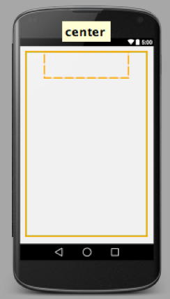
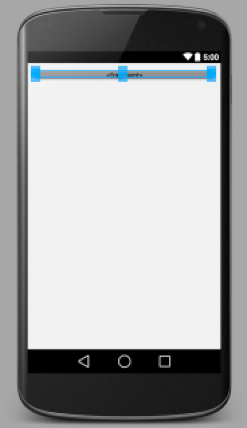

# AdapterViews and Fragments

Last week we looked at some 'simple' widgets and layouts. Simple here refers to the fact that those widgets are mainly used to display/collect small amount static data. What if the data are of a large quantity or dynamically generated? Shall we put say 20 headlines from a newspaper in TextViews one after another? Obviously the answer is no here. Let's find out how.

## Lab 1 AdapterViews

We have looked at Spinner, which is a special case i.e. subclass of AdapterView. In order to make it work, we had to combine three elements: the View itself (Spinner), the data resource which is typically a Collection (interface), an Adaptor that binds every *single entry* in the Collection with its layout. 


Now let's look at some more subclasses of AdapterView.

### Simple ListView

Follow steps below to create a simple ListView:

1. Insert the following into string.xml. We need to have some data to play with.
    
    ```xml
    <string-array name="candidateNames">
        <item>Hillary Clinton</item>
        <item>Bernie Sanders</item>
        <item>Martin O\'Malley</item>
        <item>Lincoln Chafee</item>
        <item>Donald Trump</item>
        <item>Ben Carson</item>
        <item>Marco Rubio</item>
        <item>Jeb Bush</item>
    </string-array>

    <string-array name="candidateDetails">
        <item>Former US Secretary of State Hillary Clinton (New York)</item>
        <item>US Senator Bernie Sanders (Vermont)</item>
        <item>Former Governor Martin O\'Malley (Maryland)</item>
        <item>Former Governor Lincoln Chafee (Rhode Island)</item>
        <item>Businessman Donald Trump (New York)</item>
        <item>Dr. Ben Carson (Florida)</item>
        <item>US Senator Marco Rubio (Florida)</item>
        <item>Former Governor Jeb Bush (Florida)</item>
    </string-array>
    ```
    
    > There's no Biden - on 21st this month, he announced he will not run for president in 2016. What a shame!
    
    > For the latest poll, click [here](http://www.realclearpolitics.com/epolls/latest_polls/president/).
    
2. Open content_main.xml, replace the TextView with the following
    
    ```xml
    <ListView
        android:id="@+id/listView"
        android:layout_width="match_parent"
        android:layout_height="wrap_content"></ListView>
    ```
    
3. Open MainActivity.java, insert the following declarations:
    
    ```java
    private ListView listView;
    private String[] candidateNames;
    ```
    
    The three steps above should be simple to understand.
    
4. Again in MainActivity.java, insert the following into the `onCreate()` method
    
    ```java
    candidateNames = getResources().getStringArray(R.array.candidateNames);
    
    listView = (ListView) findViewById(R.id.listView);
    // replace \ with left angle bracket in the line below
    ArrayAdapter\String> arrayAdapter = new ArrayAdapter\String>(this, android.R.layout.simple_list_item_1, candidateNames);
    listView.setAdapter(arrayAdapter);
    listView.setOnItemClickListener(
    
            new AdapterView.OnItemClickListener() {
                @Override
                public void onItemClick(AdapterView<?> parent, View view, int position, long id) {
                    Toast.makeText(getBaseContext(), candidateNames[position] + ", seriously?", Toast.LENGTH_SHORT).show();
                }
            }
    );
    ```
    
    What the code above does is to associate the ListView we declared in the layout file with the data we declared in string resource. ArrayAdapter takes three parameters: context, a layout resource for a single element of data, and the data. Here `android.R.layout.simple_list_item_1` is a system-defined resource layout file that contains only one TextView. You can define you own resource files as you see later on.
    
    > [simple_list_item_1](https://github.com/android/platform_frameworks_base/blob/master/core/res/res/layout/simple_list_item_1.xml) on Github.
    
    Inside `setOnItemClickListener()` block is an anonymous inner class. There're two ways of defining an onClickListener, one is to do `public void doSomething(View v)` and then associate with View's onClick attribute in xml, the other is what you see here. Note here instead of declaring `View.onClick()` for Buttons, which you've seen a lot already, we declared `AdapterView.OnItemClickListener()` wich is specific for AdapterViews. Here 'parent' is the parent view of single data entry, in our case is the ListView,  view is the View being clicked, position is the 'index' of current view within the adapter, id is the row id the data entry.
    
    The question mark inside angle brackets is Java generic wildcard, which basically means the type of parent passed into the method is an AdapterView of any type.
    
    If you run the app, what you'll see is this:
    
    


### Complex ListView

Simple ListView is useful for displaying data that can be converted to strings in easy steps. But if you want to fine-control the presentation of single entries in your ListView, you need to provide customized layout files for your adapter. This way, you'll make it a 'complex ListView'.

Following steps below to create the data we need later on:

1. Click on this [link](https://github.com/covcom/388COM/blob/master/Week_05_AdapterViews%20and%20Fragments/.md_images/candidates_photos.zip) to go to our GitHub page and the click 'Raw' to download some photos of the candidates. Add those to your drawable resources folder.
2. Create a new class called Candidates and insert the following 
    
    > A good point raised by Sumeet Gopiani is that it should be called 'Candidate' instead. I totally agree - I'll change it in the next year!
    
    ```java
    public class Candidates {

    private String name;
    private String detail;
    private int photo;

    public Candidates(String name, String detail, int photo) {
        this.name = name;
        this.detail = detail;
        this.photo = photo;
    }

    public String getName() {
        return name;
    }

    public String getDetail() {
        return detail;
    }

    public int getPhoto() {
        return photo;
    }

    @Override
    public String toString() {
        return detail;
    }
    }
    ```

Now we're ready to build our customized ListView.

1. Create a new layout resource file by right-clicking on the layout folder. Name it list_item.xml. Insert the following 
    
    ```xml
    <LinearLayout xmlns:android="http://schemas.android.com/apk/res/android"
    android:layout_width="match_parent"
    android:layout_height="match_parent"
    android:orientation="horizontal">
    
    <ImageView
        android:id="@+id/imageView"
        android:layout_width="85dp"
        android:layout_height="85dp"
        android:background="@android:color/darker_gray"
        android:padding="8dp"
        android:layout_marginLeft="5dp"
        android:layout_marginTop="5dp"
        android:scaleType="centerCrop" />
    
    <LinearLayout
        android:layout_width="match_parent"
        android:layout_height="wrap_content"
        android:layout_marginLeft="30dp"
        android:layout_marginTop="20dp"
        android:orientation="vertical">
    
        <TextView
            android:id="@+id/textViewName"
            android:layout_width="match_parent"
            android:layout_height="wrap_content"
            android:text="first + last name"
            android:textSize="16dp" />
        
        <TextView
            android:id="@+id/textViewDetail"
            android:layout_width="match_parent"
            android:layout_height="wrap_content"
            android:layout_marginTop="8dp"
            android:text="details of the candidate"
            android:textSize="12dp" />
    
    </LinearLayout>
    
    </LinearLayout>
    ```
    
    At the moment, your preview window should look like below. This is the layout for a single item in your list.
    
    
    
2. Create a new 'Empty Activity' called PhotoListActivity. Open activity_photo_list.xml, replace what's in it with the following:
    
    ```xml
    <RelativeLayout xmlns:android="http://schemas.android.com/apk/res/android"
    xmlns:tools="http://schemas.android.com/tools"
    android:layout_width="match_parent"
    android:layout_height="match_parent"
    android:paddingBottom="@dimen/activity_vertical_margin"
    android:paddingLeft="@dimen/activity_horizontal_margin"
    android:paddingRight="@dimen/activity_horizontal_margin"
    android:paddingTop="@dimen/activity_vertical_margin"
    tools:context="com.example.jianhuayang.mylists.PhotoListActivity">
    
    <TextView
        android:layout_width="wrap_content"
        android:layout_height="wrap_content"
        android:textAppearance="?android:attr/textAppearanceLarge"
        android:text="2016 Presidential Candidates"
        android:id="@+id/textView"
        android:layout_alignParentTop="true"
        android:layout_alignParentLeft="true"
        android:layout_alignParentStart="true" />
    
    <ListView
        android:layout_width="wrap_content"
        android:layout_height="wrap_content"
        android:id="@+id/listView2"
        android:layout_below="@+id/textView"
        android:layout_marginTop="20dp"/>
    
    </RelativeLayout>
    
    ```
    This layout is very similar to the one we've just seen.
    
3. Open PhotoListActivity.java, replace the contents of the class with the following
    
    ```java
    
    public static int[] candidatePhotos = {
            R.drawable.clinton,
            R.drawable.sanders,
            R.drawable.omalley,
            R.drawable.chafee,
            R.drawable.trump,
            R.drawable.carson,
            R.drawable.rubio,
            R.drawable.bush
    };
    private String[] candidateNames;
    private String[] candidateDetails;
    // replace \ with angle brackets
    private ArrayList\Candidates> candidates = new ArrayList<>();

    ListView listView;

    @Override
    protected void onCreate(Bundle savedInstanceState) {
        super.onCreate(savedInstanceState);
        setContentView(R.layout.activity_photo_list);

        candidateNames = getResources().getStringArray(R.array.candidateNames);
        candidateDetails = getResources().getStringArray(R.array.candidateDetails);
        generateCandidates();

        listView = (ListView) findViewById(R.id.listView2);
        listView.setAdapter(new CandidatesAdapter(this, R.layout.list_item, candidates));
        listView.setOnItemClickListener(

                new AdapterView.OnItemClickListener() {

                    @Override
                    // replace \ with angle brackets
                    public void onItemClick(AdapterView\?> parent, View view, int position, long id) {

                        Toast.makeText(getBaseContext(), "You clicked " + candidates.get(position), Toast.LENGTH_SHORT).show();
                    }
                }
        );
    }

    private void generateCandidates() {

        // replace \ with angle brackets
        for (int i = 0; i \ candidatePhotos.length; i++) {
            candidates.add(new Candidates(candidateNames[i], candidateDetails[i], candidatePhotos[i]));
        }
    }
    ```
    
    We declared an array of integers for drawable resources fist, then initialized an ArrayList for our data. The onClickListner is the same as before. The only thing that is new here is the association of data to ListView is through a customized Adapter, as we'll see later. 
    
4. Create a new class called CandidatesAdapter. Open the java file generated and replace its contents with the following lines of code
    
    ```java
    // replace \ with left angle bracket in the line below
    public class CandidatesAdapter extends ArrayAdapter\Candidates>{
    
    private int resource;
    // replace \ with left angle bracket in the line below
    private ArrayList\Candidates> candidates;
    private Context context;
    
    // replace \ with left angle bracket in the line below
    public CandidatesAdapter(Context context, int resource, ArrayList\Candidates> candidates) {
        super(context, resource, candidates);
        this.resource = resource;
        this.candidates = candidates;
        this.context = context;
    }
    
    @Override
    public View getView(int position, View convertView, ViewGroup parent){
        View v = convertView;
        try{
            if (v == null){
                LayoutInflater layoutInflater = (LayoutInflater) context.getSystemService(Context.LAYOUT_INFLATER_SERVICE);
                v = layoutInflater.inflate(resource, parent, false);
            }
            
            ImageView imageView = (ImageView) v.findViewById(R.id.imageView);
            TextView textViewName = (TextView) v.findViewById(R.id.textViewName);
            TextView textViewDetail = (TextView) v.findViewById(R.id.textViewDetail);
            
            imageView.setImageResource(candidates.get(position).getPhoto());
            textViewName.setText(candidates.get(position).getName());
            textViewDetail.setText(candidates.get(position).getDetail());
            
        }
        catch (Exception e){
            e.printStackTrace();
            e.getCause();
        }
        return v;
    }
    
    }
    ```
    
    It's important to understand the code above: our CandidatesAdapter class extends ArrayAdapter of type Candidates. In the constructor, we give the layout resource name i.e. the file that contains the custom layout, the one we created earlier. The most important method is getView, where we check if a convertView (i.e. old view) exists or not. If it doesn’t, we’ll need to inflate it. The reason we do this is because ListView recycles its rows when they move out of the screen, instead of creating new ones, to save system resources. 
    
    > [How ListView's recycling mechanism works](http://stackoverflow.com/questions/11945563/how-listviews-recycling-mechanism-works)
    
    There're several different ways of getting an LayoutInflater object:
    
    * The way we did it, `LayoutInflater layoutInflater = (LayoutInflater) context.getSystemService(Context.LAYOUT_INFLATER_SERVICE)`, is from official [documentation](http://developer.android.com/reference/android/view/LayoutInflater.html).
    * You could use `LayoutInflater inflater = ((Activity)context).getLayoutInflater()`, see an example from [here](http://www.ezzylearning.com/tutorial/customizing-android-listview-items-with-custom-arrayadapter).
    * You could also use `LayoutInflater inflater = (LayoutInflater) CandidatesAdapter.this.getSystemService(Context.LAYOUT_INFLATER_SERVICE)`, see an example from [here](http://www.codelearn.org/android-tutorial/android-listview).
    
    Note here `v.findViewById()` is different from `findViewById()`. `v.findViewById()` will only find sub views i.e. views being contained by 'v'; whereas `findViewById()` will find anything contained in the Activity.
    
5. Insert the following into menu_main.xml
    
    ```xml
    <item
        android:id="@+id/action_photo_list"
        android:orderInCategory="10"
        android:title="PhotoList"
        app:showAsAction="always" />
    ```
    
6. Open MainActivity.java, make `onOptionsItemSelected()` look like the following
    
    ```java
    @Override
    public boolean onOptionsItemSelected(MenuItem item) {
        // Handle action bar item clicks here. The action bar will
        // automatically handle clicks on the Home/Up button, so long
        // as you specify a parent activity in AndroidManifest.xml.
        int id = item.getItemId();
        //noinspection SimplifiableIfStatement
        switch (id){
            case R.id.action_photo_list:
                startActivity(new Intent(this, PhotoListActivity.class));
                return true;
            case R.id.action_settings:
                return true;
            default:
                return super.onOptionsItemSelected(item);
        }
    }
    ```
    
    Steps 5 & 6 are necessary to complete your app, but those two steps should be familiar by now. If you run the app, click on 'PhotoList' in the toolbar, you'll see the following:
    
    

### Grid View

Previous two examples showed you ArrayAdapter and customized ArrayAdapter. In fact, ArrayAdapter is a subclass of BaseAdapter. Let's now go one step further and see how to customized BaseAdapter.

Following steps below to create a GridView and provide a customized BaseAdaptor.

1. Create a new Empty Activity called GridAcitivty. Open activity_grid.xml and replace what's in it with the following
    
    ```xml
    <GridView xmlns:android="http://schemas.android.com/apk/res/android"
    xmlns:tools="http://schemas.android.com/tools"
    android:id="@+id/gridView"
    android:layout_width="match_parent"
    android:layout_height="match_parent"
    android:columnWidth="90dp"
    android:gravity="center"
    android:horizontalSpacing="10dp"
    android:numColumns="auto_fit"
    android:paddingBottom="@dimen/activity_vertical_margin"
    android:paddingLeft="@dimen/activity_horizontal_margin"
    android:paddingRight="@dimen/activity_horizontal_margin"
    android:paddingTop="@dimen/activity_vertical_margin"
    android:stretchMode="columnWidth"
    android:verticalSpacing="10dp"
    tools:context="com.example.jianhuayang.mylists.GridActivity">
    </GridView>
    ```
    
    There're some new attributes here, but most of them are self-explanatory.
    
2. Open GridActivity.java, replace `onCreate()` with the following. The only thing new here is the Adapter, which we'll look at next.
    ```java
    @Override
    protected void onCreate(Bundle savedInstanceState) {
        super.onCreate(savedInstanceState);
        setContentView(R.layout.activity_grid);
        GridView gridview = (GridView) findViewById(R.id.gridView);
        gridview.setAdapter(new ImageAdapter(this));

        gridview.setOnItemClickListener(new AdapterView.OnItemClickListener() {
            public void onItemClick(AdapterView<?> parent, View v, int position, long id) {
                Toast.makeText(getBaseContext(), "At position " + position + " is " + getResources().getStringArray(R.array.candidateNames)[position], Toast.LENGTH_SHORT).show();
            }
        });
    }
    ```
    
3. Create a new class called ImageAdapter, and insert the following
    
    ```java
    public class ImageAdapter extends BaseAdapter {
    
    private int[] candidatePhotos = PhotoListActivity.candidatePhotos;
    private Context context;
    
    public ImageAdapter(Context context) {
        this.context = context;
    }
    
    public int getCount() {
        return candidatePhotos.length;
    }
    
    public Object getItem(int position) {
        return null;
    }
    
    public long getItemId(int position) {
        return 0;
    }
    
    // create a new ImageView for each item referenced by the Adapter
    public View getView(int position, View convertView, ViewGroup parent) {
        ImageView imageView;
        if (convertView == null) {  // if it's not recycled, initialize some attributes
            imageView = new ImageView(context);
            imageView.setLayoutParams(new GridView.LayoutParams(200, 200));
            imageView.setScaleType(ImageView.ScaleType.CENTER_CROP);
            imageView.setPadding(8, 8, 8, 8);
        } else {
            imageView = (ImageView) convertView;
        }
        
        imageView.setImageResource(candidatePhotos[position]);
        return imageView;
    }
    }
    ```
    
    BaseAdapter is the superclass of different Adapters, but it's an abstract class. That means you have to provide concrete implementations for all abstract methods. That's why you see `getItem()` and `getId()` above. Although we don't use those two methods in our example we have to implement them. `getCount()` return the size of the data. The most important one is still `getView()`. Here instead of using layout resource file, we programmatically add layout widgets into the parent, and set it's properties. `GridView.LayoutParams()` creates an GridView.LayoutParams object that resides inside the parent view, which is a GridView in our case.
    
5. Insert the following into menu_main.xml
    
    ```xml
    <item
        android:id="@+id/action_grid"
        android:orderInCategory="20"
        android:title="GridView"
        app:showAsAction="always" />
    ```
    
6. Open MainActivity.java, insert the followin case into `onOptionsItemSelected()`
    
    ```java
    case R.id.action_grid:
                startActivity(new Intent(this, GridActivity.class));
                return true;
    ```
    
    If you run the app and click on 'GridView', you'll see something similar to below
    
    

### AdapterView hierarchy

You have seen BaseAdapter and ArrayAdapter, if you Google online examples you'll see more Adapters such as ListAdapter and SimpleAdapter etc. What are the relationships among these?

Basically ArrayAdapter is the first concrete Adapter in the tree, above it are interfaces and an abstract class. But sometimes people do declare something like `ListAdapter listAdapter = new ArrayAdapter<String>()`, don't be confused.


A similar hierarchy can be drawn for AdapterView and subclasses. Even though those 'collection' Views are named differently, they are in fact closely related to each other.


> Above images from a [blog](http://www.intertech.com/Blog/android-adapters-adapterviews/) written by Jim White.

## Lab 2 Fragments

When Android was first created, the screens weren't very big so there's no need to reuse part of the layout. But later on as screen sizes get bigger and bigger, Google introduced Fragments, which is basically a fraction of your layout. The idea is that Fragments can be reused to suit different screen sizes. We'll see some examples in the current lab.

### Static Fragments

Follow steps below to add static Fragments:

1. Start a new Android Studio project called 'My Fragments' using all default options. Open content_main.xml and change RelativeLayout to LinearLayout. 
    
    > Now if you go to the Design view of this layout file, go to 'Component Tree', right click on LinearLayout, under the menu called Morphing you’ll be able to switch back from LinearLayout to RelativeLayout. But if the layout is RelativeLayout (default option), this ‘morphing’ menu doesn’t show. This is a design feature (bug?) of Android Studio.
    
    > 
    
2. Delete the TextView, and add `android:orientation` attribute as vertical.
3. Right-click on the blank area of the Project tool window, select NewFragmentFragment (blank). If the system doesn’t give you the option to create new Fragment, check that if you are under the Android view. In the window that pops up, uncheck both 'include fragment factory methods' and 'include interface callbacks'. Use the default name 'BlankFragment' and click Finish. 
4. Repeat the above process for a second time to produce a second fragment, and name it BlankFragment2. After this step, your project should contain three java classes and three (or four depending on your version) layout files. The project view of Android Studio should look like this
    
    
    
5. Double click to open fragment_blank.xml. Note the TODO sentence online No.6. This is a nice feature of Android Studio. If you click on the TODO tab at the bottom of the workbench you’ll see that all TODOs are being summarized there.
    
    
    
6. Change the layout from FrameLayout to LinearLayout, add vertical as orientation. Change the TextView text to 'This is fragment No.1'. 
7. In the LinearLayout opening tag, add `android:background="#00FF00"`. Once you finish adding the text, leave your mouse within the text for a bit and Android Studio will pop up a small help window to let you choose your color. Follow the link to choose the desired color.
    
    > If you are using a Mac, you need to type in key combinations 'alt' + '3' to insert the # sign. 
    
8. Repeat the steps 6 & 7 above for fragment_blank2.xml, i.e. change layout, add orientation, change TextView text to 'This is fragment No.2', and change the background color to "#ff191e". Now we have two fragments and we’re ready to put them on our activity.
9. Open your content_main.xml, in Design view, scroll down Palette until you see fragment under Custom tab. Actually that’s almost the end, you can’t scroll down any further. Click on BlandFrangment ==> OK and leave it at the center of the screen. You fragment will appear as a narrow line as below. This is because the layout_height was set to be 'wrap_content'. Just leave it for now.
    
    
    
    
    
10. Add BlandFrangment2 onto your layout using similar steps as above. For each fragment, change layout_height to "0dp" and add the following attribute `android:layout_weight="1"`. Now each fragment will take up approximately half of the screen. (Not exactly because of the padding spaces). Your xml should now look like the following:
    
    ```xml
    <fragment
        android:layout_width="match_parent"
        android:layout_height="0dp"
        android:layout_weight="1"
        android:name="com.example.jianhuayang.myfragments.BlankFragment"
        android:id="@+id/fragment"
        android:layout_gravity="center_horizontal" />

    <fragment
        android:layout_width="match_parent"
        android:layout_height="0dp"
        android:layout_weight="1"
        android:name="com.example.jianhuayang.myfragments.BlankFragment2"
        android:id="@+id/fragment2"
        android:layout_gravity="center_horizontal" />
    ```
    
11. If you run your app you should have something similar to the one below.
    
    

### Programmatically add the fragment

In the previous example, you added static Fragments into your layout resource file. This is possible, but a more handy way to do it is to add Fragments programmatically.

1. Create an Empty Activity called DynamicActivity.
2. Open activity_dynamic.xml, insert the following into the default RelativeLayout tag `android:id="@+id/dynamicContainer"`.
3. Open DynamicActivity.java, modify the `onCreate()` method so it looks like below:
    
    ```java
        @Override
    protected void onCreate(Bundle savedInstanceState) {
        super.onCreate(savedInstanceState);
        setContentView(R.layout.activity_dynamic);

        FragmentManager fragmentManager = getFragmentManager();
        FragmentTransaction fragmentTransaction = fragmentManager.beginTransaction();
        if (getResources().getConfiguration().orientation == Configuration.ORIENTATION_LANDSCAPE) {
            BlankFragment frag1 = new BlankFragment();
            fragmentTransaction.replace(R.id.dynamicContainer, frag1);
        } else {
            BlankFragment2 frag2 = new BlankFragment2();
            fragmentTransaction.replace(R.id.dynamicContainer, frag2);
        }
        fragmentTransaction.commit();
    }
    ```
    
    In order to have Fragments loaded in your Java code, we first created a FragmentManager, which is followed by FragmentTransaction. FragmentManager, as the name suggests, can be used to track Fragments i.e. `findFragmentById()` or `findFragmentByTag()`. It can also be used to pop fragments off the back stack, or  register a listener for changes to the back stack. FragmentTransaction is used to manipulate Fragments. It has methods such as `add()`, `remove()`, and `replace()`. To apply the transaction to the activity, you must call `commit()`.
    
    `getResources().getConfiguration().orientation` is a way to determine screen orientation. Click [here](http://developer.android.com/reference/android/content/res/Configuration.html#orientation) to read the manual on Configuration class.
    
    > Check out this StackOverflow question on Android orientation [link](http://stackoverflow.com/questions/2795833/check-orientation-on-android-phone).
    
4. Add the following into menu_main.xml
    
    ```xml
    <item
        android:id="@+id/action_dynamic"
        android:orderInCategory="90"
        android:title="@string/action_dynamic"
        app:showAsAction="ifRoom" />
    ```
    
5. Replace the  method with the following
    
    ```java
       @Override
    public boolean onOptionsItemSelected(MenuItem item) {
        // Handle action bar item clicks here. The action bar will
        // automatically handle clicks on the Home/Up button, so long
        // as you specify a parent activity in AndroidManifest.xml.
        int id = item.getItemId();

        switch (id) {
            case R.id.action_dynamic:
                startActivity(new Intent(this, DynamicActivity.class));
                return true;
            case R.id.action_settings:
                return true;
            default:
                return super.onOptionsItemSelected(item);
        }

    }
    ```
    
6. If you run the app and click 'Dynamic', you'll have two different Fragments for different orientations.
    
    
    
    
    

### ListFragments

So far we have only dealt with Fragments that contain static data, we haven't used any AdapterViews we learned in the 1st lab. Let's now move to an example where we combine Fragments with ListView i.e. ListFragments. ListFragment displays a list of items that are managed by an adapter.

First of all, we need to provide some data for the app.

1. Copy the 8 photos you downloaded previously into the drawable folder of the current project.
2. Right-click on the package name of your project, select New ==> Package. Give it a name of 'data'.
    
    
    
3. Within the 'data' package, create a new class and name it Candidates. Insert the following code into the class
    
    ```java
    public final class Candidates {
    
    public static final String[] candidateNames = {
            "Hillary Clinton",
            "Bernie Sanders",
            "Martin O'Malley",
            "Lincoln Chafee",
            "Donald Trump",
            "Ben Carson",
            "Marco Rubio",
            "Jeb Bush"
    };
    public static final String[] candidateDetails = {
            "Former US Secretary of State Hillary Clinton (New York)",
            "US Senator Bernie Sanders (Vermont)",
            "Former Governor Martin O\'Malley (Maryland)",
            "Former Governor Lincoln Chafee (Rhode Island)",
            "Businessman Donald Trump (New York)",
            "Dr. Ben Carson (Florida)",
            "US Senator Marco Rubio (Florida)",
            "Former Governor Jeb Bush (Florida)",
    };
    
    public static final int[] candidatePhotos = {
            R.drawable.clinton,
            R.drawable.sanders,
            R.drawable.omalley,
            R.drawable.chafee,
            R.drawable.trump,
            R.drawable.carson,
            R.drawable.rubio,
            R.drawable.bush
    };
    
    }
    ```
    
Now we're ready to create the new Fragment.

1. Create a new Fragment by clicking New ==> Fragment ==> Fragment (list). Uncheck 'Include fragment...' and 'Switch to...' checkboxes, leave the name as defaults, and click Finish.
2. You'll see a 'dummy' folder automatically created. Delete that folder. Surprisingly the system didn't automatically generate a layout file for you. This is because the default setting is that each ListFragment has one and only one ListView with it.
3. Change the `setListAdapter()` method to the following
    
    ```java
    // replace \ with angle bracket in the line below
    setListAdapter(new ArrayAdapter\String>(getActivity(),
                android.R.layout.simple_list_item_1, android.R.id.text1, Candidates.candidateNames));
    ```
    
4. Change `public void onFragmentInteraction(String id)` to `public void onFragmentInteraction(int position)`. Basically we want an int to be passed in this interface method.
5. Change `mListener.onFragmentInteraction(DummyContent.ITEMS.get(position).id)` to `mListener.onFragmentInteraction(position)`. This is to accomodate the change in the previous step. Steps 3 - 5 should is the same as ListView.
6. Create an Empty Activity and name it ListFragmentActivity. Open activity_list_fragment.xml, insert an id attribute `android:id="@+id/ListFrameLayout"`.
7. Open ListFragmentActivity.java, modify your code so that it looks like the following:
    
    ```java
    public class ListFragmentActivity extends AppCompatActivity implements ItemFragment.OnFragmentInteractionListener{

    @Override
    protected void onCreate(Bundle savedInstanceState) {
        super.onCreate(savedInstanceState);
        setContentView(R.layout.activity_list_fragment);

        getFragmentManager().beginTransaction().add(R.id.ListFrameLayout, new ItemFragment()).commit();
    }

    @Override
    public void onFragmentInteraction(int position){
        Toast.makeText(getBaseContext(), Candidates.candidateNames[position], Toast.LENGTH_SHORT).show();
    }
    }
    ```
    
    Note here to communicate from Fragment back to Activity, we had to make sure the Activity implements the interface. This is because the same Fragment might be used in several different Activities, it needs to know which one is being called using the interface contract.
    
8. Add a menu item and case for the new Activity
    
    ```xml
    <item
        android:id="@+id/action_list"
        android:orderInCategory="80"
        android:title="@string/action_list"
        app:showAsAction="ifRoom" />
    ```
    
    ```java
        case R.id.action_list:
        startActivity(new Intent(this, ListFragmentActivity.class));
        return true;
    ```
    
    If you run the app and click 'Lists' you'll see the following
    
    
    

### Two-panel layouts

Now you've seen how to combine AdapterView with Fragments, now it's time to move on to multi-panel layouts you often see in apps such as Gmail etc. In multi-panel apps, there's a list panel which you select and click, in the detail panel the contents will get updated accordingly.

1. Create a new blank Fragment, uncheck the two 'include...' checkboxes. Name it DetailsFragment. Open fragment_details.xml and insert the following. This fragment is going to be used to display candidates details.
    
    ```xml
    <FrameLayout xmlns:android="http://schemas.android.com/apk/res/android"
    xmlns:tools="http://schemas.android.com/tools"
    android:layout_width="match_parent"
    android:layout_height="match_parent"
    tools:context="com.example.jianhuayang.myfragments.DetailsFragment"
    android:id="@+id/detailsFrameLayout">

    <!-- TODO: Update blank fragment layout -->
    <LinearLayout
        android:layout_width="match_parent"
        android:layout_height="match_parent"
        android:id="@+id/detailsLinearLayout"
        android:orientation="vertical">

        <ImageView
            android:id="@+id/imageView"
            android:layout_width="150dp"
            android:layout_height="200dp"
            android:layout_gravity="center_horizontal"
            android:layout_marginTop="20dp" />

        <TextView
            android:id="@+id/description"
            android:layout_width="match_parent"
            android:layout_height="wrap_content"
            android:layout_gravity="center_horizontal"
            android:layout_marginTop="20dp"
            android:gravity="center" />

    </LinearLayout>
    
    </FrameLayout>
    ```
    
2. Insert the following lines into DetailsFragment.java. What we do here is that we get any data that passed into the fragment first of all. In a way similar to `getIntent()` for activities, for Fragments we use `getArguments()`. The arguments are typically a Bundle. Depending on if the Bundle is empty, we initialize the views accordingly.
    
    ```java
    public static final String POSITION = "position";
    
    @Override
    public void onStart() {
        super.onStart();
        Bundle args = getArguments();
        if (args != null) {
            int position = args.getInt(POSITION);
            TextView description = (TextView) getActivity().findViewById(R.id.description);
            description.setText(Candidates.candidateDetails[position]);
            ImageView imageView = (ImageView) getActivity().findViewById(R.id.imageView);
            imageView.setImageResource(Candidates.candidatePhotos[position]);
        } else {
            TextView description = (TextView) getActivity().findViewById(R.id.description);
            description.setText("Click on the names on the left to see details");
        }
    }
    ```
    
3. Create an empty activity called MultiPanelActivity. Open activity_multi_panel.xml and insert the following
    
    ```xml
    <LinearLayout xmlns:android="http://schemas.android.com/apk/res/android"
    xmlns:tools="http://schemas.android.com/tools"
    android:id="@+id/multiPanel"
    android:layout_width="match_parent"
    android:layout_height="match_parent"
    android:orientation="horizontal"
    android:paddingBottom="@dimen/activity_vertical_margin"
    android:paddingLeft="@dimen/activity_horizontal_margin"
    android:paddingRight="@dimen/activity_horizontal_margin"
    android:paddingTop="@dimen/activity_vertical_margin"
    tools:context="com.example.jianhuayang.myfragments.MultiPanelActivity">

    <FrameLayout
        android:id="@+id/fragmentLeft"
        android:layout_width="0dp"
        android:layout_height="match_parent"
        android:layout_gravity="center_vertical"
        android:layout_weight="1" />

    <FrameLayout
        android:id="@+id/fragmentRight"
        android:layout_width="0dp"
        android:layout_height="match_parent"
        android:layout_weight="2" />
    </LinearLayout>
    ```
    
    FrameLayout here is used as placeholders for out fragments.
    
4. Open MultiPanelActivity.java and insert the following
    
    ```java
    public class MultiPanelActivity extends AppCompatActivity implements ItemFragment.OnFragmentInteractionListener {
    
    @Override
    protected void onCreate(Bundle savedInstanceState) {
        super.onCreate(savedInstanceState);
        setContentView(R.layout.activity_multi_panel);
        
        if (savedInstanceState == null){
            getFragmentManager().beginTransaction().add(R.id.fragmentLeft, new ItemFragment()).commit();
            getFragmentManager().beginTransaction().add(R.id.fragmentRight, new DetailsFragment()).commit();
        }
    }
    
    @Override
    public void onFragmentInteraction(int position) {
    
        DetailsFragment detailsFragment = (DetailsFragment)
                getFragmentManager().findFragmentById(R.id.fragmentRight);
                
        if (detailsFragment != null) {
            
            DetailsFragment detailsFragmentNew = new DetailsFragment();
            Bundle bundle = new Bundle();
            bundle.putInt(DetailsFragment.POSITION, position);
            detailsFragmentNew.setArguments(bundle);
            FragmentManager fragmentManager = getFragmentManager();
            FragmentTransaction fragmentTransaction = fragmentManager.beginTransaction();
            fragmentTransaction.replace(R.id.fragmentRight, detailsFragmentNew);
            fragmentTransaction.addToBackStack(null);
            fragmentTransaction.commit();
            
        }
        
    }
    
    }
    ```
    
    In the code above, we initialise the layouts in `onCreate()`. 'savedInstanceState' is used to check if we're restoring from a screen rotation i.e. configuration change. `findFragmentById()` is to check if we're in a dual panel mode, which is the case. This step isn't necessary for our current app, but it's important that you know you can use it to track fragments.
    
    Instead of creating a new fragment and pass data to it, you can use two lines of code to update the fragment. What are those?
    
5. Open ItemFragment.java and insert the following:
    
    ```java
    @Override
    public void onStart() {
        super.onStart();
        getListView().setChoiceMode(ListView.CHOICE_MODE_SINGLE);
        getListView().setSelector(android.R.color.darker_gray);
    
    }
    
    The default behavior at the moment is that you click the ListView and the item you clicked doesn't stay highlighted. The code above is to make the item you clicked stays highlighted. This is the first time you see `onStart()`, we'll have a look at it later.
    
6. Finally, insert the menu item in the xml and the switch in Java file. In menu_main.xml:
    
    ```xml
    <item
        android:id="@+id/action_panel"
        android:orderInCategory="70"
        android:title="@string/action_panel"
        app:showAsAction="ifRoom" 
    />
    ```
    
    In MainActivity.java:
    
    ```java
    case R.id.action_panel:
    startActivity(new Intent(this, MultiPanelActivity.class));
    return true;
    ```
    
    If you run the app, you'll see something similar to below
    
    

### Fragment lifecycle


> Above images created by [Steve Pomeroy](https://github.com/xxv/android-lifecycle).

You have seen methods such as `onCreate()`, `onCreateView()`, and `onStart()`. All these are Fragment lifecycle callbacks, similar to Activity callbacks. The most important things to remember:

* Fragments need to have empty constructors. (Don't ask me why!) Data passed into it need to use `setArguments()`.
* `onAttach()` is specific to fragments. If your Activity implements some interfaces, in your Fragment you need to `getActivity()` there so you can all the interface methods.
* Activity coordinates Fragments lifecycle. For example, when the activity receives `onPause()`, each fragment in the activity receives `onPause()`.

## Lab 3 Advanced topics

In a similar module run by Professor Andrew T. Campbell at Dartmouth College, they used some material from the official Android samples. Follow the tutorial at [here](http://www.cs.dartmouth.edu/~campbell/cs65/lecture09/lecture09.html) and answer the following questions:

* What did they use to manage state between orientation flips?
* How did they achieve fragment transition from TitlesFragment to DetailsFragment?

