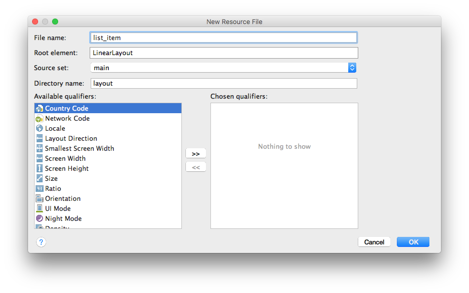
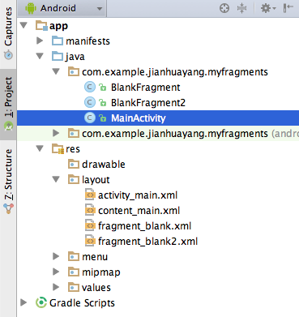
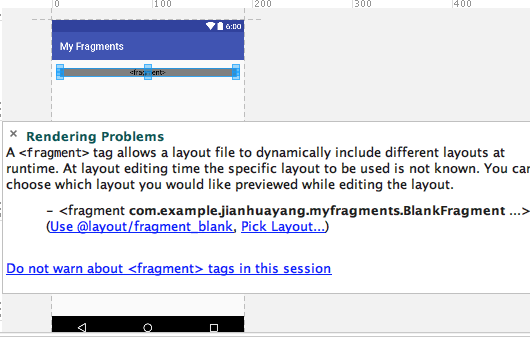
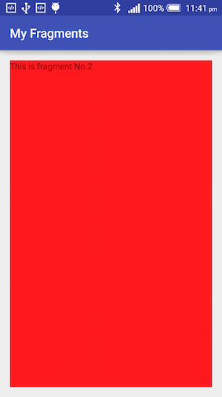
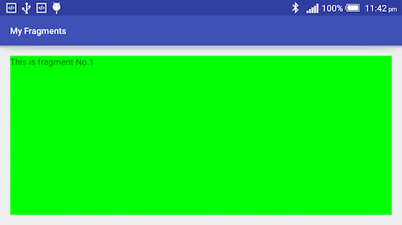
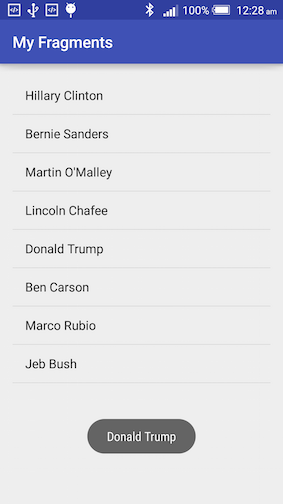

# AdapterViews and Fragments

Last week we looked at some 'simple' widgets and layouts. Simple here refers to the fact that those widgets are mainly used to display/collect a small amount of data. What if the data are of a large quantity or dynamically generated? Do we put say 200 student records in TextViews one after another? Obviously, the answer is no here. Let's find out how to do it properly.

> On 20th October 2016, winners were announced for this year's Google Material Design Awards, check it out [here](http://www.xda-developers.com/winners-announced-for-googles-material-design-awards-2016/).

## Lab 1 AdapterViews

We looked at Spinner previously, which is a special case i.e. subclass of AdapterView. In order to get it work, we had to combine three elements: the View itself (Spinner), the data resource which is typically a Collection (interface), an Adaptor that binds every *single entry* in the Collection with its layout. 


Now let's look at some more subclasses of AdapterView.

### Simple ListView

Using default options, create a new project and name it 'My Lists'. Then, follow steps below to create a simple list:

1. First of all, we need to have some data to play with. Insert the following into string.xml. 
    
    ```xml
    <string-array name="candidateNames">
        <item>Hillary Clinton</item>
        <item>Bernie Sanders</item>
        <item>Martin O\'Malley</item>
        <item>Lincoln Chafee</item>
        <item>Donald Trump</item>
        <item>Ben Carson</item>
        <item>Marco Rubio</item>
        <item>Jeb Bush</item>
    </string-array>

    <string-array name="candidateDetails">
        <item>Former US Secretary of State Hillary Clinton (New York)</item>
        <item>US Senator Bernie Sanders (Vermont)</item>
        <item>Former Governor Martin O\'Malley (Maryland)</item>
        <item>Former Governor Lincoln Chafee (Rhode Island)</item>
        <item>Businessman Donald Trump (New York)</item>
        <item>Dr. Ben Carson (Florida)</item>
        <item>US Senator Marco Rubio (Florida)</item>
        <item>Former Governor Jeb Bush (Florida)</item>
    </string-array>
    ```
    > For the latest polls on US presidential election, click [here](http://www.realclearpolitics.com/epolls/latest_polls/president/).
    
2. Open activity_main.xml, delete the default TextView and drag/drop a ListView from Containers sub-group in Palette. In text mode, rearrange XML so it looks like this
    
    ```xml
    <ListView
        android:id="@+id/listViewSimple"
        android:layout_width="match_parent"
        android:layout_height="match_parent"
        android:layout_alignParentRight="true"
        android:layout_alignParentEnd="true"
        android:layout_alignParentTop="true" />
    ```
    
3. Open MainActivity.java, insert the following declarations:
    
    ```java
    private ListView listView;
    private String[] candidateNames;
    ```
    
    The three steps above are 'routines' when you create new projects i.e. the model (string array), view (ListView), and controller (Activity).
    
4. In MainActivity.java, insert the following into the `onCreate()` method
    
    ```java
    candidateNames = getResources().getStringArray(R.array.candidateNames);
    
    listView = (ListView) findViewById(R.id.listViewSimple);
    ArrayAdapter<String> arrayAdapter = new ArrayAdapter<String>(this, android.R.layout.simple_list_item_1, candidateNames);
    listView.setAdapter(arrayAdapter);
    listView.setOnItemClickListener(
    
            new AdapterView.OnItemClickListener() {
                @Override
                public void onItemClick(AdapterView<?> parent, View view, int position, long id) {
                    Toast.makeText(getBaseContext(), candidateNames[position] + ", seriously?", Toast.LENGTH_SHORT).show();
                }
            }
    );
    ```
    
    What the code above does is to associate the ListView declared in the layout file with the data (string array) declared in string resource. ArrayAdapter takes three parameters: context, a layout resource for a single element of data, and the data. Here `android.R.layout.simple_list_item_1` is a system-defined resource layout file that contains only one TextView. You can define you own resource files as you see later on.
    
    > [simple_list_item_1](https://github.com/android/platform_frameworks_base/blob/master/core/res/res/layout/simple_list_item_1.xml) on Github.
    
    Inside `setOnItemClickListener()` block is an anonymous inner class, which was mentioned many times already in our class. There're two ways of defining an onClickListener, one is to do `public void doSomething(View v)` and then associate with View's `onClick` attribute in XML, the other is what you see here. Note here instead of declaring `View.onClick()` for Buttons, which you (hopefully) have seen a lot already, we declared `AdapterView.OnItemClickListener()` wich is specific for AdapterViews. Here 'parent' is the parent view of single data entry, in our case is the ListView,  view is the View being clicked, position is the 'index' of current view within the adapter, id is the row id the data entry.
    
    The question mark inside angle brackets is Java generic wildcard, which basically means the type of parent passed into the method is an AdapterView of any type.
    
If you run the app, what you'll see is something like this:


### Complex ListView

Simple ListView is useful for displaying data that can be converted to strings in easy steps. But if you want to have fine control of the presentation of single entries in your ListView, you need to provide customized layout files for your adapter. In this way, you'll make it a 'complex ListView'.

1. First of all, download some images to use later on. Click on [this link](https://github.com/covcom/300CEM/blob/master/Week_05_AdapterViews_and_Fragments/.md_images/candidates_photos.zip) to go to GitHub page and then click 'View Raw' to download some images of US presidential election candidates. Add those to your res/drawable resources folder.
    
2. Create a new Java class called Candidate and insert the following 
    
    ```java
    private String name;
    private String detail;
    private int photo;

    public Candidate(String name, String detail, int photo) {
        this.name = name;
        this.detail = detail;
        this.photo = photo;
    }

    public String getName() {
        return name;
    }

    public String getDetail() {
        return detail;
    }

    public int getPhoto() {
        return photo;
    }

    @Override
    public String toString() {
        return detail;
    }
    ```
    
3. Create a new layout resource file by right-clicking on the layout folder and select New ==> Layout resource file. Name it list_item.xml. 
    
    
    
    Change the default orientation of the container LinearLayout from `vertical` to `horizontal`, and insert the following within the LinearLayout
    
    ```xml
    <ImageView
        android:id="@+id/imageView"
        android:layout_width="85dp"
        android:layout_height="85dp"
        android:layout_marginLeft="5dp"
        android:layout_marginTop="5dp"
        android:background="@android:color/darker_gray"
        android:padding="8dp"
        android:scaleType="centerCrop" />

    <LinearLayout
        android:layout_width="match_parent"
        android:layout_height="wrap_content"
        android:layout_marginLeft="30dp"
        android:layout_marginTop="20dp"
        android:orientation="vertical">

        <TextView
            android:id="@+id/textViewName"
            android:layout_width="match_parent"
            android:layout_height="wrap_content"
            android:text="first + last name"
            android:textSize="16sp" />

        <TextView
            android:id="@+id/textViewDetail"
            android:layout_width="match_parent"
            android:layout_height="wrap_content"
            android:layout_marginTop="8dp"
            android:text="details of the candidate"
            android:textSize="12sp" />

    </LinearLayout>
    ```
    
    At the moment, your preview window should look like below. This is the layout for a single item in your list.
    
    
    
4. Create a new activity using the 'Empty Activity' template and name it PhotoListActivity. Open activity_photo_list.xml, insert the following into the container RelativeLayout:
    
    ```xml
    <TextView
        android:id="@+id/textView"
        android:layout_width="wrap_content"
        android:layout_height="wrap_content"
        android:layout_alignParentLeft="true"
        android:layout_alignParentStart="true"
        android:layout_alignParentTop="true"
        android:text="2016 Presidential Candidates"
        android:textAppearance="?android:attr/textAppearanceLarge" />

    <ListView
        android:id="@+id/listViewComplex"
        android:layout_width="wrap_content"
        android:layout_height="wrap_content"
        android:layout_below="@+id/textView"
        android:layout_marginTop="20dp" />
    ```
    
    This layout is very similar to the one we saw earlier in the simple list example. The only difference is that it has an additional TextView above ListView.
    
5. In PhotoListActivity.java, add the following class member variable declaration/initialization.
    
    ```java
    private ListView listView;
    private String[] candidateNames;
    private String[] candidateDetails;
    public static int[] candidatePhotos = {
            R.drawable.clinton,
            R.drawable.sanders,
            R.drawable.omalley,
            R.drawable.chafee,
            R.drawable.trump,
            R.drawable.carson,
            R.drawable.rubio,
            R.drawable.bush
    };
    private ArrayList<Candidate> candidates = new ArrayList<>();
    ```
    
    One thing to note in the code above is that an array of integers is declared for drawable resources. The type is int, why?
    
6. Insert the following into the `onCreate()` method, just below `setContentView()`, to initialize variables
    
    ```java
    @Override
    protected void onCreate(Bundle savedInstanceState) {
        super.onCreate(savedInstanceState);
        setContentView(R.layout.activity_photo_list);

        candidateNames = getResources().getStringArray(R.array.candidateNames);
        candidateDetails = getResources().getStringArray(R.array.candidateDetails);
        generateCandidates();
    ```
    
    Insert the following code at outside of `onCreate()` but inside the class. This is to create a function that initializes the ArrayList for Candidate class.
    
    ```java
    private void generateCandidates() {

        for (int i = 0; i < candidatePhotos.length; i++) {
            candidates.add(new Candidate(candidateNames[i], candidateDetails[i], candidatePhotos[i]));
        }
    }
    ```
    
7. Insert the following code into `onCreate()` method
    
    ```java
    listView = (ListView) findViewById(R.id.listViewComplex);
        listView.setAdapter(new CandidateAdapter(this, R.layout.list_item, candidates));
        listView.setOnItemClickListener(
        
                new AdapterView.OnItemClickListener() {
                    @Override
                    public void onItemClick(AdapterView<?> parent, View view, int position, long id) {
                    
                        Toast.makeText(getBaseContext(), "You clicked " + candidates.get(position), Toast.LENGTH_SHORT).show();
                    }
                }
        );
    ```
    
    The code above initialize a ListView and associates it with a customized Adapter. The onClickListner is the same as in the simple list example. The only thing that is new here is the association of data and ListView through a customized Adapter. We'll look at it in a minute. 
    
8. Create a new class called CandidateAdapter. Open the Java file and replace auto-generated class with the following (don't touch the package declaration!)
    
    ```java
    public class CandidateAdapter extends ArrayAdapter<Candidate> {

        private int resource;
        private ArrayList<Candidate> candidates;
        private Context context;

        public CandidateAdapter(Context context, int resource, ArrayList<Candidate> candidates) {
            super(context, resource, candidates);
            this.resource = resource;
            this.candidates = candidates;
            this.context = context;
        }

        @NonNull
        @Override
        public View getView(int position, View convertView, ViewGroup parent) {
            View v = convertView;
            try {
                if (v == null) {
                    LayoutInflater layoutInflater = (LayoutInflater) context.getSystemService(Context.LAYOUT_INFLATER_SERVICE);
                    v = layoutInflater.inflate(resource, parent, false);
                }

                ImageView imageView = (ImageView) v.findViewById(R.id.imageView);
                TextView textViewName = (TextView) v.findViewById(R.id.textViewName);
                TextView textViewDetail = (TextView) v.findViewById(R.id.textViewDetail);

                imageView.setImageResource(candidates.get(position).getPhoto());
                textViewName.setText(candidates.get(position).getName());
                textViewDetail.setText(candidates.get(position).getDetail());

            } catch (Exception e) {
                e.printStackTrace();
                e.getCause();
            }
            return v;
        }

    }
    ```
    
    It's important to understand the code above: our CandidatesAdapter class extends ArrayAdapter of type Candidates. In the constructor, we provide the layout resource name i.e. the file that contains the customized layout XML created earlier. The most important method is `getView()`, where we check if a convertView (i.e. old view) exists or not. If it doesn’t, we’ll need to inflate it. The reason we do this is because ListView recycles its rows when they move out of the screen, instead of creating new ones, to save system resources. 
    
    > [How ListView's recycling mechanism works](http://stackoverflow.com/questions/11945563/how-listviews-recycling-mechanism-works)
    
    There're several different ways of getting an LayoutInflater object:
    
    * The way we did it, `LayoutInflater layoutInflater = (LayoutInflater) context.getSystemService(Context.LAYOUT_INFLATER_SERVICE)`, is from official [documentation](http://developer.android.com/reference/android/view/LayoutInflater.html).
    * You can use `LayoutInflater inflater = ((Activity)context).getLayoutInflater()`, see an example from [here](http://www.ezzylearning.com/tutorial/customizing-android-listview-items-with-custom-arrayadapter).
    * You can also use `LayoutInflater inflater = (LayoutInflater) CandidatesAdapter.this.getSystemService(Context.LAYOUT_INFLATER_SERVICE)`, see an example from [here](https://github.com/pranayairan/Code-Learn-Android-Example/blob/master/CodeLearnListExample/src/org/codelearn/codelearnlistexample/ListViewWithBaseAdapter.java).
    
    Note here `v.findViewById()` is different from `findViewById()`. `v.findViewById()` will only find sub views i.e. views being contained by 'v'; whereas `findViewById()` will find anything contained in the Activity.
    
9. Insert the following into activity_main.xml before the ListView
    
    ```xml
    <Button
        android:id="@+id/complexList"
        android:layout_width="wrap_content"
        android:layout_height="wrap_content"
        android:onClick="onButtonClick"
        android:text="Complex List" />
    ```
    
    Insert the following attribute into the ListView `android:layout_below="@id/complexList"`, and remove attribute `android:layout_alignParentTop="true"` if it is in there.
    
10. Open MainActivity.java, insert the following into the class
    
    ```java
    public void onButtonClick(View v){
        startActivity(new Intent(this, PhotoListActivity.class));
    }
    ```
    
Steps 9 & 10 are needed only for the sake of demonstration. If you run the app, click on 'Complex List' button, you'll see the following:


### Grid View

<!--https://developer.android.com/guide/topics/ui/layout/gridview.html-->
Previous two examples used default ArrayAdapter and customized (extended) ArrayAdapter. In fact, ArrayAdapter is a subclass of BaseAdapter. Let's now go one step further and see how to customize (extend) BaseAdapter. In the following example, you'll learn how to create a GridView and provide a customized BaseAdaptor for it.

1. Create a new Activity using the 'Empty Activity' template and name it GridAcitivty. Open activity_grid.xml and change the container layout from RelativeLayout to GridView. Insert the following attributes into the opening tag of GridView:
    
    ```xml
    android:columnWidth="90dp"
    android:gravity="center"
    android:horizontalSpacing="10dp"
    android:numColumns="auto_fit"
    android:stretchMode="columnWidth"
    android:verticalSpacing="10dp"
    ```
    
    There are new attributes, but they are quite self-explanatory.
    
2. Open GridActivity.java, insert the following code into `onCreate()` just before the ending curly brackets '}'.
    
    ```java
    GridView gridview = (GridView) findViewById(R.id.activity_grid);
    gridview.setAdapter(new ImageAdapter(this));

    gridview.setOnItemClickListener(new AdapterView.OnItemClickListener() {
        public void onItemClick(AdapterView<?> parent, View v, int position, long id) {
            Toast.makeText(getBaseContext(), "At position " + position + " is " + getResources().getStringArray(R.array.candidateNames)[position], Toast.LENGTH_SHORT).show();
        }
    });
    ```
    The only thing new here is the ImageAdapter, which we'll look at next.
    
3. Create a new class called ImageAdapter. Replace the auto-generated class with the following
    
    ```java
    public class ImageAdapter extends BaseAdapter {

        private int[] candidatePhotos = PhotoListActivity.candidatePhotos;
        private Context context;

        public ImageAdapter(Context context) {
            this.context = context;
        }

        @Override
        public int getCount() {
            return candidatePhotos.length;
        }

        @Override
        public Object getItem(int position) {
            return null;
        }

        @Override
        public long getItemId(int position) {
            return 0;
        }

        public View getView(int position, View convertView, ViewGroup parent) {
            ImageView imageView;
            if (convertView == null) {
                imageView = new ImageView(context);
                imageView.setLayoutParams(new GridView.LayoutParams(200, 200));
                imageView.setScaleType(ImageView.ScaleType.CENTER_CROP);
                imageView.setPadding(8, 8, 8, 8);
            } else {
                imageView = (ImageView) convertView;
            }

            imageView.setImageResource(candidatePhotos[position]);
            return imageView;
        }

    }
    ```
    
    BaseAdapter is the superclass of different Adapters, but it's an abstract class. That means you have to provide concrete implementations for all abstract methods. That's why you see `getItem()` and `getItemId()` above. Although we don't use those two methods in our example we have to implement them. `getCount()` return the size of the data. The most important one is still `getView()`. Here instead of using layout resource file, we programmatically add layout widgets into the parent and set it's properties. `GridView.LayoutParams()` creates an GridView.LayoutParams object that resides inside the parent view, which is a GridView in our case.
    
5. Insert the following into activity_main.xml, just before the ListView
    
    ```xml
    <Button
        android:id="@+id/gridView"
        android:layout_width="wrap_content"
        android:layout_height="wrap_content"
        android:layout_below="@id/complexList"
        android:onClick="onButtonClick"
        android:text="Grid View" />
    ```
    
    Change the ListView attribute `android:layout_below` value from `"@id/complexList"` to `"@id/gridView"`.
    
10. Open MainActivity.java, insert the following into the class
    
    ```java
    public void onButtonClick(View v){
        startActivity(new Intent(this, PhotoListActivity.class));
    }
    ```
6. Open MainActivity.java, replace contents of `onButtonClick()` with the following
    
    ```java
    switch (v.getId()) {
        case R.id.complexList:
            startActivity(new Intent(this, PhotoListActivity.class));
            break;
        case R.id.gridView:
            startActivity(new Intent(this, GridActivity.class));
            break;
    }
    ```
    
If you run the app and click on 'GridView', you'll see something similar to below


### AdapterView hierarchy

You saw BaseAdapter and ArrayAdapter already. If you Google online examples you'll see more Adapters such as ListAdapter and SimpleAdapter etc. What are the relationships among these?

Basically, ArrayAdapter is the first concrete Adapter in the tree, above it are interfaces and an abstract class. But sometimes people do declare something like `ListAdapter listAdapter = new ArrayAdapter<String>()`, don't be confused.


A similar hierarchy can be drawn for AdapterView and subclasses. Even though those 'collection' Views are named differently, they are in fact closely related to each other.


> Above images from a [blog](http://www.intertech.com/Blog/android-adapters-adapterviews/) written by Jim White.

## Lab 2 Fragments

When Android was first created, the typical mobile devices' screens weren't very big so there's no need to reuse any part of the layout. But later on, as screen sizes get bigger and bigger, Google introduced Fragments, which is basically a fraction of your layout. The idea is that Fragments can be reused to suit different screen sizes/orientations.

### Static Fragments

Follow steps below to add static Fragments:

1. Start a new Android Studio project called 'My Fragments' using all default options. Open activity_main.xml, change RelativeLayout to LinearLayout, add `android:orientation` attribute as vertical.
2. Delete the TextView.
3. Right-click on the blank area of the Project tool window, select New ==> Fragment ==> Fragment (blank). If the system doesn’t give you the option to create new Fragment, check that if you are under the Android view. In the window that pops up, **uncheck both** 'include fragment factory methods' and 'include interface callbacks'. Use the default name 'BlankFragment' and click Finish. 
4. Repeat the above process for a second time to produce another fragment. In the Configure Component window, name the new fragment 'BlankFragment2', and set the Fragment Layout Name to be 'fragment_blank2'. After this step, your project should contain three java classes and three layout files (or four if you can see 'content_main.xml', depending on your Android Studio version). The project view of Android Studio should look like this
    
    
    
5. Double click to open fragment_blank.xml. Note the TODO sentence online No.7. This is a nice feature of Android Studio. If you click on the TODO tab at the bottom of the workbench you’ll see that all TODOs are being summarized there.
    
    
    
6. In fragment_blank.xml, change the layout from FrameLayout to LinearLayout, add vertical as orientation. Change the TextView text to 'This is fragment No.1'. 
7. In the LinearLayout opening tag, add `android:background="#00FF00"`.
    
    > If you are using a Mac, you need to type in key combinations 'alt' + '3' to insert the # sign. 
    
8. Repeat the steps 6 & 7 above for fragment_blank2.xml, i.e. change layout, add orientation, change TextView text to 'This is fragment No.2', and change the background color to be "#ff191e".
    
    Now we have two fragments and we’re ready to put them on our activity.
    
9. Open your activity_main.xml, in Design view, scroll down Palette until you see fragment under Layouts sub-group. Drag/drop fragment from Palette onto graphical layout and the system will give you a list of Fragments to choose from. Select BlankFragment and click OK. What you'll see next is that your fragment appears like a narrow line, and the system gives you some warning messages. Click on 'Use @layout/fragment_blank' to continue.
    
    
        
10. In the same way, add BlandFrangment2 onto your layout. In text mode, for each fragment, change layout_height to "0dp" and add the following attribute `android:layout_weight="1"`. Now each fragment will take up approximately half of the screen. (Not exactly because of the padding spaces). Your XML should now look like the following:
    
    ```xml
    <fragment
        android:id="@+id/fragment"
        android:name="com.example.jianhuayang.myfragments.BlankFragment"
        android:layout_width="match_parent"
        android:layout_height="0dp"
        android:layout_weight="1"
        tools:layout="@layout/fragment_blank" />

    <fragment
        android:id="@+id/fragment2"
        android:name="com.example.jianhuayang.myfragments.BlankFragment2"
        android:layout_width="match_parent"
        android:layout_height="0dp"
        android:layout_weight="1"
        tools:layout="@layout/fragment_blank2" />
    ```
    
If you run your app you should have something similar to the one below.


### Programmatically add the fragment

In the previous example, you added static Fragments into your layout resource file. This is possible, but a more handy way to do it is to add Fragments programmatically.

1. Create an Empty Activity called DynamicActivity.
2. Open DynamicActivity.java, insert the following code into `onCreate()`, just below the `setContentView()` method:
    
    ```java
    FragmentManager fragmentManager = getSupportFragmentManager();
    FragmentTransaction fragmentTransaction = fragmentManager.beginTransaction();
    if (getResources().getConfiguration().orientation == Configuration.ORIENTATION_LANDSCAPE) {
        BlankFragment frag1 = new BlankFragment();
        fragmentTransaction.replace(R.id.activity_dynamic, frag1);
    } else {
        BlankFragment2 frag2 = new BlankFragment2();
        fragmentTransaction.replace(R.id.activity_dynamic, frag2);
    }
    fragmentTransaction.commit();
    ```
    
    In order to have Fragments loaded in your Java code, we first created a FragmentManager, which is followed by FragmentTransaction. FragmentManager, as the name suggests, can be used to track Fragments i.e. `findFragmentById()` or `findFragmentByTag()`. It can also be used to pop fragments off the back stack, or  register a listener for changes to the back stack. FragmentTransaction is used to manipulate Fragments. It has methods such as `add()`, `remove()`, and `replace()`. To apply the transaction to the activity, you must call `commit()`.
    
    `getResources().getConfiguration().orientation` is a way to determine screen orientation. Click [here](http://developer.android.com/reference/android/content/res/Configuration.html#orientation) to read the manual on Configuration class. There're other ways to determine screen orientation, e.g. `getWindowManager().getDefaultDisplay().getRotation()`, check it out on [StackOverflow](http://stackoverflow.com/questions/2795833/check-orientation-on-android-phone).
    
3. Add the following into activity_main.xml, before the first fragment
    
    ```xml
    <Button
        android:id="@+id/dynamicFragments"
        android:layout_width="wrap_content"
        android:layout_height="wrap_content"
        android:onClick="onButtonClick"
        android:text="Dynamic fragments" />
    ```
    
4. Insert the following method into MainActivity.java
    
    ```java
    public void onButtonClick(View v){
        startActivity(new Intent(this, DynamicActivity.class));
    }
    ```
    
If you run the app and click the 'Dynamic fragments', you'll have two different Fragments for different orientations.





### ListFragment

So far we have only dealt with Fragments that contain static data, we haven't used any of the AdapterViews we learned previously. Let's now move to an example where we combine Fragments with ListView i.e. ListFragments. ListFragment displays a list of items that are managed by an adapter.

1. First of all, we need to have some data to play with. Copy the 8 photos you downloaded for project 'My Lists' into the drawable folder of the current project.
2. Right-click on the package name of your project, select New ==> Package. Give it a name of 'data'.
    
    
    
3. Within the 'data' package, create a new class and name it Candidates. Insert the following code into the class
    
    ```java
    public static final String[] candidateNames = {
            "Hillary Clinton",
            "Bernie Sanders",
            "Martin O'Malley",
            "Lincoln Chafee",
            "Donald Trump",
            "Ben Carson",
            "Marco Rubio",
            "Jeb Bush"
    };
    public static final String[] candidateDetails = {
            "Former US Secretary of State Hillary Clinton (New York)",
            "US Senator Bernie Sanders (Vermont)",
            "Former Governor Martin O\'Malley (Maryland)",
            "Former Governor Lincoln Chafee (Rhode Island)",
            "Businessman Donald Trump (New York)",
            "Dr. Ben Carson (Florida)",
            "US Senator Marco Rubio (Florida)",
            "Former Governor Jeb Bush (Florida)",
    };
    public static final int[] candidatePhotos = {
            R.drawable.clinton,
            R.drawable.sanders,
            R.drawable.omalley,
            R.drawable.chafee,
            R.drawable.trump,
            R.drawable.carson,
            R.drawable.rubio,
            R.drawable.bush
    };
    ```
    
    If you see 'R' is highlighted using red underline, you'll need to import the 'R' class. Now we're ready to create a new Fragment.
    
4. Create a new Fragment using the Blank Fragment template, uncheck the 'Create layout XML' box, also uncheck the two 'include...' checkboxes. Name this fragment ItemFragment. Open ItemFragment.java, replace superclass Fragment with ListFragment, and implement AdapterView.OnItemClickListener. Now your class declaration should look like this
    
    ```java
    public class ItemFragment extends ListFragment implements AdapterView.OnItemClickListener
    ```
    
    The reason why we unchecked '' is that ListFragment has a default layout that consists of a single list view. We can manipulate this ListView in Java code.
    
5. Insert the following code into the ItemFragment class.
    ```java
    @Override
    public void onActivityCreated(@Nullable Bundle savedInstanceState) {
        super.onActivityCreated(savedInstanceState);
        setListAdapter(new ArrayAdapter<String>(getActivity(),
                android.R.layout.simple_list_item_1, android.R.id.text1, Candidates.candidateNames));
        getListView().setOnItemClickListener(this);
    }

    @Override
    public void onItemClick(AdapterView<?> parent, View view, int position, long id) {
        Toast.makeText(getActivity(), Candidates.candidateNames[position], Toast.LENGTH_SHORT).show();
    }
    ```
    
    In code above, `onItemClick()` should look familiar now. The only thing new here is the `onActivityCreated()` callback method. As we'll see later, there're a few lifecycle callback methods that are specific to fragments. This is one of those. It'll be called when the activity associated with the fragment is created.
    
6. Create an Empty Activity and name it ListFragmentActivity. Open ListFragmentActivity.java, insert the following line of code into `onCreate()`, just below `setContentView()`
    
    ```java
    getSupportFragmentManager().beginTransaction().add(R.id.activity_list_fragment, new ItemFragment()).commit();
    ```
    
7. Follow previous instructions (points No.3 & 4 in 'Programmatically add the fragment') to add a button called 'List Fragment' in activity_main.xml, associate this button with an intent that goes to ListFragmentActivity. 
    
Now if you run the app and click 'List Fragment' you'll see the following
    


### Two-panel layouts

You often see multi-panel layouts in apps such as Gmail. In some of these apps, there's a list panel where you can click and select, and then in the detail panel contents will get updated accordingly. The following exercise teaches you how to do something alike

1. Create a new blank Fragment, uncheck the two 'include...' checkboxes. Name it DetailsFragment. This fragment is going to be used to display candidates details. Open fragment_details.xml, delete the auto-generated TextView and insert the following attribute into FragmentLayout. 
    ```xml
    android:id="@+id/detailsFrameLayout"
    ```
    
    Insert the following widgets into the FragmentLayout
    ```xml
    <LinearLayout
        android:id="@+id/detailsLinearLayout"
        android:layout_width="match_parent"
        android:layout_height="match_parent"
        android:orientation="vertical">

        <ImageView
            android:id="@+id/imageView"
            android:layout_width="150dp"
            android:layout_height="200dp"
            android:layout_gravity="center_horizontal"
            android:layout_marginTop="20dp" />

        <TextView
            android:id="@+id/description"
            android:layout_width="match_parent"
            android:layout_height="wrap_content"
            android:layout_gravity="center_horizontal"
            android:layout_marginTop="20dp"
            android:gravity="center" />
    </LinearLayout>
    ```
    
2. Insert the following lines into DetailsFragment class. What we do here is that we get any data that passed into the fragment first of all. In a way similar to `getIntent()` for activities, for Fragments we use `getArguments()`. The arguments are typically a Bundle. Depending on if the Bundle is empty, we initialize the views accordingly.
    
    ```java
    public static final String POSITION = "position";
    
    @Override
    public void onStart() {
        super.onStart();
        Bundle args = getArguments();
        if (args != null) {
            int position = args.getInt(POSITION);
            TextView description = (TextView) getActivity().findViewById(R.id.description);
            description.setText(Candidates.candidateDetails[position]);
            ImageView imageView = (ImageView) getActivity().findViewById(R.id.imageView);
            imageView.setImageResource(Candidates.candidatePhotos[position]);
        } else {
            TextView description = (TextView) getActivity().findViewById(R.id.description);
            description.setText("Click on the names on the left to see details");
        }
    }
    ```
    
3. Create an empty activity called MultiPanelActivity. Open activity_multi_panel.xml, change the container layout from RelativeLayout to horizontal LinearLayout and insert the following FrameLayouts. FrameLayouts here are used as placeholders for our fragments.

    
    ```xml
    <FrameLayout
        android:id="@+id/fragmentLeft"
        android:layout_width="0dp"
        android:layout_height="match_parent"
        android:layout_gravity="center_vertical"
        android:layout_weight="1" />

    <FrameLayout
        android:id="@+id/fragmentRight"
        android:layout_width="0dp"
        android:layout_height="match_parent"
        android:layout_weight="2" />
    ```
    
4. Open MultiPanelActivity.java and make the class implement `AdapterView.OnItemClickListener` interface. So your class declaration should look like this
    
    ```java
    public class MultiPanelActivity extends AppCompatActivity implements AdapterView.OnItemClickListener
    ```
    
    Insert the following overriding `onItemClick()` method into the class. By doing this, this MultiPanelActivity is capable of handling clicks that take place within an AdapterView.
    
    ```java
    @Override
    public void onItemClick(AdapterView<?> parent, View view, int position, long id) {
        DetailsFragment detailsFragmentNew = new DetailsFragment();
        Bundle bundle = new Bundle();
        bundle.putInt(DetailsFragment.POSITION, position);
        detailsFragmentNew.setArguments(bundle);
        FragmentManager fragmentManager = getSupportFragmentManager();
        FragmentTransaction fragmentTransaction = fragmentManager.beginTransaction();
        fragmentTransaction.replace(R.id.fragmentRight, detailsFragmentNew);
        fragmentTransaction.addToBackStack(null);
        fragmentTransaction.commit();
    }
    ```
    
    >Instead of creating a new fragment and passing data to it, you can use just one line of code to update, what will that be? Navigate to MyFragment sample project MultiPanelActivity.java source code to find out.
    
5. In MultiPanelActivity class, insert the following code into `onCreate()` method, below `setContentView()`. This will initialize the activity with the two fragments.
    
    ```java
    if (savedInstanceState == null){
        getSupportFragmentManager().beginTransaction().add(R.id.fragmentLeft, new
                ItemFragment()).commit();
        getSupportFragmentManager().beginTransaction().add(R.id.fragmentRight, new
                DetailsFragment()).commit();
    }
    ```
    
    The code above initializes the activity layout in `onCreate()` using the two fragments. 'savedInstanceState' is used to check if we're restoring from configuration change e.g. screen rotation.
    
6. Open ItemFragment.java and replace `getListView().setOnItemClickListener(this);` with the following. This code checks the container activity and set OnItemClickListener accordingly. 
    
    ```java
    if (getActivity() instanceof ListFragmentActivity) {
        getListView().setOnItemClickListener(this);
    }

    if (getActivity() instanceof MultiPanelActivity) {
        getListView().setOnItemClickListener((MultiPanelActivity) getActivity());
    }
    ```
    
    Insert the following method into the ItemFragment class
    
    ```java
    @Override
    public void onStart() {
        super.onStart();
        getListView().setChoiceMode(ListView.CHOICE_MODE_SINGLE);
        getListView().setSelector(android.R.color.darker_gray);
    }
    ```
    
<!--    above from http://stackoverflow.com/questions/5853719/highlighting-the-selected-item-in-the-listview-in-android-->
    The default behavior of ListView is that you click the ListView item but the item you clicked doesn't stay highlighted. The code above makes the item you clicked stays highlighted. This is the first time you see `onStart()`, we'll have a look at it later.
    
7. Follow previous instructions (points No.3 & 4 in 'Programmatically add the fragment') to add a button called 'Multipanel' in activity_main.xml, associate this button with an intent that goes to MultiPanelActivity.
    
If you run the app, you'll see something similar to below


> The exercise here is a simplified version of a sample from the official API guide. For the original full version, see [here](https://developer.android.com/reference/android/app/Fragment.html) and [here](https://developer.android.com/guide/components/fragments.html).

### Fragment lifecycle


> Above images created by [Steve Pomeroy](https://github.com/xxv/android-lifecycle).

You have seen methods such as `onCreate()`, `onCreateView()`, and `onStart()`. All these are Fragment lifecycle callbacks, similar to Activity callbacks. The most important things to remember:

* Fragments need to have empty constructors (and don't ask me why). Data passed into it need to use `setArguments()`.
* `onAttach()` is specific to fragments. There're several other fragment-specific call-back functions. Read the [official guide](https://developer.android.com/guide/components/fragments.html) for details on this.
* Activity coordinates Fragments lifecycle. For example, when the activity receives `onPause()`, each fragment in the activity receives `onPause()`.

## Lab 3 Advanced topics

### The RecylerView in Material design

List fragment template (i.e. Fragment (list)) has changed since the release of Android Studio 2. The recommended way of doing ListFragment is through a view called [RecyclerView](). Now try to generate a list fragment using that template and see how much you understand the source code including the auto-generated dummy folder?

### Module taught at US Dartmouth College


In a similar module run by Professor Andrew T. Campbell at the US Dartmouth College, they also used some material from the official Android samples. Follow their tutorial [here](http://www.cs.dartmouth.edu/~campbell/cs65/lecture09/lecture09.html) and answer the following questions:

* What did they use to manage state between orientation flips?
* How did they achieve fragment transition from TitlesFragment to DetailsFragment?

