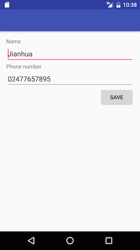
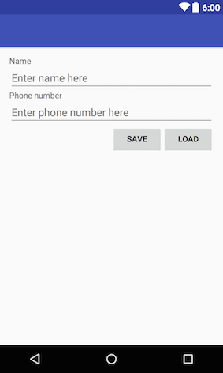
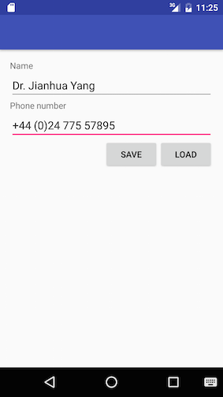
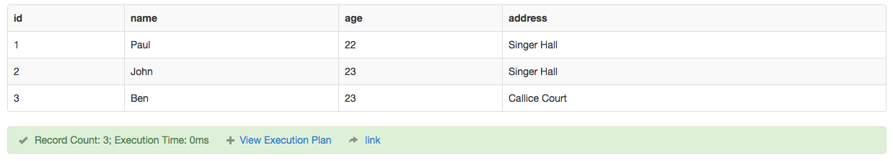
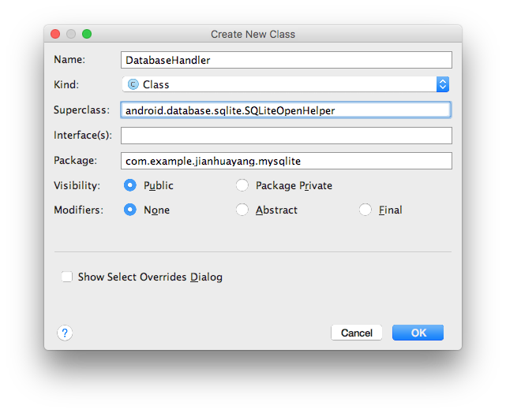
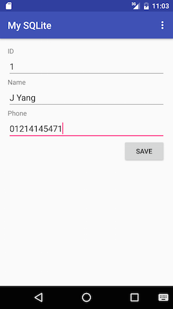

# Data persistence

Data persistence refers to the fact that data need to persist through app life cycle changes. In other words, even if you close the app completely the data need to be restored when the user navigates back to the app. There're several ways to save data in Android. First of all, we'll look at using SharedPreferences and File APIs. Later on, we'll see how to save data using SQL databases.

> The most common mistake people make when demonstrating data persistence is that they press the Home button when they finish saving data and then tap the app icon again to bring the app back. NO! That's NOT how you demonstrate data persistence! The proper way of doing it is, after saving your data, you close the app completely using app switcher e.g. the square button and then start your app again by tapping the icon.

> To understand why this is the case we need to remind ourselves about Activity Lifecycle. What happens when you press the Home button is `onPause()` => `onStop()`. In contrast, what happens when you press the Back button is `onPause()` => `onStop()` => `onDestroy()`. In other words, when a user clicks the Back button, they are telling Android that they are done with the activity. Android will destroy the Activity. In contrast, when the user clicks the Home button the activity is merely placed into the background – Android will not kill the activity.

## Lab 1 SharedPreferences and files

### SharedPreferences

SharedPreferences is a way to save simple key-value pairs. In fact, the file produced by SharedPreferences API is a plain xml file similar to the resource files you provide for the system. 

Follow steps below to prepare the layout xml file:

1. Start a new Android Studio project and name it 'My SharedPreference'. In activity_main.xml, change RelativeLayout to LinearLayout, add `android:orientation="vertical"`.
2. In the Design view, drag and drop the following items onto the layout in the order of Plain Text, TextView, and Phone. All these three go below the 'Hello World' TextView that was automatically generated by the system.
3. Double click on the first TextView and in the Properties tool window change the text to Name, and id to name. Double click on the second TextView and change the text to 'Phone number', and id to 'phone'.
4. Double click on the first EditText and delete the text string (leave it empty), and change the id to nameText. For the second EditText, again delete the text string change the id to phoneText.
5. Switch to the Text view and add `android:hint="Enter name here"` for EditText 'nameText' and `android:hint="Enter phone number here"` for EditText 'phoneText' respectively. 
6. Switch to Design view, drag and drop a Button onto the layout. Make sure both width and height are set to 'wrap_content' and align it to the right of the screen. Set the text as 'Save', id as 'button'. 

The finished layout file should look like below:

```xml
<TextView
    android:id="@+id/name"
    android:layout_width="wrap_content"
    android:layout_height="wrap_content"
    android:text="Name"/>

<EditText
    android:id="@+id/nameText"
    android:layout_width="match_parent"
    android:layout_height="wrap_content"
    android:ems="10"
    android:hint="Enter name here"
    android:inputType="textPersonName"/>

<TextView
    android:id="@+id/phone"
    android:layout_width="match_parent"
    android:layout_height="wrap_content"
    android:text="Phone numer"/>

<EditText
    android:id="@+id/phoneText"
    android:layout_width="match_parent"
    android:layout_height="wrap_content"
    android:ems="10"
    android:hint="Enter phone number here"
    android:inputType="textCapWords|phone"
    />

<Button
    android:id="@+id/button"
    android:layout_width="wrap_content"
    android:layout_gravity="right"
    android:layout_height="wrap_content"
    android:text="Save"/>
```


Next, we need to use SharedPreferences API to save some simple data.

1. Open MainActivity.java file and insert the following declarations immediately after the class declaration:
    
    ```java
    private EditText editTextName;
    private EditText editTextPhone;
    public static final String NAME_KEY = "NAME_KEY";
    public static final String PHONE_KEY = "PHONE_KEY";
    private SharedPreferences sharedPreferences;
    ```
    
    Here we initialized two EditText objects that hold the user inputs and two static strings we're going to use as keys in the key-value pairs.
    
2. Modify the `onCreate()` method to match the following:
    
    ```java
    @Override
    protected void onCreate(Bundle savedInstanceState) {
        super.onCreate(savedInstanceState);
        setContentView(R.layout.activity_main);
        
        editTextName = (EditText) findViewById(R.id.nameText);
        editTextPhone = (EditText) findViewById(R.id.phoneText);
        sharedPreferences = getSharedPreferences("MySharedPreMain", Context.MODE_PRIVATE);
        
        if (sharedPreferences.contains(NAME_KEY)) {
            editTextName.setText(sharedPreferences.getString(NAME_KEY, ""));
        }
        
        if (sharedPreferences.contains(PHONE_KEY)) {
            editTextPhone.setText(sharedPreferences.getString(PHONE_KEY, ""));
        }
    }
    ```
    
    There're several methods offered by the SharedPreferences class, here we used `contains()` and `getString()` method to test if the SharedPreferenes object contains a specific key. If it does, we'll get the data out.
    
3. Create a call-back method that responds to the click event of the only button, as in the code below. Don't forget the `commit()` method, which is similar to `commit()` in FragmentTransaction. We also need to update the xml file to associate the button with this method by inserting `android:onClick="save"` line into the xml.
    
    ```java
    public void save(View v){
        SharedPreferences.Editor editor = sharedPreferences.edit();
        editor.putString(NAME_KEY, editTextName.getText().toString());
        editor.putString(PHONE_KEY, editTextPhone.getText().toString());
        editor.commit();
        Toast.makeText(v.getContext(),"data saved",Toast.LENGTH_SHORT).show();
    }
    ```
   
4. Run the app and type in something, then click the 'Save' button. Close the app properly (don't know how? use app switcher) and then re-open you'll the data is still there.
    
    
    
    
    
5. To actually see the file that was created, you'll need to run the app using an AVD. If in previous steps you used a real device, now switch to an AVD based on API 23 and save some data in the app. Click Tools ==> Android ==> Android Device Monitor to bring up the Android Device Monitor
    
    > It seems that the latest Android 7.0 (API 24 and above) does not integrate well with [DDMS](https://developer.android.com/studio/profile/ddms.html), you will have to use an AVD that is based on Android 6.0 (API 23) or below.
    
    
    
    In the File Explorer tab, go to Data ==> Data ==> com.example.jianhuayang.mysharedpreferences ==> shared_prefs folder, you'll see an xml file named 'MySharedPreMain.xml', which is the name we gave earlier in the `getSharedPreference()` method. This is where your data were saved. Single-click on that xml file to select it, then click the Get Device File icon (the left-most icon in the toolbar) to export the file to your hard drive. 
    
    
    
    If you open the file in a text editor, you'll see the contents. Note that key-value pairs are being stored as texts in it.
    
    
    
    > If you do it on a real device, you'll see that data folder is empty. That's because you don't have the admin a.k.a. root privileges to access contents in that folder. You can 'root' your device in a way similar to jailbreaking iPhones, but this is not recommended as it opens security holes. To see why you shouldn't root your device, read this [blog](http://resources.infosecinstitute.com/android-hacking-security-part-9-insecure-local-storage-shared-preferences/) written by Srinivas, where SharedPreferences were used to manipulate game scores.

### Writing and reading to files

Instead of writing to an internal XML file using SharedPreferences API, you can also use the standard Java IO API to read/write files as if Android is a small PC. 

> In case you are new to Java I/O, have a look at [Java I/O Tutorials](https://docs.oracle.com/javase/tutorial/essential/io/) and [how to read data from InputStream into String in java](http://howtodoinjava.com/2013/10/06/how-to-read-data-from-inputstream-into-string-in-java/). 

Follow steps below to create a simple app that stores some data in a file.

1. Locate the 'My SharedPreference' project you created earlier on your hard drive, make a copy of it and rename the new folder to 'MyFiles'.
2. Open 'MyFiles' project, in activity_main.xml, in the Design view drag and drop a LinearLayout (horizontal) before the Button. Make sure this LinearLayout has 'layout_width="match_parent"' and 'layout_height="wrap_content"'.
3. Switch to the  Text view, move the Button tag into this newly created LinearLayout.
4. Switch back to the design view, drag and drop another button to the right of the Save button, and a Plain TextView to the left of the Save button. Now your layout should look like this:
    
    
    
5. Double click on the new button, change the text to Load, and id to load. 
6. Double click on the new TextView, delete the text 'TextView' so it becomes blank. Switch back to the text view and give this TextView a weight of 1, and width/height of '0dp'. This finished inner LinearLayout should look like below. 

    > What we just did was a trick to aligning buttons to the right within a vertical linear layout.
    
    ```xml
    <LinearLayout
        android:layout_width="match_parent"
        android:layout_height="wrap_content"
        android:orientation="horizontal">

        <TextView
            android:id="@+id/textView"
            android:layout_width="0dp"
            android:layout_height="wrap_content"
            android:layout_weight="1"
            />

        <Button
            android:id="@+id/button"
            android:layout_width="wrap_content"
            android:layout_height="wrap_content"
            android:layout_gravity="right"
            android:onClick="save"
            android:text="Save"/>

        <Button
            android:id="@+id/load"
            android:layout_width="wrap_content"
            android:layout_height="wrap_content"
            android:text="Load"/>
        
    </LinearLayout>
    ```
    
    
    
7. Open MainActivity.java file, locate and delete the following lines of code
    
    ```java
    public static final String NAME_KEY = "NAME_KEY";
    public static final String PHONE_KEY = "PHONE_KEY";
    private SharedPreferences sharedPreferences;
    ```
    
    and
    
    ```java
    sharedPreferences = getSharedPreferences("MySharedPreMain", Context.MODE_PRIVATE);
    
    if (sharedPreferences.contains(NAME_KEY)) {
        editTextName.setText(sharedPreferences.getString(NAME_KEY, ""));
    }
    
    if (sharedPreferences.contains(PHONE_KEY)) {
        editTextPhone.setText(sharedPreferences.getString(PHONE_KEY, ""));
    }
    
    ```
    
    and finally
    
    ```java
    SharedPreferences.Editor editor = sharedPreferences.edit();
    editor.putString(NAME_KEY, editTextName.getText().toString());
    editor.putString(PHONE_KEY, editTextPhone.getText().toString());
    editor.commit();
    ```

8. In order to use file input/output, we need to declare some variables. The declaration goes together with EditeTexts' declaration
    
    ```java
    private EditText editTextName;
    private EditText editTextPhone;
    public static final String FILE_NAME = "contacts.txt";
    private File file;
    private FileOutputStream outputStream;
    private FileInputStream inputStream;
    ```
    
9. Inside the `onCreate()` method insert a line to initialize the file object:
    
    ```java
    file = new File(this.getFilesDir(), FILE_NAME);
    ```
    
    This will create a new file at the system default location for your app with the given file name.
    
10. Modify the `save()` method, so it looks like below
    
    ```java
    public void save(View v) {
        String data = editTextName.getText().toString() + "|" + editTextPhone.getText().toString();
        try {
            outputStream = new FileOutputStream(file);
            outputStream.write(data.getBytes());
            outputStream.close();
            Toast.makeText(this, "data saved", Toast.LENGTH_SHORT).show();
        } catch (Exception e) {
            e.printStackTrace();
        }
    }
    ```
    
    What we did here is to get texts in name and phone fields and join them using the character '|'. Which character you want to use in your own app is totally up to you, but you need some special characters i.e. those not often seen in names and phone numbers so that parsing data back is easier. Anything that concerns InputStream/OutputStream (FileInputStream/FileOutputStream are sub-classes) should be closed properly, and need to be enclosed within try/catch block.
    
11. Create a new method called `load()`, using the following lines of codes:
    
    ```java
    public void load(View v) {
        int length = (int) file.length();
        byte[] bytes = new byte[length];
        try {
            inputStream = new FileInputStream(file);
            inputStream.read(bytes);
            inputStream.close();
            String data = new String(bytes);
            editTextName.setText(data.split("\\|")[0]);
            editTextPhone.setText(data.split("\\|")[1]);
            Toast.makeText(getBaseContext(), "data loaded", Toast.LENGTH_SHORT).show();
        } catch (Exception e) {
            e.printStackTrace();
        }
    }
    ```
    
    From the file object we created in the `onCreate()` method, we get the total number of bytes. Using this number, we then define an array to hold all bytes. And then we read every byte in one go and convert them into a String so that we can assign these texts to different widgets.
    
12. Open activity_main.xml file and associate this `load()` method with the Load button. Job done! 

Run this app in an AVD and type some info such as those in the screenshot below, and click save. Shut your app properly and re-open it, if you click the Load button your data will be retrieved. The same as in the Shared Preferences example, the file you saved can be found using the Device Monitor. You can pull the file onto your local hard drive to have a look at its contents.




## Lab 2 SQLite Databases

SharedPreferences and File storage are mainly used to store data of small quantity. If you have a large amount of data the chance is that you'll need to use SQLite database.

> Exercises in this section roughly follow [the official guide](https://developer.android.com/training/basics/data-storage/databases.html) and [an online tutorial written by Ravi Tamada](http://www.androidhive.info/2011/11/android-sqlite-database-tutorial/).

### SQL in 5 minutes

For those of you who aren't familiar with SQL syntax, follow instructions below to finish a very simple exercise. If you 'are familiar with SQL, you can simply skip this section and move to the next one directly.

1. Click on the following link to go to [SQL Fiddle](http://sqlfiddle.com). Paste the following into the Schema Panel (left panel) and then click the Build Schema button
    
    ```sql
    DROP TABLE IF EXISTS contacts;
    CREATE TABLE contacts (
        id INT PRIMARY KEY     NOT NULL,
        name          TEXT    NOT NULL,
        age           INT,
        address       CHAR(50)
    );
    ```
    
    This will create a new table that has four columns, each of these columns has a pre-defined type. If you click the Browser button, and then click on the 'contacts (TABLE)' you'll see different columns and associated data types
    
    
    
2. Click on DDL Editor button to go back to Schema Panel again. Insert the following SQL statements **below** (append, NOT replace) what's in there already and hit Build Schema button. This will insert some rows into the table. 
    
    ```sql
    INSERT INTO contacts (id, name, age, address) VALUES (1, 'Paul', 22, 'Singer Hall');
    INSERT INTO contacts (id, name, age, address) VALUES (2, 'John', 23, 'Singer Hall');
    INSERT INTO contacts (id, name, age, address) VALUES (3, 'Ben', 23, 'Callice Court');
    ```
    
3. When you see texts 'Schema Ready' below the Schema panel, you can insert the following into the SQL panel (right panel), and then click Run SQL
    
    ```sql
    SELECT * FROM contacts;
    ```
    
    After completion, you will see the data rows you just inserted come back from the query. You can also run queries using the 'WHERE' clause such as `SELECT * FROM contacts WHERE id = 2;`
    
    
    
    Some of you experienced problems with SQL Fiddle lately e.g. the website is very slow. If that happens again, repeat above steps using [SQL Tryit Editor from W3Schools](http://www.w3schools.com/sql/trysql.asp?filename=trysql_delete), or try [Online SQL interpreter](https://kripken.github.io/sql.js/GUI/) as suggested by Adam Towse.

Have a play around and make sure you understand everything, as these are important for the following steps. In case you want to know more, go to [W3Schools](http://www.w3schools.com/sql/) and click links on the left to read.

### The Contact class - the model

In the following exercise, we're going to build a contact app to save some basic info of other people. First of all, let's create our data model.

1. Start a new Android Studio project and name it 'My SQLite'.
2. Right-click in the Project tool window to create a new class, and name it Contact.
3. Modify your class to make it look like the following. You should automatically generate getters and setters instead of typing them manually (don't just copy/paste). You might need to 'Rearrange Code' after that.
    
    ```java
    public class Contact {
        private int id;
        private String name;
        private String phone;
        
        public Contact(int id, String name, String phone) {
            this.id = id;
            this.name = name;
            this.phone = phone;
        }
        
        public int getId() {
            return id;
        }
        
        public void setId(int id) {
            this.id = id;
        }
        
        public String getName() {
            return name;
        }
        
        public void setName(String name) {
            this.name = name;
        }
        
        public String getPhone() {
            return phone;
        }
        
        public void setPhone(String phone) {
            this.phone = phone;
        }
    }
    ```

### The layout file - the view

Next, we'll need to create a layout to accommodate the data module (V in MVC). Open activity_main.xml, replace the default RelativeLayout with LinearLayout and insert `android:orientation="vertical"`. Delete the default TextView and insert the following

```xml
<TextView
    android:layout_width="wrap_content"
    android:layout_height="wrap_content"
    android:text="ID" />

<EditText
    android:id="@+id/IDText"
    android:layout_width="match_parent"
    android:layout_height="wrap_content"
    android:hint="insert ID"
    android:inputType="number" />

<TextView
    android:id="@+id/textView"
    android:layout_width="wrap_content"
    android:layout_height="wrap_content"
    android:text="Name" />

<EditText
    android:id="@+id/nameText"
    android:layout_width="match_parent"
    android:layout_height="wrap_content"
    android:hint="insert name"
    android:inputType="textPersonName" />

<TextView
    android:id="@+id/textView2"
    android:layout_width="wrap_content"
    android:layout_height="wrap_content"
    android:text="Phone" />

<EditText
    android:id="@+id/phoneText"
    android:layout_width="match_parent"
    android:layout_height="wrap_content"
    android:hint="insert phone number"
    android:inputType="phone" />

<Button
    android:id="@+id/save"
    android:layout_width="wrap_content"
    android:layout_height="wrap_content"
    android:layout_gravity="right"
    android:onClick="save"
    android:text="Save" />
```

### The DB handler and activity - the controller

Once we have the data model and front UI, we'll need to work on how to link both together (i.e. C in MVC). This is probably the most challenging part in terms of app development. However, for SQLite databases, Android provides a helper class i.e. SQLiteOpenHelper that is very handy to use.

1. Create a new class called DatabseHandler extending SQLiteOpenHelper
    
    
    
    ```java
    public class DatabaseHandler extends SQLiteOpenHelper{
    
    }
    ```
    
2. If you move your mouse over the red highlighted class declaration you'll see that we need to implement some abstract methods in order to inherit. Insert the following codes into the class to implement the two abstract methods.
    
    ```java
    @Override
    public void onCreate(SQLiteDatabase db) {
    }

    @Override
    public void onUpgrade(SQLiteDatabase db, int oldVersion, int newVersion) {
    }
    ```
    
3. What you'll see now is that even though you have implemented the two abstract methods, there's still an error saying no constructor available. Click Code ==> Generate... ==> Constructor, in the window that pops up select the first option (the one with fewer inputs). This will generate a constructor for you.
    
    ```java
    public DatabaseHandler(Context context, String name, SQLiteDatabase.CursorFactory factory, int version) {
        super(context, name, factory, version);
    }
    ```
    
    There're four parameters that are passed on to super constructor. The first one is the current context and the second is the database name. The 3rd parameter is an SQLiteDatabase.CursorFactory. The last parameter is the database version, where most likely you'll want it to be 1. This auto-generated constructor is overwhelming as we don't need all those info for such a simple app. Replace it with the following simplified version:
    
    ```java
    public DatabaseHandler(Context context){
        super(context, "testDB", null, 1);
    }
    ```
    
4. By now all error messages (i.e. red underline highlights) should disappear, but still the `onCreate()` method is empty. Insert code into the method so it looks like the following:

    ```java
    public void onCreate(SQLiteDatabase db){
        db.execSQL("CREATE TABLE contactTable (colID, colName, colPhone)");
    }
    ```
    
    Here 'col' means column, but it can be anything as it's just a name. Note that the way we create the table is very simple - just one line of code without declaring data type. However, there're many different ways to create tables in SQLite. For example, statements can be optionally included or excluded in the following diagram. Detailed instruction of this can be found on [the official SQLite documentation](https://www.sqlite.org/lang_createtable.html). 
    
    

5. In order to have a functional storage, you need to read/write to it. In terms of SQL database, this is commonly referred to as CRUD i.e. create, read, update, and delete. Insert the following method into the DatabaseHandler class
    
    ```java
    public void addContact(Contact contact) {
        SQLiteDatabase sqLiteDatabase = getReadableDatabase();

        ContentValues contentValues = new ContentValues();
        contentValues.put("colID", contact.getId());
        contentValues.put("colName", contact.getName());
        contentValues.put("colPhone", contact.getPhone());

        long result = sqLiteDatabase.insert("contactTable", null, contentValues);

        if (result > 0) {
            Log.d("dbhelper", "inserted successfully");
        } else {
            Log.d("dbhelper", "failed to insert");
        }
        sqLiteDatabase.close();
    }
    ```
    
    The method above will insert data into the database. ContentValues is very similar to Bundle - both are used to store key-values pairs. But Bundle is associated with Intent and used to pass data in between activities. ContentValues is mainly for database insertion/updating etc. People are suggesting that ContentValues is a special case of Bundle, see [discussions on Stack Overflow](http://stackoverflow.com/questions/9334470/is-there-an-efficient-way-to-convert-from-bundle-to-contentvalues). Also note here what comes back from insertion is the row id if it's successful or '-1' if it failed.
    
6. Now we'll need to work on the MainActivity to link everything together. Open MainActivity.java file and declare these variables after class declaration.

    ```java
    private EditText idText;
    private EditText nameText;
    private EditText phoneText;
    ```
    
    Insert variable initializations in `onCreate()` method

    ```java
    idText = (EditText) findViewById(R.id.IDText);
    nameText = (EditText) findViewById(R.id.nameText);
    phoneText = (EditText) findViewById(R.id.phoneText);
    ```

    Next, create a `save()` method. If not done yet, you should also associate this method with the 'save' button in activity_main.xml.

    ```java
    public void save(View v){
        int anID = Integer.parseInt(idText.getText().toString());
        String aName = nameText.getText().toString();
        String aPhone = phoneText.getText().toString();
        DatabaseHandler db = new DatabaseHandler(this);
        db.addContact(new Contact(anID, aName, aPhone));
    }
    ```

If you run this app in an AVD and insert some texts and click save, what you'll see is that there's a log entry produced:



`'. .'`'. .'`'. .'`'. .'`'. .'`'. .'`'. .'`'. .'`'. .'`'. .'(a beautiful divider)
   `     `     `     `     `     `     `     `     `     `


### Verify the results

Open the Android Device Monitor, locate the SQLite database you just created. Export this file to your hard drive.


Download and install a Firefox addon called 'SQLite Manager'. 


Once installed, restart Firefox and click Tools ==> SQLite Manager. In the window that pops up, click the 'open folder' icon in the toolbar and then navigate to where you exported the SQLite database. Now you'll see the data you just created.


Now we have finished database insertion. The rest of the CRUD operation follow exactly the same routes. With the help of [the official documentation of SQLiteDatabase class] (https://developer.android.com/reference/android/database/sqlite/SQLiteDatabase.html), try to implement 'read', 'update' and 'delete'.

## Lab 3 Advanced topics

### Free online tutorial

You should be really careful with free online tutorials, as some may contain out-of-date or even incorrect information. One example is the SharedPreferences example on [TutorialsPoint](http://www.tutorialspoint.com/android/android_shared_preferences.htm) that still shows MODE_WORLD_READABLE and MODE_WORLD_WRITEABLE, both of which were [deprecated in API level 17](http://developer.android.com/reference/android/content/Context.html#MODE_WORLD_READABLE). In general, TutorialsPoint is a good website. But for this particular case at least it's not very helpful.

### Array data using SharedPreferences

Typically SharedPreferences APIs are designed to handle simple key-value pairs. But it can be configured to handle arrays as well. Consider the following code example, taken from [Stack Overflow](http://stackoverflow.com/questions/3876680/is-it-possible-to-add-an-array-or-object-to-sharedpreferences-on-android).  

```java
// to save string array
public boolean saveArray(String[] array, String arrayName, Context mContext) {   
    SharedPreferences prefs = mContext.getSharedPreferences("preferencename", 0);  
    SharedPreferences.Editor editor = prefs.edit();  
    editor.putInt(arrayName +"_size", array.length);  
    for(int i=0;i<array.length;i++)  
        editor.putString(arrayName + "_" + i, array[i]);  
    return editor.commit();  
} 
    
// to retrieve string array
public String[] loadArray(String arrayName, Context mContext) {  
    SharedPreferences prefs = mContext.getSharedPreferences("preferencename", 0);  
    int size = prefs.getInt(arrayName + "_size", 0);  
    String array[] = new String[size];  
    for(int i=0;i<size;i++)  
        array[i] = prefs.getString(arrayName + "_" + i, null);  
    return array;  
}  
```

* What will happen if the array size changes e.g. reduce?

### External storage

What you have done in lab 1 is to use internal storage. What can also be done is to use external storage i.e. SD card. The procedures are pretty much the same. The only two differences are:

1.    You'll need to add permissions in the manifest.
2.    You'll need to check the status `Environment.getExternalStorageState()`.

* Can you change the example in lab 1 so that the system write to external storage?

### SQLite CRUD operations

Read through [the online tutorial written by Ravi Tamada](http://www.androidhive.info/2011/11/android-sqlite-database-tutorial/) and answer the following questions:

* How to define a 'contract' class, as suggested [in the official Android guide](http://developer.android.com/training/basics/data-storage/databases.html), to improve the tutorial?
* How would you implement 'delete'/'update' on the UI?

### A demo project on using a pre-existing SQLite database is available in the repository


