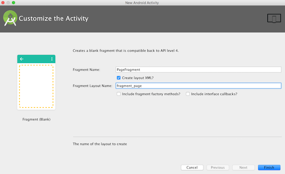
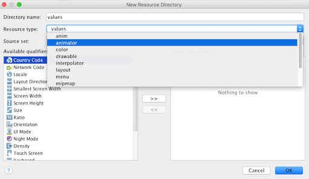

# Graphics and Animation

Android provides a number of useful APIs for manipulating graphics and animation. We will look at some simple examples in the exercises below. Upon finishing the exercises, you should have an app that has two 'pages', each of which contains a single graphic. If you press the 'start/stop' button, you'll start/stop some animations on those pages.

## Lab 1 Graphics

Previously we used many UI controls provided by the system. However, we haven't created any shapes or views ourselves. In the 1st lab of the week, we'll learn how to do it. But before that, let's create an app that has two 'pages' and a user can use swipe gestures to switch from one to another. Technically, we use ViewPagers for the transition between the two pages.

### ViewPager

Create an app called My Graphics using all default options. Then follow steps below to add ViewPager that allows the user to swipe left or right through pages.

1. Right-click your app's package name, then select New ==> Fragment ==> Fragment (Blank). Name it PageFragment, and uncheck the bottom two options.
    
    
    
2. Open fragment_page.xml, insert the following to replace the defalut TextView
<!--    insert the following ID attribute into the default FrameLayout's openning tag `android:id="@+id/frameLayout"`. Next, -->
    ```xml
    <RelativeLayout
        android:id="@+id/container"
        android:layout_width="match_parent"
        android:layout_height="match_parent"
        android:orientation="vertical">
    
        <TextView
            android:id="@+id/title"
            android:layout_width="match_parent"
            android:layout_height="wrap_content"
            android:layout_marginLeft="30dp"
            android:layout_marginTop="30dp"
            android:text="@string/hello_blank_fragment" />
    
        <ImageView
            android:id="@+id/body"
            android:layout_width="50dp"
            android:layout_height="50dp"
            android:layout_below="@id/title"
            android:layout_marginLeft="30dp"
            android:layout_marginTop="30dp"
            android:text="place holder text" />
    
        <Button
            android:id="@+id/button"
            android:layout_width="wrap_content"
            android:layout_height="wrap_content"
            android:layout_alignParentBottom="true"
            android:layout_marginBottom="20dp"
            android:layout_marginLeft="30dp"
            android:text="Start/Stop" />
    
    </RelativeLayout>
    ```
    
3. Open activity_main.xml and replace the default TextView with the following
    
    ```xml
    <TextView
        android:id="@+id/textView"
        android:layout_width="wrap_content"
        android:layout_height="wrap_content"
        android:text="My Graphics!" />

    <FrameLayout
        android:id="@+id/frameLayout"
        android:layout_width="match_parent"
        android:layout_height="match_parent"
        android:layout_alignLeft="@+id/textView"
        android:layout_alignStart="@+id/textView"
        android:layout_below="@+id/textView"
        android:layout_marginTop="20dp"></FrameLayout>
    ```
4. Open MainActivity.java, insert the following code into `onCreate()` method
    
    ```java
    FragmentManager fragmentManager = getFragmentManager();
    FragmentTransaction fragmentTransaction = fragmentManager.beginTransaction();
    PageFragment pageFragment = new PageFragment();
    fragmentTransaction.add(R.id.frameLayout, pageFragment);
    fragmentTransaction.commit();
    ```
    
    Steps above are something we have done when we learned Fragments. If this doesn't look familiar, you'll need to go back and check previous material. If you run the app at this moment, you'll see something similar to below.
    
    
    
5. Open activity_main.xml and replace everything in between the RelativeLayout tags (basically everything in that file except first line 'prolog') with the following:
    
    ```xml
    <android.support.v4.view.ViewPager xmlns:android="http://schemas.android.com/apk/res/android"
    android:id="@+id/viewPager"
    android:layout_width="match_parent"
    android:layout_marginTop="50dp"
    android:layout_height="match_parent" 
    />
    ```
    
    Similar to ListView in a ListActivity, we can use ViewPager as the single element in a layout file, or we can use it in combination with other views. Here it's the only thing we need. Also, note that ViewPager is dependent on the v4 version of the support library.
    
6. Open PageFragment.java, insert the following member variables
    
    ```java
    public static final String ARG_PAGE = "ARG_PAGE";
    private int pageNumber;
    ```
    
    Next, create a static method that takes an integer and returns the fragment itself as the return type
    
    ```java
    public static PageFragment create(int pageNumber) {
        PageFragment pageFragment = new PageFragment();
        Bundle bundle = new Bundle();
        bundle.putInt(ARG_PAGE, pageNumber);
        pageFragment.setArguments(bundle);
        return pageFragment;
    }
    
    ```
    
    Here this `create()` method uses the factory method [*NOT* factory pattern](http://www.tutorialspoint.com/design_pattern/factory_pattern.htm). Instead of using constructors and passing values using Bundle, we use a [static factory method](http://stackoverflow.com/questions/929021/what-are-static-factory-methods) to create the fragment object. 
    
    Insert the following method into PageFragment class. This will initialize the member variable `pageNumber` using values passed from the static factory method. This variable is later used in the `onCreateView()` method to update the TextView texts.
    
    ```java
        @Override
        public void onCreate(Bundle b) {
            super.onCreate(b);
            pageNumber = getArguments().getInt(ARG_PAGE);
            
        }
    ```
    
    In `onCreateView()` method, delete auto-genearted line `return inflater.inflate(R.layout.fragment_page, container, false)`. Insert following lines into this `onCreateView()` method instead. This is to link the member variable `pageNumber` with front UI
    
    ```java
    View v = inflater.inflate(R.layout.fragment_page, container, false);
    TextView textView = (TextView) v.findViewById(R.id.title);
    textView.setText("This is page No. " + Integer.toString(pageNumber + 1));
    return v;
    ```
    
    Now the finished PageFragment class should look like the following
    
    ```java
    public class PageFragment extends Fragment {

        public static final String ARG_PAGE = "ARG_PAGE";
        private int pageNumber;

        public PageFragment() {
        }

        public static PageFragment create(int pageNumber) {
            PageFragment pageFragment = new PageFragment();
            Bundle bundle = new Bundle();
            bundle.putInt(ARG_PAGE, pageNumber);
            pageFragment.setArguments(bundle);
            return pageFragment;
        }

        @Override
        public void onCreate(Bundle b) {
            super.onCreate(b);
            pageNumber = getArguments().getInt(ARG_PAGE);
        }
        
        @Override
        public View onCreateView(LayoutInflater inflater, ViewGroup container,
                                 Bundle savedInstanceState) {
            View v = inflater.inflate(R.layout.fragment_page, container, false);
            TextView textView = (TextView) v.findViewById(R.id.title);
            textView.setText("This is page No. " + Integer.toString(pageNumber + 1));
            return v;
        }
    }
    ```
    
7. Open MainActivity.java and delete (or comment out) following lines:
    
    ```java
    FragmentManager fragmentManager = getFragmentManager();
    FragmentTransaction fragmentTransaction = fragmentManager.beginTransaction();
    PageFragment pageFragment = new PageFragment();
    fragmentTransaction.add(R.id.frameLayout, pageFragment);
    fragmentTransaction.commit();
    ```
    
    Insert following declarations for member variables:
    
    ```java
    ViewPager viewPager;
    PageFragmentPagerAdapter pageFragmentPagerAdapter;
    ```
    
    Insert the following into the `onCreate()` method. You'll see this is very similar to AdapterViews.
    
    ```java
    viewPager = (ViewPager) findViewById(R.id.viewPager);
    pageFragmentPagerAdapter = new PageFragmentPagerAdapter(getSupportFragmentManager());
    viewPager.setAdapter(pageFragmentPagerAdapter);
    ```
    
    Insert the following class as an inner class:
    
    ```java
    private class PageFragmentPagerAdapter extends FragmentStatePagerAdapter {

        public PageFragmentPagerAdapter(FragmentManager fm) {
            super(fm);
        }

        @Override
        public Fragment getItem(int position) {
            return PageFragment.create(position);
        }

        @Override
        public int getCount() {
            return 2;
        }
    }
    ```
    
    In order to combine Fragment with ViewPager, you need to use a FragmentStatePagerAdapter, which is a subclass of android.support.v4.view.PagerAdapter. This is not to be confused with android.widget.Adapter, which is used to work together with AdapterView to achieve dynamic data binding. For FragmentStatePagerAdapter we need to override the two methods `getItem()` and `getCount()`. Note here the two Fragments will be created as soon as ViewPager becomes visible. This means that some ordinary call-backs for Fragment such as `onPause()` etc. will never be called! Instead ViewPager provides a [OnPageChangeListener interface](https://developer.android.com/reference/android/support/v4/view/ViewPager.OnPageChangeListener.html) to deal with page state change. Apart from FragmentStatePagerAdapter, Android also provides an adapter called FragmentPagerAdapter. The difference between are two is mainly that FragmentStatePagerAdapter is for larger data (more pages) and FragmentPagerAdapter is for smaller data (fewer pages). But in either case, by default ViewPager will only load 3 fragments into memory. Click to see some [discussions on Stack Overflow about FragmentPagerAdapter and FragmentStatePagerAdapter](http://stackoverflow.com/questions/18747975/difference-between-fragmentpageradapter-and-fragmentstatepageradapter).

If you run the app now, you'll see two pages that allow you to switch between each other using sliding


### Drawable resources for ShapeDrawable

Now we're ready to insert some shapes into the 1st page. Previously we used images as drawable. We can also define the shapes in an xml file.

1. Right-click on the res folder and select New ==> Android resource file. In the New Resoure File pop-up window, select Resource type to be Drawable, and in the File name field name the file gradient_box.
    
    
    
2. Replace the 'selector' tag with the following:
    
    ```xml
    <shape xmlns:android="http://schemas.android.com/apk/res/android"
       android:shape="rectangle">
    <gradient
        android:angle="45"
        android:endColor="#80FF00FF"
        android:startColor="#FFFF0000"/>
    <padding
        android:bottom="7dp"
        android:left="7dp"
        android:right="7dp"
        android:top="7dp"/>
    <corners android:radius="8dp"/>
</shape>
    ```
    
    Here we define a rectangle shape and customize it using gradient and padding tags. A full list of available tags and attributes can be found [on the official API guides on Drawable Resources](http://developer.android.com/guide/topics/resources/drawable-resource.html#Shape). If you open the Preview tool window, you'll see something like below
    
    
    
3. Open PageFragment.java, insert the following line into the `onCreateView()` method, before the final `return v` line
    
    ```java
    if (pageNumber == 0) {
            Drawable drawable = ContextCompat.getDrawable(getContext(), R.drawable.gradient_box);
            ImageView imageView = (ImageView) v.findViewById(R.id.body);
            imageView.setImageDrawable(drawable);
        }
    ```
    
    What we did before with system resources such as string resources are to call functions like `getResources().getString()`. It is also possible here to call `getResources().getDrawable()`, like the example in the [official guide on Drawable resources](https://developer.android.com/guide/topics/resources/drawable-resource.html#Shape). However, if you do that the system will prompt a warning message indicating some compatibility issues. The proper, or bulletproof, way of doing it is to use the `ContextCompat` or `ResourcesCompat` classes. The reason for this is that [`getDrawable(int)`](https://developer.android.com/reference/android/content/res/Resources.html#getDrawable(int)) is deprecated, and new way of doing it is '[`getDrawable(int, Theme)`](https://developer.android.com/reference/android/content/res/Resources.html#getDrawable(int, android.content.res.Resources.Theme)), which is not supported in older platforms. For more discussions on this, view this [Stack Overflow discussions on Android getResources().getDrawable() deprecated API 22](http://stackoverflow.com/questions/29041027/android-getresources-getdrawable-deprecated-api-22).
    
    We have set images for ImageButtons previously in XML files using attribute `android:src`. The equivalent of that in Java code is to call function `setImageResource (int)`. Now the code above shows you a different way of doing the same thing in Java i.e. `setImageDrawable(drawable)` 

If you run the app now you'll see that on the first page a little rectangle shape has been created:


### Extending View class

You can also create a customized shape by extending View and including ShapeDrawables in it.

1. Create a new class called CustomDrawableView and insert the following code:
    
    ```java
    public class CustomDrawableView extends View {

        private ShapeDrawable mDrawable;

        public CustomDrawableView(Context context) {
            super(context);

            int x = 10;
            int y = 10;
            int width = 300;
            int height = 50;

            mDrawable = new ShapeDrawable(new OvalShape());
            mDrawable.getPaint().setColor(0xff74AC23);
            mDrawable.setBounds(x, y, x + width, y + height);
        }

        protected void onDraw(Canvas canvas) {
            mDrawable.draw(canvas);
        }
    }
    ```
    
    This is an example taken from [the office API guide on Graphics](http://developer.android.com/guide/topics/graphics/2d-graphics.html#drawables-from-xml). After defining the oval shape in constructor, once `View.onDraw()` is called, our shape will draw itself on the canvas provided by the system.
    
2. Open PageFragment.java, edit the `if` clause inside `onCreateView()` method so it becomes the following
    
    ```java
    if (pageNumber == 0) {
            Drawable drawable = ContextCompat.getDrawable(getContext(), R.drawable.gradient_box);
            ImageView imageView = (ImageView) v.findViewById(R.id.body);
            imageView.setImageDrawable(drawable);
        } else if (pageNumber == 1) {
            ImageView imageView = (ImageView) v.findViewById(R.id.body);
            imageView.setVisibility(View.GONE);
            RelativeLayout relativeLayout = (RelativeLayout) v.findViewById(R.id.container);
            CustomDrawableView customDrawableView = new CustomDrawableView(getContext());
            RelativeLayout.LayoutParams params = new RelativeLayout.LayoutParams(ViewGroup.LayoutParams.WRAP_CONTENT, ViewGroup.LayoutParams.WRAP_CONTENT);
            params.setMargins(80, 80, 0, 0);
            params.addRule(RelativeLayout.BELOW, textView.getId());
            relativeLayout.addView(customDrawableView, params);
    }
    ```
    
    For the second page, what we did is that we hide the ImageView by setting its visibility to GONE. Then we create a new CustomDrawableView and add it to the RelativeLayout. For more info on LayoutParams click [here](http://developer.android.com/guide/topics/ui/declaring-layout.html#layout-params).

If you run the app now, you'll see the new View object, like this


## Lab 2 Animations

There're three different ways to do animation in Android, and two of those are commonly used. One is to use property animation and the other is View animation. While the former is capable of animating any objects, the latter is limited to Views only. We'll look at examples of both.

### Property animation

1. Some housekeeping tasks. Duplicate the My Graphics project created earlier, and rename it My Graphics2. Open this new project, in PageFragmet.java file remove the TextView declaration in `onCreateView()` method, so that the following line
    
    ```java
    TextView textView = (TextView) v.findViewById(R.id.title);
    ```
    
    becomes
    
    ```java
    textView = (TextView) v.findViewById(R.id.title);
    ```
    
    Now declare variable `textView` directly after class declaration i.e. it becomes a member variable
    
    ```java
    private TextView textView;
    ```
    
    Similarly, declare member variables for CustomDrawableView, Button, and ImageView
    
    ```java
    private CustomDrawableView customDrawableView;
    private Button button;
    private ImageView imageView;
    ```
    
    initialize Button and ImageView in `onCreateView()` method
    
    ```java
    button = (Button) v.findViewById(R.id.button);
    imageView = (ImageView) v.findViewById(R.id.body);
    ```
    
    and initialize CustomDrawableView in `else` block
    
    ```java
    customDrawableView = new CustomDrawableView(getContext());
    ```
    
    Also, delete the two ImageView lines in 'if/else' blocks.
    
    ```java
    ImageView image = (ImageView) v.findViewById(R.id.body);
    ```
    
    After this step, class member variables should look like this
    
    ```java
    public static final String ARG_PAGE = "ARG_PAGE";
    private CustomDrawableView customDrawableView;
    private TextView textView;
    private Button button;
    private ImageView imageView;
    private int pageNumber;
    ```
    
    and the `onCreateView()` method should look similar to below
    
    ```java
    @Override
    public View onCreateView(LayoutInflater inflater, ViewGroup container,
                             Bundle savedInstanceState) {
        View v = inflater.inflate(R.layout.fragment_page, container, false);
        textView = (TextView) v.findViewById(R.id.title);
        textView.setText("This is page No. " + Integer.toString(pageNumber + 1));
        button = (Button) v.findViewById(R.id.button);
        imageView = (ImageView) v.findViewById(R.id.body);

        if (pageNumber == 0) {
            Drawable drawable = ContextCompat.getDrawable(getContext(), R.drawable.gradient_box);
            imageView.setImageDrawable(drawable);
        } else if (pageNumber == 1) {
            imageView.setVisibility(View.GONE);
            RelativeLayout relativeLayout = (RelativeLayout) v.findViewById(R.id.container);
            customDrawableView = new CustomDrawableView(getContext());
            RelativeLayout.LayoutParams params = new RelativeLayout.LayoutParams(ViewGroup.LayoutParams.WRAP_CONTENT, ViewGroup.LayoutParams.WRAP_CONTENT);
            params.setMargins(80, 80, 0, 0);
            params.addRule(RelativeLayout.BELOW, textView.getId());
            relativeLayout.addView(customDrawableView, params);
        }
        return v;
    }
    ```
    
2. Add some more variable declarations into the class
    
    ```java
    private AnimatorSet set;
    private boolean isAnimatorSetOn = false;
    private Animation hyperspaceJumpAnimation;
    ```
    
2. In the Android tool window, right-click on the res folder and select New ==> Android Resource Directory, select animator as the type and click OK.
    
    
    
3. Right-click on the animator folder that was just created, and create a resource file called property_animator.xml
4. Insert the following into the `set` tags
    
    ```xml
    <set>
        <objectAnimator
            android:duration="500"
            android:propertyName="x"
            android:repeatCount="infinite"
            android:repeatMode="reverse"
            android:valueTo="800"
            android:valueType="floatType" />
        <objectAnimator
            android:duration="500"
            android:propertyName="y"
            android:repeatCount="infinite"
            android:repeatMode="reverse"
            android:valueTo="300"
            android:valueType="floatType" />
    </set>
    <objectAnimator
        android:duration="500"
        android:propertyName="alpha"
        android:repeatCount="infinite"
        android:repeatMode="reverse"
        android:valueTo="0f" />
    ```
    
    Here we defined two levels of hierarchy by using the 'set' tag. The parent 'set' tag contains another 'set' tag and an objectAnimator. The inner 'set' in turn contains two animators for both 'x' and 'y' coordinates.
    
5. Open PageFragment.java, insert the following line into the `if (pageNumber == 0) ` block, after line `imageView.setImageDrawable(drawable)`
    
    ```java
    set = (AnimatorSet) AnimatorInflater.loadAnimator(getContext(), R.animator.property_animator);
    set.setTarget(imageView);
    
    button.setOnClickListener(new View.OnClickListener() {
        @Override
        public void onClick(View view) {
        
            if (!isAnimatorSetOn) {
                set.start();
                isAnimatorSetOn = true;
            } else {
                set.cancel();
                isAnimatorSetOn = false;
            }
        }
    });
    ```
    
    Here we load the AnimatorSet from the resource xml file and set the target as the rectangle created earlier. Note that we used `android:valueType="floatType"` for the coordinates because that is the type that [ImageView uses to draw itself](https://developer.android.com/reference/android/widget/ImageView.html#drawableHotspotChanged(float, float)). But this can be intType for different objects. After setting the target, we set the onClickListener for the button. As mentioned already, some fragment lifecycle methods are not called automatically. So we have to implement the `set.cancel()` method to stop the animation manually.

### View animation

Property animation was introduced in Android 3.0 (API 11), it can be applied to any objects. An older alternative is View animation. As the name suggests, it can only be applied to Views. The following exercises will show you how to apply View animation to the customized View class `CustomDrawableView`.

In the Android tool window, right-click on the res folder and select New ==> Android Resource Directory, select anim as the type and click OK. Right-click on the folder you just created, and create a new resource file called hyperspace_jump.xml. Insert into it the following contents:

```xml
<scale
    android:duration="700"
    android:fillAfter="false"
    android:fromXScale="1.0"
    android:fromYScale="1.0"
    android:interpolator="@android:anim/accelerate_decelerate_interpolator"
    android:pivotX="50%"
    android:pivotY="50%"
    android:toXScale="1.4"
    android:toYScale="0.6"/>
<set android:interpolator="@android:anim/decelerate_interpolator">
    <scale
        android:duration="400"
        android:fillBefore="false"
        android:fromXScale="1.4"
        android:fromYScale="0.6"
        android:pivotX="50%"
        android:pivotY="50%"
        android:startOffset="700"
        android:toXScale="0.0"
        android:toYScale="0.0"/>
    <rotate
        android:duration="400"
        android:fromDegrees="0"
        android:pivotX="50%"
        android:pivotY="50%"
        android:startOffset="700"
        android:toDegrees="-45"
        android:toYScale="0.0"/>
</set>
```

Open PageFragment.java, insert the following line into the `else if (pageNumber == 1)` block, after line `relativeLayout.addView(customDrawableView, params)`

```java
hyperspaceJumpAnimation = AnimationUtils.loadAnimation(getActivity(), R.anim.hyperspace_jump);
button.setOnClickListener(new View.OnClickListener() {
    @Override
    public void onClick(View view) {
    
        if (!isAnimatorSetOn) {
            customDrawableView.startAnimation(hyperspaceJumpAnimation);
            isAnimatorSetOn = true;
        } else {
            customDrawableView.clearAnimation();
            isAnimatorSetOn = false;
        }
    }
});
```

In a way similar to property animation, in View animation we need to load the object from a system resource. But the difference is that here we use an inherited method `startAnimation()` to start the actual process.

## Lab 3 Useful Resources

### OpenGL ES example

Android includes support for high-performance 2D and 3D graphics with the Open Graphics Library (OpenGL®), specifically the OpenGL ES API. Our past student *Fabian Furger* created a squash training app using OpenGL. Take a look here:

* Squash simulation on [GitHub](https://github.com/furgerf/Squash/tree/master/Squash%20Simulation)
* YouTube [video](https://www.youtube.com/watch?v=4VqZXWbodaY)

### Other useful links

* [Official training on Creating Swipe Views with Tabs](https://developer.android.com/training/implementing-navigation/lateral.html)
* [Official training on Building Apps with Graphics & Animation](https://developer.android.com/training/building-graphics.html)
* [Official API guides on Animation and Graphics](https://developer.android.com/guide/topics/graphics/overview.html)
* [Official API guides on Animation Resources](https://developer.android.com/guide/topics/resources/animation-resource.html)
* [Simplified Coding tutorial on Android TabLayout Example using ViewPager and Fragments]
(https://www.simplifiedcoding.net/android-tablayout-example-using-viewpager-fragments)
* [Code Project Beginner's Guide to Android Animation/Graphics](http://www.codeproject.com/Articles/825700/Beginners-Guide-to-Android-Animation-Graphics)
* [Android Hive tutorial Android Working with XML Animations written by Ravi Tamada.](http://www.androidhive.info/2013/06/android-working-with-xml-animations/) This tutorial is for view animation.
<!--* [Add submodule in Git](https://git-scm.com/book/en/v2/Git-Tools-Submodules)-->
<!--(git submodule add https://github.com/jianhuayang/Squash.git)-->
<!--* [How to embed a video into GitHub README.md](http://stackoverflow.com/questions/4279611/how-to-embed-a-video-into-github-readme-md/29842302#29842302)-->
<!--* [EZGif.com/](http://ezgif.com)-->

