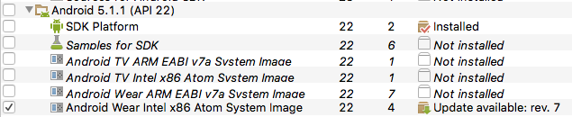
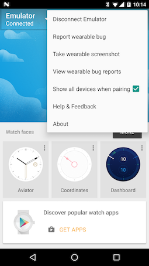
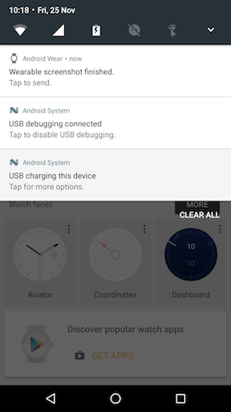
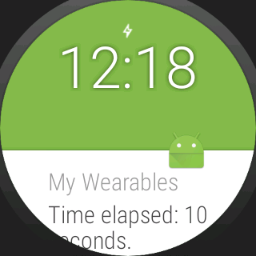
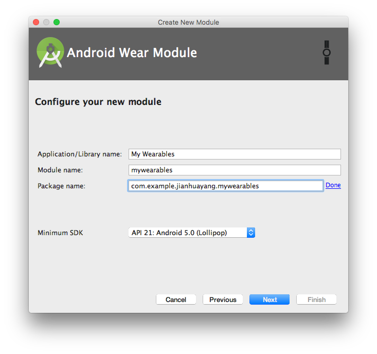

# Services and wearables

This week we look at Android wearables i.e. watches. There are mainly two different usages of Android watches: 

1. As an extension of your phone/tablet. Here extension means the watch provides assistive functions to apps installed on the phone.
2. You can also have apps run directly on the watch, in which case, the watch is a separate standalone device.

To finish this week's exercises, you'll need an Android watch, either real or virtual. In addition, you must have a real Android phone/tablet to connect the watch. An Android wear emulator is used for demo purposes in the lab sheets.

> Be aware that it's not advisable to connect an emulated watch with an emulated phone. But there are workarounds for this, [check out discussions on Pairing Android and Wear emulators on Stack Overflow](http://stackoverflow.com/questions/25205888/pairing-android-and-wear-emulators) in case you don't have an Android phone. 

> Read news on [Top 10 Android Wear Apps and Faces](http://www.androidheadlines.com/2016/11/top-10-android-wear-apps-and-faces-november-2016-edition.html) from Android Headlines.

## Lab 1 Notifications on Android wearables

Suppose you're in a lecture and the lecturer hates it when you check Facebook messages on your phone from time to time, which is also not something you enjoy doing. A less awkward solution is to check it on your watch! That is how the notifications are delivered! Notifications delivered to your phone will automatically be displayed on your watch as well.


### Setting up an Android watch AVD

Follow steps below to setup an Android watch AVD and connect to your phone.

1. Open your SDK Manager and make sure that you have at least one Android wear system image installed.
    
    
    
    While your SDK Manager is open, verify that Google Play Services and Google Repository are both installed. These are needed for the 2nd lab.
    
    
    
2. Set up an Android wear AVD:
    1. Open AVD Manager and click Create Virtual Device
    2. Select Android Wear Round with 320*320 resolution
    3. Select the system image you downloaded earlier (e.g. Marshmallow 23 x86 Android 6.0) and click Next ==> Finish
    4. Click the green triangle once the AVD is created to start it. On the first start, the watch may give you a quick demo on how to use it (depending on your version). If that happens, follow instructions and feel free to explore your virtual watch. 
        
        
    
3. On your Android phone/tablet, install an app called Android Wear from Play store.
4. Connect your phone to the Mac/Windows machine using a USB cable.
5. Find out your Android SDK location by right-clicking on the app folder in project tool window, select Open Module Settings ==> SDK Location.
6. Open a terminal window, navigate to a subfolder inside the SDK location called platform-tools. For example, my platform-tools is located at `/Users/jianhuayang/Portables/android-sdk-macosx/platform-tools`. Issue the following command so that the AVD can connect to the phone `./adb -d forward tcp:5601 tcp:5601`. This command should return nothing.
    
    
    
    > This command only works when you have a single wearable. If you have more than one, you should try to disable one of those. Or you can check out [discussions on Stack Overflow on Connecting Multiple Devices using adb](http://stackoverflow.com/questions/14654718/adb-shell-when-multiple-devices).
    
    > In case you have a real Android watch such as Moto 360 2nd Gen, to setup debugging you'll need to follow [official guides on Debugging over Bluetooth](https://developer.android.com/training/wearables/apps/bt-debugging.html). Note that some online tutorials use `localhost` instead of `127.0.0.1`, which may not work.
    
    ```bash
    ./adb forward tcp:4444 localabstract:/adb-hub
    ./adb connect 127.0.0.1:4444
    ```
    
7. On your phone, open Android Wear and connect to the watch called Emulator. To test the connection, click Take wearable screenshot. If it's connected successfully you should see in the notification area you have a new message saying 'Wearable screenshot finished.'
    
    
        
    

### Services and broadcasting

In the following sections, we'll build an app that runs some tasks (i.e. counting the time passed) in the background as services. Here service means that we can leave the app and do something else. The service will broadcast its results back and send notifications both to the phone and watch.

Follow steps below to setup a service class:

1. Create a new project called My Wearables using all default options.
2. Open activity_main.xml, replace the TextView with the following. This is the only widget we need to start the counting service.
    
    ```xml
    <Button
        android:id="@+id/buttonStart"
        android:layout_width="wrap_content"
        android:layout_height="wrap_content"
        android:layout_alignParentLeft="true"
        android:layout_marginLeft="20dp"
        android:layout_marginTop="22dp"
        android:onClick="onStartClick"
        android:text="Start counting" 
    />
    ```
    
3. Open MainActivity.java and insert the following member variable and method. Here we start a service in a way similar to starting an activity. We'll define the service later.
    
    ```java
    public static final String DEBUG_KEY = "DEBUG_KEY";
    public void onStartClick(View v) {
        startService(new Intent(this, CountingService.class));
        Log.d(DEBUG_KEY, "service started");
    }
    ```
    
4. Create an Empty Activity named DisplayActivity. Open activity_display.xml and insert the following TextView. We need this activity to display the counting result from the service.
    
    ```xml
    <TextView
        android:id="@+id/display"
        android:layout_width="match_parent"
        android:layout_height="wrap_content"
        />
    ```
    
5. Create a new class called CountingService and edit the Java file so it looks like the following:
    
    ```java
    public class CountingService extends IntentService {
    
    public static final String REPORT_KEY = "REPORT_KEY";
    public static final String INTENT_KEY = "com.example.jianhuayang.mywearables.BROADCAST";
    
    public CountingService() {
        super("BackgroundCounting");
    }
    
    @Override
    protected void onHandleIntent(Intent intent) {
    
        int count = 0;
        while (count < 10) {
            synchronized (this) {
                try {
                    wait(1000);
                    count++;
                    Log.d(MainActivity.DEBUG_KEY, Integer.toString(count));
                } catch (Exception e) {
                }
            }
        }
        Log.d(MainActivity.DEBUG_KEY, "service finished");
        
    }
    }
    ```
    
    In Android, a Service is like an Activity but without UI. You can perform certain tasks in the background without interfering with the UI of your app. 
    * Here we extended IntentService, wich requires us to provide a constructor and override the `onHandleIntent()` method. This is the simplest case of a Service.
    * The `synchronized (this){}` block is to ensure that only one thread has access at a time. Otherwise, if you click Start Counting in the main activity you'll start several different services.
    * IntentService class needs to finish the job defined in `onHandleIntent()`. Once started, we cannot call methods to stop it. This is why we used the `while` block.
    
6. Open AndroidManifest.xml and insert the following within `application` tags, in parallel with `activity` tags
    
    ```xml
    <service
            android:name=".CountingService"
            android:enabled="true"
            android:exported="false" 
    />
    ```
    
    Now if you run the app on your phone, once you click Start Counting, you'll see the following outputs in the Android Monitor tool window, regardless of if you're still in the app or not
    
    
    
7. At this point, we can define an Intent in the service and start the display activity when the counting reaches a certain point, like in the code below
    
    ```java
    Intent intentNew = new Intent(getBaseContext(), DisplayActivity.class);
    intentNew.putExtra(REPORT_KEY, Integer.toString(count));
    intentNew.addFlags(Intent.FLAG_ACTIVITY_NEW_TASK);
    intentNew.addFlags(Intent.FLAG_ACTIVITY_CLEAR_TOP);
    getBaseContext().startActivity(intentNew);
    ```
    
    However, an alternative and better way of doing it is to use broadcasting. Insert the following lines into the CountingService class, just below line `Log.d(MainActivity.DEBUG_KEY, Integer.toString(count))`
    
    ```java
    Intent localIntent = new Intent();
    localIntent.setAction(INTENT_KEY);
    localIntent.putExtra(REPORT_KEY, Integer.toString(count));
    sendBroadcast(localIntent);
    Log.d(MainActivity.DEBUG_KEY, "broadcasted");
    ```
    
    The advantage of broadcasting is that many receivers can receive the message intent instead of targeting at only one activity. Instead of sending global broadcast using `sendBroadcast(localIntent)`, what can be done here is to use LocalBroadcastManager like this `LocalBroadcastManager.getInstance(this).sendBroadcast(localIntent)`. [There are a number of advantages of using LocalBroadcastManager over sending global broadcasts](https://developer.android.com/reference/android/support/v4/content/LocalBroadcastManager.html). However, in order to receive broadcasts sent using LocalBroadcastManager,  you'll have to register receiver using LocalBroadcastManager, see [Android official guide on Running in a Background Services](https://developer.android.com/training/run-background-service/report-status.html#ReceiveStatus)
    
8. Create a new class called CountingReceiver. Open CountingReceiver.java and make the class look like the following
    
    ```java
    public class CountingReceiver extends BroadcastReceiver {
        public CountingReceiver() {
        }
        @Override
        public void onReceive(Context context, Intent intent) {
            Log.d(MainActivity.DEBUG_KEY, "on receive");
            String timeElapsed = intent.getStringExtra(CountingService.REPORT_KEY);
            Log.d(MainActivity.DEBUG_KEY, "time elapsed: " + timeElapsed);

            Intent intentNew = new Intent(context, DisplayActivity.class);
            intentNew.addFlags(Intent.FLAG_ACTIVITY_NEW_TASK);
            intentNew.addFlags(Intent.FLAG_ACTIVITY_CLEAR_TOP);
            intentNew.putExtra(CountingService.REPORT_KEY, timeElapsed);
            context.startActivity(intentNew);
        }
    }
    ```
    
    Here once we receive the intent, we'll start the display activity to display the time elapsed. In the service class, we broadcast every single second. This means that the display activity will get started every second too. Intent flags make sure that once we have a new activity started this new activity will replace what's already on the screen instead of adding on top of the stack.
    
9. Open AndroidManifest.xml and insert the following within `application` tag. Note here the intent-filter string is the same as the one we defined as INTENT_KEY in CountingService.java.
    
    ```xml
    <receiver
            android:name=".CountingReceiver"
            android:enabled="true"
            android:exported="false">
            <intent-filter>
                <action android:name="com.example.jianhuayang.mywearables.BROADCAST" />
            </intent-filter>
    </receiver>
    ```
    
10. Open DisplayActivity.java, insert the following into the `onCreate()` method
    
    ```java
    if (getIntent() != null) {
            Intent intent = getIntent();
            TextView textView = (TextView) findViewById(R.id.display);
            textView.setText("Time elapsed (seconds):\n" + intent.getStringExtra(CountingService.REPORT_KEY));
        }
    ```
    
If you run the app, hit the Start Counting button and then the home button, you'll see that even though you navigate away from the app the service will automatically start the display activity for you and display the time counts.

### Notifications

The way how service is used above doesn't concern wearables at all. In order to deliver messages to wearables, we'll need to build notifications. 

1. Open CountingService.java, locate the following code and delete (or comment out)
    
    ```java
    Intent localIntent = new Intent();
    localIntent.setAction(INTENT_KEY);
    localIntent.putExtra(REPORT_KEY, Integer.toString(count));
    sendBroadcast(localIntent);
    Log.d(MainActivity.DEBUG_KEY, "broadcasted");
    ```
    
2. Inserted the following code into the try-catch block, just below line `Log.d(MainActivity.DEBUG_KEY, "broadcasted")`. This will build notifications and send to both phone and watch.
    
    ```java
    NotificationCompat.Builder builder =
            new NotificationCompat.Builder(this)
                    .setSmallIcon(R.mipmap.ic_launcher)
                    .setContentTitle("My Wearables")
                    .setContentText("Time elapsed: " + Integer.toString(count) + " seconds.");
    Intent resultIntent = new Intent(this, DisplayActivity.class);
    resultIntent.putExtra(REPORT_KEY, Integer.toString(count));

    TaskStackBuilder taskStackBuilder = TaskStackBuilder.create(this);
    taskStackBuilder.addParentStack(DisplayActivity.class);
    taskStackBuilder.addNextIntent(resultIntent);
    PendingIntent resultPendingIntent =
            taskStackBuilder.getPendingIntent(0, PendingIntent.FLAG_UPDATE_CURRENT);
    builder.setContentIntent(resultPendingIntent);
    NotificationManager notificationManager =
            (NotificationManager) getSystemService(Context.NOTIFICATION_SERVICE);
    notificationManager.notify(123123, builder.build());
    ```
    
    There are several things to note in the codes above:
    * Intent is what we've been using since we started. However, we'll probably need to close the app completely before we use the notification to start it again. Here comes the PendingIntent. By giving a PendingIntent to notification builder, you are granting it the right to perform the operation you have specified as if the other application was yourself.
    * When we start display activity, we must preserve the user's expected navigation experience. For example, clicking Back should take the user back through the application's normal workflow to the Home screen, and clicking Recents should show the Activity as a separate task. This is why we use TaskStackBuilder.

If you run the app and hit Start Counting, you'll see that on both your phone and watch the notification updates itself.




If you click Open on phone in the watch, it'll bring you back to the display activity


## Lab 2 Android wear apps

The My Wearables app created previously uses notifications on wearable to control the app installed on the phone. In the following exercise, we'll build an app that runs directly on the watch. The idea is that once we start the app we'll start counting down the time. And if we hit Send button, we'll send a message to the phone to display a Toast.

### Add a wearable module

1. Duplicate the project folder you created earlier and rename it MyWearables2, open it in Android Studio.
2. Click menu File ==> New ==> New Module, and select Android wear Module
    
    
    
3. Give the application a name My Wearables. Make sure that the Package name is the same as your existing package name (otherwise the wear module may not get installed properly, see [Stack Overflow discussions on Android Wear App not Installed](http://stackoverflow.com/questions/24685845/android-wear-app-not-installed)).
    
    
    
4. Select Always On Wear Activity, click Next until Finish. Now you have two modules in your project, as follows
    
    
    
    If you receive a warning message saying 'Project mywearables: Provided dependencies can only be jars. com.google.android.wearable:wearable:aar:2.0.0-alpha2 is an Android Library' you'll need open build.gradle (Module: mywearables) file and change line `provided 'com.google.android.wearable:wearable:2.0.0-alpha2'` to `compile 'com.google.android.wearable:wearable:2.0.0-alpha2'`.
    
5. Refactor these two modules so that their names change to mobile and wear respectively. These should be default module names for such an app.
    
    
    
5. Open build.gradle (Module: mobile) file and insert the following into dependencies block. Your exact version number of Google Play Services can be found from build.gradle (Module: wear) file.
    
    ```xml
    wearApp project(':wear')
    compile 'com.google.android.gms:play-services:9.6.1'
    ```
    
    The reason for doing this i.e. including wear module inside a mobile module, is that a wearable app needs to be included in the corresponding mobile app in order to be installed. This makes sense as there are no standalone wear apps.

### Build an interface

1. Open activity_main.xml for wear. In Preview tool window, click the Device in Editor drop down menu and change the device to Android Wear Square
    
    
    
2. Insert the following XML code into the layout file, in between the two TextViews. This simply puts a Button onto the layout. Note that in the layout file we have a BoxInsetLayout, which we haven't seen before. Here, BoxInsetLayout is used to auto detect the watch shape.
    
    ```xml
    <Button
        android:id="@+id/send"
        android:layout_width="80dp"
        android:layout_height="40dp"
        android:layout_gravity="center"
        android:onClick="onSendClick"
        android:text="Send" 
    />
    ```

### Send message back to the phone

1. Open MainActivity.java for wear, insert the following variable declarations
    
    ```java
    private Button button;
    private static final long CONNECTION_TIME_OUT_MS = 100;
    private String message;
    private GoogleApiClient client;
    private String nodeId;
    ```
    
2. Insert the following code into  the `onCreate()` method
    
    ```java
    button = (Button) findViewById(R.id.send);
    initApi();
    new CountDownTimer(30000, 1000) {
    
        public void onTick(long millisUntilFinished) {
            message = "seconds remaining: " + millisUntilFinished / 1000;
            mTextView.setText(message);
        }
        
        public void onFinish() {
            mTextView.setText("done!");
        }
    }.start();
    ```
    
    The codes above use an Android system built-in timer to count down 30 seconds and display it on the watch screen. Once counting down finishes, it'll display 'done!'.
    
3. Modify the `updateDisplay()` method to add configurations for the Button. The finished `updateDisplay()` should look similar to below
    
    ```java
    private void updateDisplay() {
        if (isAmbient()) {
            //existing code
            button.setTextColor(getResources().getColor(android.R.color.white));
        } else {
            //existing code
            button.setTextColor(getResources().getColor(android.R.color.black));
        }
    }
    ```
    
    Ambient is the state when you put the watch to 'sleep' so that it is in a low energy state. You can do this by clicking the 'power' button next to the watch screen in an AVD, or the 'power' button in the AVD toolbar. If both buttons fail, you'll need to enable developer options in wearable settings, and then disable 'Stay awake when charging'.
    
4. Insert the following code into the class
    
    ```java
    private void initApi() {
        client = getGoogleApiClient(this);
        retrieveDeviceNode();
    }
    
    private GoogleApiClient getGoogleApiClient(Context context) {
        return new GoogleApiClient.Builder(context)
                .addApi(Wearable.API)
                .build();
    }
    
    private void retrieveDeviceNode() {
        new Thread(new Runnable() {
            @Override
            public void run() {
                client.blockingConnect(CONNECTION_TIME_OUT_MS, TimeUnit.MILLISECONDS);
                NodeApi.GetConnectedNodesResult result =
                        Wearable.NodeApi.getConnectedNodes(client).await();
                List<Node> nodes = result.getNodes();
                if (nodes.size() > 0) {
                    nodeId = nodes.get(0).getId();
                    Log.d("DEBUG_KEY", "size "+Integer.toString(nodes.size()));

                    Log.d("DEBUG_KEY", nodeId);
                }
                client.disconnect();
            }
        }).start();
    }
    
    public void onSendClick(View v) {
        if (nodeId != null) {
            new Thread(new Runnable() {
                @Override
                public void run() {
                    Log.d("DEBUG_KEY", "on click");
                    client.blockingConnect(CONNECTION_TIME_OUT_MS, TimeUnit.MILLISECONDS);
                    Wearable.MessageApi.sendMessage(client, nodeId, message, null);
                    client.disconnect();
                    Log.d("DEBUG_KEY", "on click sent");
                    
                }
            }).start();
        }
    }
    ```
    
    To send data from watch to phone, we'll need to use Google Play services. This is completely different from the case in lab 1 where you treat the watch as part of the app. First of all, we set up GoogleApiClient to use Wearable API. Then we test to see if we have any connections. To have the app work correctly, it's vital in this step that we have only 1 watch connected to the phone. Once we have the node id we can then send the message over.
    
5. Create a new class called ListenerService for the mobile module, insert the following code into the Java file. What happens here is that once we receive the Message, we'll display it as a Toast. This is done by implementing the `WearableListenerService` interface.
    
    ```java
    public class ListenerService extends WearableListenerService {
        @Override
        public void onMessageReceived(MessageEvent messageEvent) {
            Log.d("DEBUG_KEY", "on received");
            showToast(messageEvent.getPath());
        }

        private void showToast(String message) {
            Toast.makeText(this, message, Toast.LENGTH_LONG).show();
        }
    }
    ```
    
6. Finally, we need to add permissions for the system to use our service. Open AndroidManifest.xml and insert the following into `application` tags
    
    ```xml
    <service
            android:name=".ListenerService">
            <intent-filter>
                <action android:name="com.google.android.gms.wearable.BIND_LISTENER" />
            </intent-filter>
    </service>
    ```
    
    You'll probably see a warning message saying something like BIND_LISTENER is deprecated. The documentation on this is not very clear as regards to what to use. However, to get around this you'll need to change play-services-wearable version from 9.6.1 to 7.8.0 in both build.gradle files.
    
If you run the app on your watch by tapping My Wearables icon, the counting down timer will auto start. If you press the Send button at any point, the time left will be sent to your phone and appears as a Toast message.


## Lab 3 Useful Resources

* [Android API guide on Services](https://developer.android.com/guide/components/services.html)
* [Android Best Practices for Background Jobs](https://developer.android.com/training/best-background.html)
* [Building Apps for Wearables](https://developer.android.com/training/building-wearables.html)


