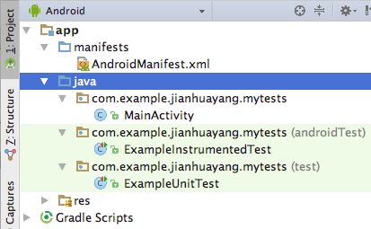
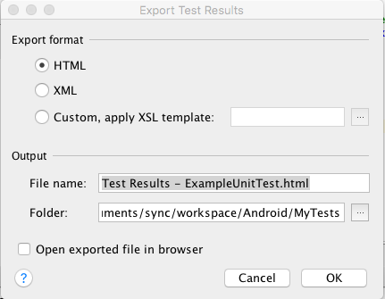
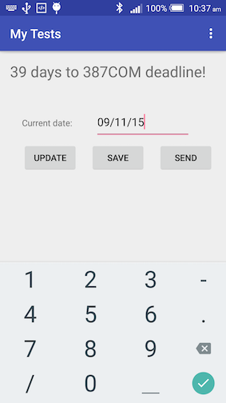
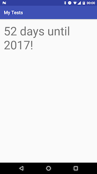
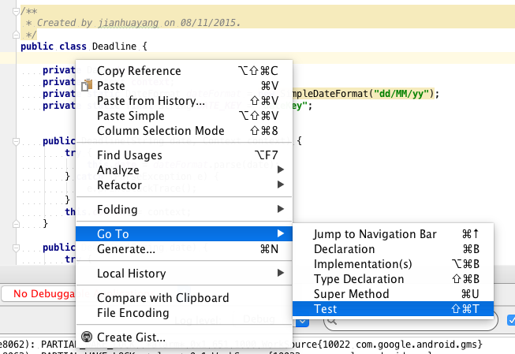
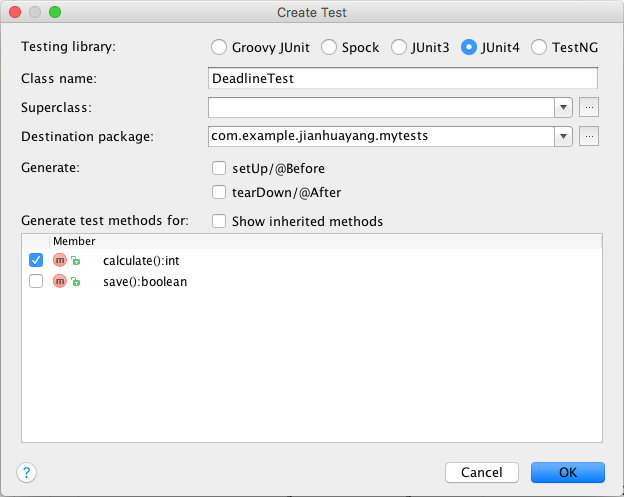
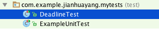
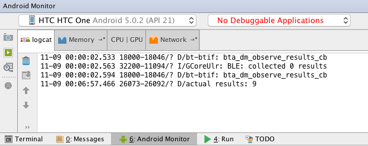

# Testing

When you create your apps, you need to make sure it works as expected. The ways we have used in the past to do this is to use `Log.d()` to produce some results. What we can also do is to use the [Assert](http://developer.android.com/reference/junit/framework/Assert.html) class. But to test properly, we need to write testing classes. 

<!--http://english.stackexchange.com/questions/174017/is-this-correct-let-me-know-once-you-finish-->
<!--https://books.google.com/ngrams/graph?content=once+you+finish%2Conce+you+have+finished%2Cwhen+you+finish%2Cwhen+you+have+finished&year_start=1940&year_end=2000&corpus=15&smoothing=3&share=&direct_url=t1%3B%2Conce%20you%20finish%3B%2Cc0%3B.t1%3B%2Conce%20you%20have%20finished%3B%2Cc0%3B.t1%3B%2Cwhen%20you%20finish%3B%2Cc0%3B.t1%3B%2Cwhen%20you%20have%20finished%3B%2Cc0-->

As a simple example, consider the following class (example taken from [JUnit introduction](https://github.com/junit-team/junit/wiki/Getting-started))

```java
public class Calculator {
  public int evaluate(String expression) {
    int sum = 0;
    for (String summand: expression.split("\\+"))
      sum += Integer.valueOf(summand);
    return sum;
  }
}
```

To check if it works properly or not we'll need to try it out. Put simply, we'll run the class with some string inputs such as `"1+2+3"` and see if the output is `6`. Put this in the context of JUnit testing, we have

```java
import static org.junit.Assert.assertEquals;
import org.junit.Test;

public class CalculatorTest {
  @Test
  public void evaluatesExpression() {
    Calculator calculator = new Calculator();
    int sum = calculator.evaluate("1+2+3");
    assertEquals(6, sum);
  }
}
```

Now this explains the idea of testing. Instead of JUnit, you can find other tools/packages available for Java. But JUnit is what we need for Android.

> The lastest version of JUnit is 4, but some online tutorials still use JUnit 3. A lot of syntax between the two versions are the same. But the differences are also huge. The most noticeable difference is the use of annotations in JUnit 4 such as `@Before` and `@after` in replacement of `setup()` and `tearDown()` in JUnit 3. Click to read a nice blog on [JUnit 4 annotations](http://javarevisited.blogspot.co.uk/2012/06/junit4-annotations-test-examples-and.html).

> Some tutorials use `@Before setup()` in the code. Once you see this you know straightaway it's JUnit 4. Here `setup()` is just a name, not an overriding method anymore.

## Lab 1 Unit testing

There're two types of testing in Android depending on whether an Android device (physical or AVD) is needed or not: 

1. Local unit tests run on a local JVM on your development machine, and doesn't require Android devices; 
2. The other type of testing is called instrumented testing, which requires an Android device, as will be discussed later. 

At runtime, local unit tests will be executed against a modified version of android.jar where all final modifiers have been stripped off. For more info on this, read [the official Android user guide on testing](https://developer.android.com/studio/test/index.html).
<!--http://tools.android.com/tech-docs/unit-testing-support-->

### Default app and default tests

Let's have a look at the default tests generated by Android Studio

1. Create a new project called 'My Tests' using all default options. 
2. In the Project tool window, click on app ==> java. You'll see there're three sub-folders (packages) and each has a auto-generated class
    
    
    
    As we know already, Gradle uses conventions to build the system. The convention here is this:
    * Your 'main' codes and resources are saved in a folder called 'app/src/main'.
    * Your local unit tests are saved in a folder called 'app/src/test'.
    * Your instrumentation tests are saved in a folder called 'app/src/androidTest'.
    
    
    
3. Double-click to open ExampleUnitTests.java, what you'll see is the following
    
    ```java
    import org.junit.Test;
    import static org.junit.Assert.*;
    
    public class ExampleUnitTest {
        @Test
        public void addition_isCorrect() throws Exception {
            assertEquals(4, 2 + 2);
        }
    }
    ```
    
    Note the use of JUnit classes. Also, here we used `import static` statement to import static members.
    
4. Right-click on ExampleUnitTest and select Run 'ExampleUnitTest'.
    
5. Now your Run tool window will look similar to this
    
    
    
    * The color of the status bar indicates whether the tests have passed successfully. Green for pass, red for fail.
    * The left-hand pane shows the tree view of all tests within the current run/debug configuration.
    * The toolbar provides controls that enable you to monitor the tests and analyze results. Notice the export icon (the one to the right of down-arrow), if you click it you'll be able to export the test results.
    
    
    
    > In some online tutorials, you'll see that they talk about HTML reports generated in build/reports folder. Forget about it, those have been deprecated!

Now you have just finished your first ever tests!

### The 'Deadline' app

To do some testing exercises, we'll need to create an app. Here we create an app that calculates time left until 300CEM assignment deadline (how exciting!). The idea of the app is that given the current date in the format of dd/mm/yy, the app should 

* Display how many days left until coursework submission once you click 'Update'.
    
    
    
* Save the current date to SharedPreferences once you click 'Save'.
* Send current date to new activity once you click 'Send'.

    

Follow steps below to create the app. This is a simple app and should be self-explanatory.

1. Open activity_main.xml, delete the auto-generated TextView and insert the following:
    
    ```xml
    <TextView
        android:id="@+id/textView"
        android:layout_width="wrap_content"
        android:layout_height="wrap_content"
        android:text="Hi, there!"
        android:textSize="24sp" />
    
    <TextView
        android:id="@+id/textView1"
        android:layout_width="wrap_content"
        android:layout_height="wrap_content"
        android:layout_alignLeft="@id/textView"
        android:layout_below="@id/textView"
        android:layout_marginLeft="19dp"
        android:layout_marginTop="56dp"
        android:text="Current date:"
        android:textAppearance="?android:attr/textAppearanceSmall" />
    
    <EditText
        android:id="@+id/editText"
        android:layout_width="wrap_content"
        android:layout_height="wrap_content"
        android:layout_alignBaseline="@id/textView1"
        android:layout_alignBottom="@id/textView1"
        android:layout_marginLeft="36dp"
        android:layout_marginRight="40dp"
        android:layout_toRightOf="@id/textView1"
        android:ems="10"
        android:hint="dd/mm/yy"
        android:inputType="date" />
    
    <Button
        android:id="@+id/buttonUpdate"
        android:layout_width="wrap_content"
        android:layout_height="wrap_content"
        android:layout_alignParentLeft="true"
        android:layout_below="@+id/editText"
        android:layout_marginLeft="20dp"
        android:layout_marginTop="22dp"
        android:onClick="onUpdateClick"
        android:text="Update" />
    
    <Button
        android:id="@+id/buttonSave"
        android:layout_width="wrap_content"
        android:layout_height="wrap_content"
        android:layout_alignBottom="@+id/buttonUpdate"
        android:layout_centerHorizontal="true"
        android:layout_marginLeft="20dp"
        android:layout_toRightOf="@+id/buttonUpdate"
        android:onClick="onSaveClick"
        android:text="Save" />
    
    <Button
        android:id="@+id/buttonSend"
        android:layout_width="wrap_content"
        android:layout_height="wrap_content"
        android:layout_alignBottom="@id/buttonUpdate"
        android:layout_centerHorizontal="true"
        android:layout_marginLeft="20dp"
        android:layout_toRightOf="@id/buttonSave"
        android:onClick="onSendClick"
        android:text="Send" />
    ```
    
2. Create a new Deadline class, and insert the following into Deadline.java
    
    ```java
    private Date date;
    private Context context;
    private static DateFormat dateFormat = new SimpleDateFormat("dd/MM/yy");
    private static final String DATE_KEY = "dateKey";
    
    public Deadline(String date, Context context) {
        try {
            this.date = dateFormat.parse(date);
        } catch (ParseException e) {
            e.printStackTrace();
        }
        this.context = context;
    }
    
    public Deadline(String date) {
        try {
            this.date = dateFormat.parse(date);
        } catch (ParseException e) {
            e.printStackTrace();
        }
    }
    
    public int calculate() {
        Date submission;
        try {
            submission = dateFormat.parse("18/12/15");
            return (int) ((submission.getTime() - date.getTime() )/ (1000 * 60 * 60 * 24));
        } catch (ParseException e) {
            e.printStackTrace();
            return -1;
        }
    }
    
    public boolean save() {
        SharedPreferences sharedPreferences = ((Activity)context).getPreferences(Context.MODE_PRIVATE);
        SharedPreferences.Editor editor = sharedPreferences.edit();
        editor.putString(DATE_KEY, dateFormat.format(date));
        return editor.commit();
    }
    ```
    
    This class has two methods. The `calculate()` method calculates the time difference in days between the input and the submission deadline which is 13/12/16. The `save()` method save the date data in a SharedPreferences xml file.
    
3. Open MainActivity.java, insert the following into the class:
    
    ```java
    private TextView textView;
    private EditText editText;
    private Deadline deadline;
    public static final String DAYS_KEY = "DAYS_KEY";
    
    public void onUpdateClick(View v){
        deadline = new Deadline(editText.getText().toString(), this);
        textView.setText(deadline.calculate() + " days to 300CEM deadline!");
    }
    
    public void onSaveClick(View v){
        deadline = new Deadline(editText.getText().toString(), this);
        deadline.save();
    }
    
    public void onSendClick(View v){
        deadline = new Deadline(editText.getText().toString(), this);
        Intent intent = new Intent(this, DisplayActivity.class);
        intent.putExtra(DAYS_KEY, deadline.calculate());
        startActivity(intent);
    }
    ```
    
    Insert the following into `onCreate()` method:
    
    ```java
    editText = (EditText) findViewById(R.id.editText);
    textView = (TextView) findViewById(R.id.textView);
    ```
    
4. Create a new empty Activity called DisplayActivity. Insert the following into the RelativeLayout in activity_display.xml
    
    ```xml
    <TextView
        android:id="@+id/textView"
        android:layout_width="match_parent"
        android:layout_height="wrap_content"
        android:textSize="50sp"
        android:text="placeholder"/>
    ```
    
5. Open DisplayActivity.java, insert the following code into the `onCreate()` method, just below `setContentView()`
    
    ```java
    TextView textView = (TextView) findViewById(R.id.textView);
    Intent intent = getIntent();
    int daysLeft = intent.getIntExtra(MainActivity.DAYS_KEY, 0);
    textView.setText(Integer.toString(daysLeft + 18) + " days until 2017!" );
    ```

### Local unit tests

The critical part of the app above is the capability to calculate time differences. Now let's design a test for this.

1. Open Deadline.java, navigate your cursor to be within the class body, right-click and select Go To ==> Test.
    
    
    
2. In the window that pops up, select Create New Test. Then in the Create Test window check the 'calculate()' checkbox, click OK.
    
    
    
3. Choose the 'test' folder in the Direcotry Structure tab, and click OK. You just created a testing class for Deadline, and this new class appears in the test package.
    
    
    
4. Insert the following into `calculate()`
    
    ```java
    Deadline deadline = new Deadline("12/12/16");
    assertEquals(deadline.calculate(), 1);
    ```
    
    Now your DeadlineTest class looks like the following:
    
    ```java
    public class DeadlineTest {
        @Test
        public void calculate() throws Exception {
            Deadline deadline = new Deadline("12/12/16");
            assertEquals(deadline.calculate(), 1);
        }
    }
    ```
    
    The test itself is a public class. Here we use an annotation to mark the actual test we want to run, which is a member method in that class. We then simply declare a new instance of the class that we know the calculation result.
    
5. If you right-click on the DeadlineTest in Project tool window and choose Run 'DeadlineTest', you'll see something similar to below:
    
    
    
    The test runs at local JVM and finishes without any error. If you change assertion to `assertEquals(deadline.calculate(), 2)` and run it, what happens?

### Local mocked unit tests

The test we did above used the Deadline constructor that doesn't require the Context input parameter. This is because Context is Android dependant we cannot run a test on local JVMs. The way to get around this, i.e. to test Android SDK dependant code, is to use a mocking framework called Mockito.

1. Open build.gradle (Module: app), insert Mockito and Hamcrest dependencies into the dependencies configuration block (after line `testCompile 'junit:junit:4.12'`)
    
    ```xml
    testCompile 'org.mockito:mockito-core:1.10.19'
    testCompile 'org.hamcrest:hamcrest-library:1.3'
    ```
    
    Mockito is a mocking framework, and Hamcrest is a package to make testing more readable. You'll see both later. Click 'Sync Now' after making changes.
    
2. Modify your DeadlineTest.java so it looks like the following (If you type the code you'll probably understand more than if you simply copy/paste)
    
    ```java
    @SmallTest
    @RunWith(MockitoJUnitRunner.class)
    public class DeadlineTest {
    
        @Mock
        Context context;
        
        @Mock
        Activity activity;
        
        @Mock
        SharedPreferences sharedPreferences;
        
        @Mock
        SharedPreferences.Editor editor;
        
        private Deadline deadline;
        
        @Test
        public void testCalculate() throws Exception {
            Deadline deadline = new Deadline("17/12/15");
            assertEquals(deadline.calculate(), 1);

        }

        @Test
        public void testCalculate2() throws Exception {
            Deadline deadline = new Deadline("16/12/15", context);
            assertThat("check if time interval is calculated properly", deadline.calculate(), is(equalTo(2)));

        }

        @Before
        public void initTests() {
            deadline = new Deadline("15/12/15", activity);
        }

        @Test
        public void testSave() throws Exception {

            when(activity.getPreferences(Context.MODE_PRIVATE)).thenReturn(sharedPreferences);
            when(sharedPreferences.edit()).thenReturn(editor);
            when(editor.commit()).thenReturn(true);
            assertThat(deadline.save(), is(true));
        }
    }
    ```
    
    There're quite a lot going on here:
    * `@SmallTest` is a way to classify different tests, as you might have guessed, so later on we can ask the system to run for example SmallTests only. Check out [here](http://developer.android.com/tools/testing/testing_otheride.html) for an example. Also this [StackOverflow page](http://stackoverflow.com/questions/4671923/what-is-the-purpose-of-smalltest-mediumtest-and-largetest-annotations-in-an) for the differences among SmallTest, MediumTest and LargeTest. Texts below are quoted directly from [Google](http://developer.android.com/training/activity-testing/activity-ui-testing.html):
    
        > Typically, a short running test that take only a few milliseconds should be marked as a @SmallTest. Longer running tests (100 milliseconds or more) are usually marked as @MediumTests or @LargeTests, depending on whether the test accesses resources on the local system only or remote resources over a network. 
    * `@RunWith` line specifies the Runner of the current testing class. A Runner is merely another class that is designed to perform some specific functions. In the current case, MockitoJUnitRunner will mock our dependencies in Android system. An example Runner is something like below (example taken from [TutorialsPoint](http://www.tutorialspoint.com/junit/junit_suite_test.htm))
    ```
    import org.junit.runner.JUnitCore;
    import org.junit.runner.Result;
    import org.junit.runner.notification.Failure;
    
    public class TestRunner {
        public static void main(String[] args) {
           Result result = JUnitCore.runClasses(JunitTestSuite.class);
           for (Failure failure : result.getFailures()) {
              System.out.println(failure.toString());
           }
           System.out.println(result.wasSuccessful());
        }
    }
    ```
    * `@Mock` line indicates a variable is being mocked. When being mocked, all methods of the class throw exceptions. This is because the android.jar file that is used to run unit tests does not contain any actual code. For more details on this, read [here](http://tools.android.com/tech-docs/unit-testing-support)
    * `@Before` line indicates the code block will be invoked before each test. You should use this annotation to specify a block of code with test setup operations.
    * In `testSave()` method we used `when().thenReturn()` to mock the behavior of mocked classes. This is because context/activity etc. are all mocked objects, which don't contain any actual methods. You'll need to supply some results once there methods are called.
    * Note in line `assertThat("check if time interval is calculated properly", deadline.calculate(), is(equalTo(2)))` we used `assertThat`, `is` and `equalTo` from Hamcrest to increase readability. But this is essentially the same as `assertEquals(deadline.calculate(), 2)`. Here `is` and `equalTo` are both matchers.
    
3. Right-click and run DeadlineTest, then export the results to HTML. Locate and open that HTML file, you'll see something similar to below:
    
    

## Lab 2 Instrumented testing

Tests we've done so far run on local JVM and don't require Android devices. If you need to access Android system resources such as Context you need to test your app on an actual device or an AVD. Android instrumentation is a set of control methods or 'hooks' in the Android system. With Android instrumentation, you can invoke for example activity callback methods in your test code. This gives you fine-control of everything. For more details on instrumentation, click [here](http://developer.android.com/tools/testing/testing_android.html#Instrumentation).

### Instrumented unit tests

Follow steps below to create an instrumented unit test:

1. Open build.gradle (Module: app), insert following androidTest dependencies so it becomes
    
    ```xml
    dependencies {
        compile fileTree(dir: 'libs', include: ['*.jar'])
        compile 'com.android.support:appcompat-v7:23.1.0'
        compile 'com.android.support:design:23.1.0'

        testCompile 'junit:junit:4.12'
        testCompile 'org.mockito:mockito-core:1.10.19'
        testCompile 'org.hamcrest:hamcrest-library:1.3'

        androidTestCompile 'com.android.support:support-annotations:23.1.0'
        androidTestCompile 'com.android.support.test:runner:0.4'
        androidTestCompile 'org.hamcrest:hamcrest-library:1.3'
        androidTestCompile 'com.android.support.test:rules:0.4'
        androidTestCompile 'com.android.support.test.espresso:espresso-core:2.2.1'
    }
    ```
    
2. Insert the following line into the defaultConfig block
    
    ```xml
    testInstrumentationRunner "android.support.test.runner.AndroidJUnitRunner"
    ```
    
    Note here some online tutorials use InstrumentationTestRunner, which is going to deprecate in the future. Click 'Sync Now' after making changes.
    
3. Make sure Test Artifact is Android Instrumentation Tests in the Build Variants tool window. Right-click on the androidTest package and create a new class called InstrumentedDeadlineTest
    
    
    
4. Open InstrumentedDeadlineTest.java, replace the class body with the following
    
    ```java
    @RunWith(AndroidJUnit4.class)
    @SmallTest
    public class InstrumentedDeadlineTest {
    
        private Deadline deadline;
        
        @Before
        public void initTests(){
            Context context = InstrumentationRegistry.getInstrumentation().getTargetContext();
            deadline = new Deadline("09/12/15", context);
            
        }
        
        @Test
        public void testCalculate(){
            Log.d("actual results", Integer.toString(deadline.calculate()));
            assertThat(deadline.calculate(), is(equalTo(9)));
            
        }
        
    }
    ```
    
    As you can see we don't need to mock anything anymore. We could use some system resources such as `InstrumentationRegistry` and `Log`. But remember this is still a unit test, which means we didn't start the actual app and we don't have access to things like activity methods such as `findViewById()`.
    
5. If you right-click the class and run, you'll see that all tests are passed. In addition, in the logcat tool window you'll see the actual log message. 
    
    
    
    You've probably noticed that instrumented tests run slower than local JUnit tests that run on JVM. This is one of the advantages of local unit tests.

### UI testing using Espresso

The Espresso testing framework, provided by the Android Testing Support Library, provides APIs for writing UI tests to simulate user interactions within a single target app. One advantage of Espresso is that it detects when the main thread is idle, so it is able to run your test commands at the appropriate time, improving the reliability of your tests. 

> If you follow along the official tutorial on [Testing Your Android Activity](http://developer.android.com/training/activity-testing/index.html), you'll see they use ActivityInstrumentationTestCase2 heavily. But you should be aware that with the help of tools such as Espresso, developer rarely has to use the instrumentation API directly. For more info on this, click [here](http://www.vogella.com/tutorials/AndroidTesting/article.html). Also, ActivityInstrumentationTestCase2 will become deprecated so you need to define a `@Rule`. For more info on this, click [here](http://wiebe-elsinga.com/blog/whats-new-in-android-testing/).

Follow steps below to create a UI test:

1. Create a new class in an androidTest package called EspressoTest.
2. Replace the class body in EspressoTest.java with the following:
    
    ```java
    @RunWith(AndroidJUnit4.class)
    @SmallTest
    public class EspressoTest {
    
        @Rule
        public ActivityTestRule<MainActivity> activityTestRule = new ActivityTestRule<>(
                MainActivity.class);
                
        @Test
        public void changeText_sameActivity() {
            onView(withId(R.id.editText)).perform(typeText("17/12/15"), closeSoftKeyboard());
            onView(withId(R.id.buttonUpdate)).perform(click());
            onView(withId(R.id.textView)).check(matches(withText("1 days to 387COM deadline!")));
        }
        
        @Test
        public void changeText_newActivity() {
            onView(withId(R.id.editText)).perform(typeText("17/12/15"), closeSoftKeyboard());
            onView(withId(R.id.buttonSend)).perform(click());
            onView(withId(R.id.textView)).check(matches(withText("14 days until 2016!")));
        }
    }
    ```
    
    `@Rule` defines a customized set of actions to take. `@Rule` is similar to `@Before` but more powerful. In our case, ActivityTestRule enables the start of MainActivity class. This essentially starts the app when you run the test class. 
    
    Typical uses of espresso is `onView(withId(R.id.my_view)).perform(click()).check(matches(isDisplayed()))`. Here in `changeText_sameActivity()` we perform text inputs and check calculation results; in `changeText_newActivity()` we check if data is passed between activities and displayed correctly.
    
3. If you run this test class you'll see that your device briefly shows up the app as if someone is using it. When the test finishes it'll reverse to the previous state.

## Lab 3 Advanced topics

As you can tell already, Android testing is not well documented, and sometimes contain conflicted info. Here I list some important resources for you to read. These are (probably) most up-to-date info online.

### What to test
Google lists the following for your to consider regarding testing, more info can be found here](http://developer.android.com/tools/testing/what_to_test.html):

* Change in orientation
* Change in configuration
* Battery life
* Dependence on external resources

### Official resources for Android Testing

* [Best practices for testing](http://developer.android.com/training/testing.html)
* [Android workflow testing](http://developer.android.com/tools/testing/index.html)
* [Android testing tools](http://developer.android.com/tools/testing/testing-tools.html)
* The testing section in [Gradle Plugin User Guide](http://tools.android.com/tech-docs/new-build-system/user-guide#TOC-Testing)
* Android Studio [unit testing support](http://tools.android.com/tech-docs/unit-testing-support)
* Android testing samples on [GitHub](https://github.com/googlesamples/android-testing)

### IntelliJ resources for Android Testing

* [Testing](https://www.jetbrains.com/idea/help/testing.html)
* [Testing Android Applications](https://www.jetbrains.com/idea/help/testing-android-applications.html)
* [Test Runner Tab](https://www.jetbrains.com/idea/help/test-runner-tab.html)


