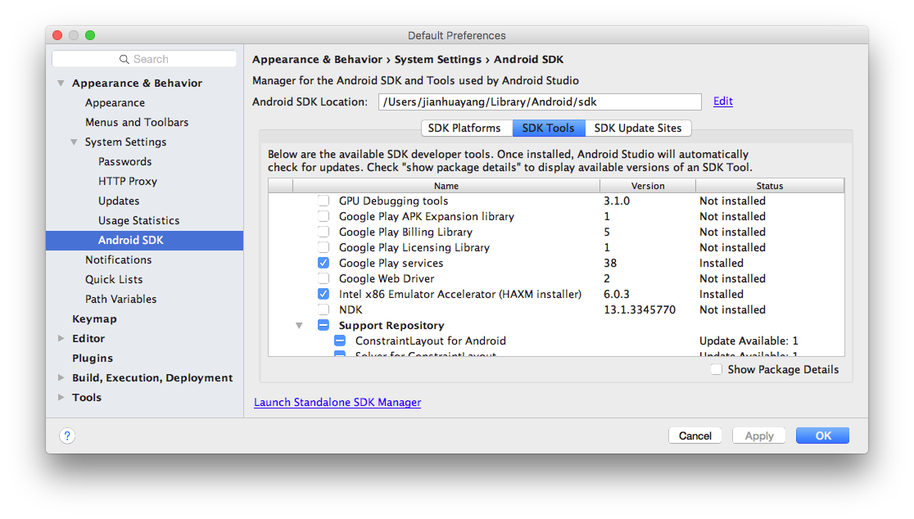
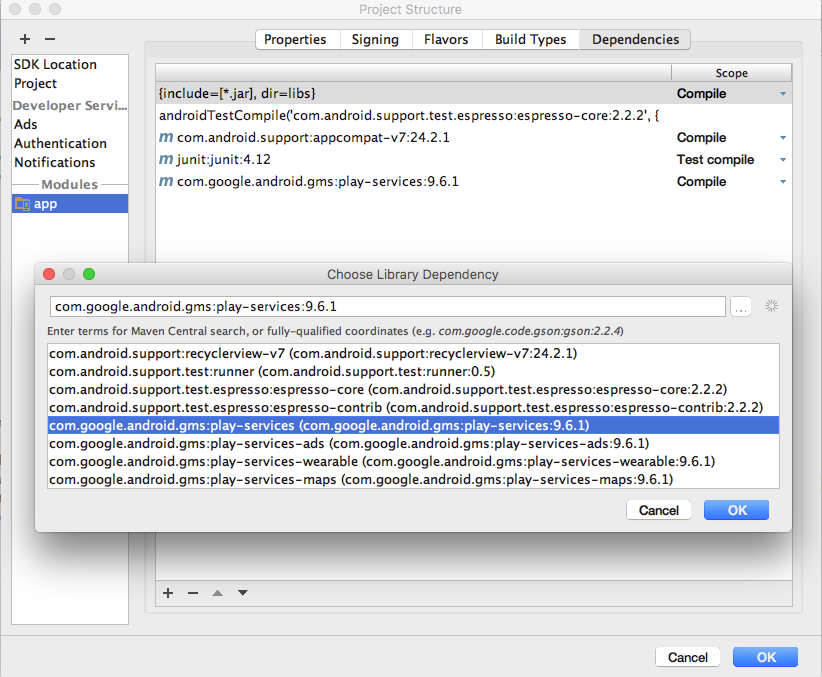
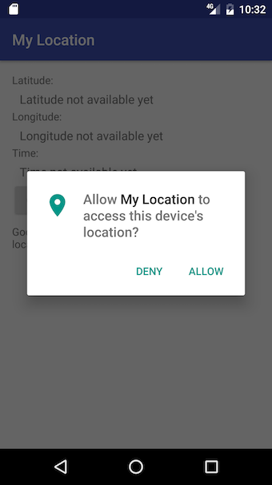

# Location Services and Google Maps

Most, if not all, Android devices have built-in sensors such as motion sensors to detect screen orientation and position sensors to detect your current position. [Read the official API guide for an overview of sensors available on the Android platform](https://developer.android.com/guide/topics/sensors/sensors_overview.html). Among many sensors that are available, the most widely used one is the location sensor.

## Lab 1 Location Services

There are different ways of determining an Android device's location. Two widely used APIs are the built-in Android location (android.location) and the Google Play services. The Google Play services location APIs, which are part of Google Play Services, are preferred over the Android framework location APIs (android.location) as it offers simpler interface and better battery usage.

In the following exercise, we’ll use the Google Play services location APIs to create an app that is capable of determining a device's location. In addition, the app can interprete the device's location in terms of latitue/longitude and turn it into a meaningful address.

### The app

Follow steps below to download the sample app from module's GitHub page and run it on your own machine.

1. Make sure Google play service is available on your system. In Android Studio, click Tools ==> Android ==> SDK Manager, this will bring up the Preference tool window Android SDK settings page. Make sure that Google Play services are installed.
    
    
    
2. Install the app. Download sample project called MyLocation from module's GitHub page, and open it in Android Studio. Click Build ==> Rebuild Project. In case that the system complains about Google Play services version required is different from what is installed, you'll need to delete existing dependency and replace it with the one you have.
    
    
    
3. Get the permission. Run the app on an AVD (not real device, as you'll need to mock locations later), the first screen you'll see is something like below. These are really place holders.
    
    
    
    Now if you click On/Off button, it'll ask your permissons to access device location. Click Allow.
    
    
    
4. Simulate location change in AVD. In the Extended controls window for AVD, in the Location tab, insert the following location for latitude and longtitude respectively, 52.191064 and -1.707510, and click Send.
    
    
    
5. Determine current location and display Address. If you click the Locate button in the app you'll see that the above latitude/longitude corresponds to an address in Stratford (Shakespeare birthplace). If you then decide to mock a new location and send to the AVD, the app should pick this new location automatically for you.
    
    

### Source code

In following sections, some important concepts used in the demo app are explained. More importantly, the sample project are well documented. You should study the source code carefully and read comments. You should also try and change some source code to explore and see what different functions the altered software offers.

** Get the permission **

The app needs to access the device's location. There're two parts to get this done:

1. First of all, declare 'uses-permission' in manifest file, contained witin the `manifest` tag
    
    ```xml
    <uses-permission android:name="android.permission.ACCESS_FINE_LOCATION"/>
    ```
    
2. In MainActivity.java, check if permission is granted or not. If not, request that permission. You'll only need to do this once.
    
    ```java
   if (ContextCompat.checkSelfPermission(this, Manifest.permission.ACCESS_FINE_LOCATION) !=
           PackageManager.PERMISSION_GRANTED) {
       ActivityCompat.requestPermissions(this, new String[]{android.Manifest.permission.ACCESS_COARSE_LOCATION},
               REQUEST_LOCATION);
   }
    ```
    
    How Android system handles permission has changed. The old way is to require all permissions upon installation. And the new way is to require individual permissons on first use.

** Get last known location **

The app builds the GoogleApiClient to begin with. Once it is built, the client connects to Google Play services in the background. If it connects successfuly, getting the last known location is just a single line of code

```java
mLastLocation = LocationServices.FusedLocationApi.getLastLocation(mGoogleApiClient);
```

Note here even though at the very beginning of this document we mentioned that the Google Play services location APIs are preferred over the Android framework location APIs, `getLastLocation()` function will infact return an `android.location.Location` object.

** Receive location updates **

To receive location updates, i.e. get notified each time the device has a new location, use the following code

```java
LocationServices.FusedLocationApi.requestLocationUpdates(mGoogleApiClient, mLocationRequest, this);
```

In the above code, `this` pass the current opbject as the listener by implementing the `onLocationChanged()` method.

```java
 @Override
    public void onLocationChanged(Location location) {
    //actual code
    }
```

** Turn geographic location into addresses **

To convert geographic location into address, or the opposite, you'll need the Geocoder class from android.location.

```java
List<Address> addresses = mGeocoder.getFromLocation(mLastLocation.getLatitude(), mLastLocation.getLongitude(), 1);
```

In fact, the three classes we need from android.location are Address, Geocoder and Location.

## Lab 2 Google Maps

The first app allows you to manipulate devices' location without touching the Google Map. However, it'll be much nicer to see how the app interacts with the user on a real map. Before diving into module demo code, take a look at the [Getting Started on Google Maps Android API](https://developers.google.com/maps/documentation/android-api/start). 


In the above tutorial 'Step 4. Get a Google Maps API key', when you go to Google developer console to create new project, the default project name is also 'My Project'. If that name annoys you, it can be changed through Google Cloud Platform page, on the righ-hand-side under Project settings.


### The app

Download our demo project MyLocation2 and run it.

### Source code

** asdf **


### Setting up Google Play Services


### Getting last known location


## Lab 3 Advanced topics

### Official training on Making Your App Location-Aware

The MyLocation project roughly follows the Android official guide [Making Your App Location-Aware](https://developer.android.com/training/location/index.html). The complete source code for that project, called Basic Location Sample, is on [GitHub](https://github.com/googlesamples/android-play-location/tree/master/BasicLocationSample) too. However, that project is not quite up-to-date in a sense that how apps obtain permissions has changed. To get up-to-date on how the latest permission system works, take a look at the following:

* [Google Play Services and Runtime Permissions](https://developers.google.com/android/guides/permissions)
* [Android Guide Requesting Permissions at Run Time](https://developer.android.com/training/permissions/requesting.html)

### Project names


