# Location Services and Google Maps

Most Android devices have built-in sensors such as motion sensors to detect screen orientation and position sensors to detect your current position. In fact, sensors are one of the criteria in the marking rubrics. Click [here](http://developer.android.com/guide/topics/sensors/sensors_overview.html) for an overview of sensors available in Android.

## Lab 1 Location Services

There are several different ways of finding a location using Android device. In the first example, we’ll use the android.location package and built-in GPS sensors, as that is something we can emulate using an AVD with minimum configuration. For those of you who own an actual Android device, you can try to use your device instead of ADV. But you should be aware that the recommended way is to use the Google Location Services API, which is part of Google Play Services.

### Determine current location

Start a new Android project, and name it My Location. In activity_main.xml, delete the android:text attribute and give the TextView an ID of textView1. Your xml file should look like below:

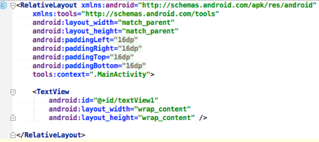

Now, go to MainActivity.java. You need the following member variables, which are defined just after the declaration of the class:

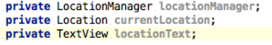

Here, LocationManager is new. This is a class that provides system-wide location services. In order to get this service, you need to call the getSystemService method:

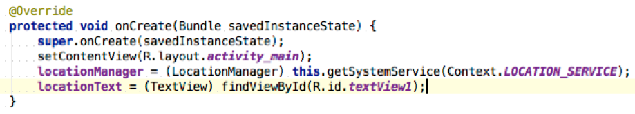

Next, we have our utility function and listener defined.  The first function is to update the TextView once we have some location data. This is easy to understand.

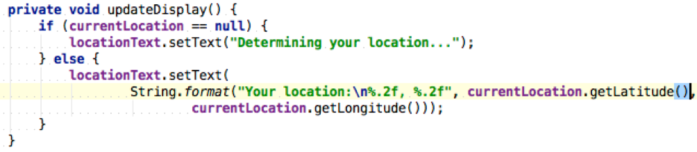

The second one is to define a location listener, which is very similar to the onclick listener. As you type along, you’ll notice that Android Studio keeps giving your errors saying that you need to implement certain abstract methods. And once you implemented all those required abstract methods, the error message will go away.

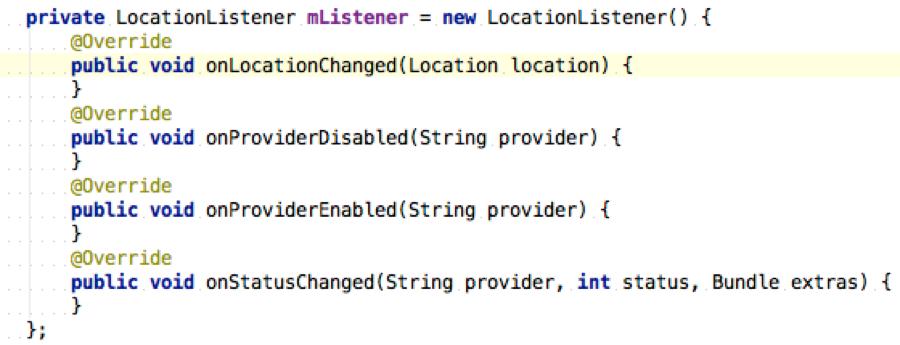

You probably noticed here we defined another member variable mListener, and this listener is being 'attached' or 'removed' depending on the app status, as you’ll see later. If you look at the [online documentation](http://developer.android.com/reference/android/location/LocationListener.html), you’ll see what abstract methods are being defined there. That is why we need to implement them all.

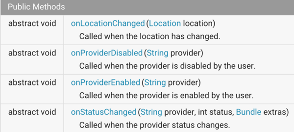

The actual code that goes into the onLocationChanged method is relatively easy:

Next, we need to override onResume and onPause methods, as follows

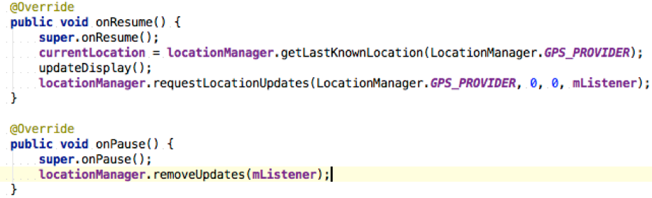

These two methods make sure that we get the location before our activity goes online, and we stop updating before it goes offline. requestionLocationUpdates takes 4 parameters, as follows:

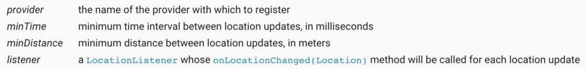

Now, you need to give permission in Manifest so the app can access GPS data 

If you run this app, you should have something similar to the one below. But the app doesn’t detect location change – that’s what we’re going to do next.

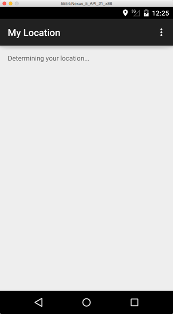

### Simulating location change

The problem we have now is that the AVD is on an actual computer, and we cannot carry it around to have location change. To simulate location change, we need to do the following:

1.    In Android Studio, open ToolsAndroidAndroid Device Monitor
2.    Click the Emulator Control tab
3.    Scroll down to the Location Controls part, and give some locations using the longitude and latitude coordinate, for example, the Coventry University location.

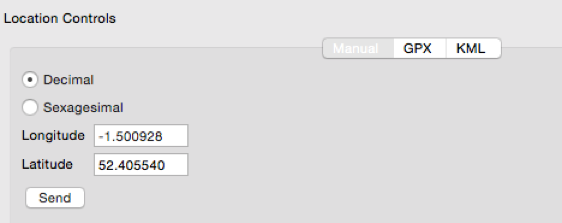

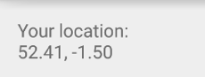

Once you click Send, the location info will be displayed on your AVD screen.

## Lab 2 Google Maps

### Setting up Google Play Services

Configuring to use Google Play Services on Android is a bit difficult compared to iOS. However, once it’s configured, it’s pretty easy to use. To get things ready, simply follow the following steps:

1.    Open Android SDK Manager, install Google Play service under the Extras group
    
    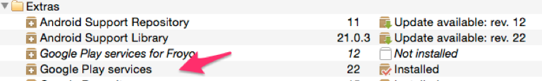
    
2. Install Google APIs and relevant system images for your Android SDK. In my case, I installed both 32 and 64-bit images
    
    
    
3. Open Android Virtual Device Manager, create a new AVD that targets at Google APIs, 
    
    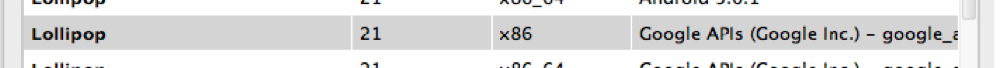
    
4. Go to where you saved your Android SDK, then go to extras ==> google ==> google_play_services ==> libproject ==> google_play-services_lib ==> res ==> values ==> version.xml, open that file you’ll see the version number. It should be like this:
    
    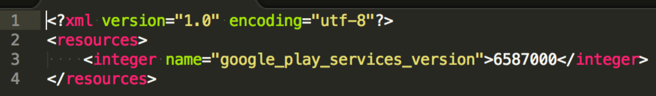
    
5. Take a note of the above number, open your module’s gradle file (that is build.gradle (Module: app)), and insert the following line into dependencies section so it becomes
    
    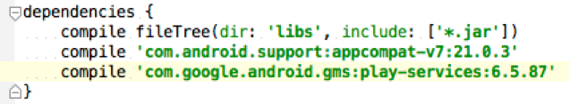
    
    If your version number is not 6587, you’ll need to adjust accordingly. Save the file and click the Sync Project with Gradle Files button.
    
    > If you have problems following instructions above, try to do the following, taken from [here](http://stackoverflow.com/questions/16624827/android-studio-with-google-play-services):
    
    * Go to File -> Project Structure
    * Select 'Project Settings'
    * Select 'Dependencies' Tab
    * Click '+' and select '1.Library Dependencies'
    * Search for : com.google.android.gms:play-services
    * Select the latest version and click 'OK'
    
6. Add the following line as a child of the application element in your manifest file
    
    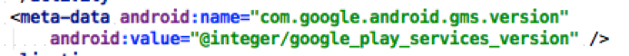
    
### Getting last known location

**Preparation**

Now we’re ready to get the location from Google Play Services. Copy and paste your MainAcitivity.java file in the same directory, and give it a name, for example, MainAcitivity_BACKUP.java. This is to produce a backup copy in case we need to reverse back. In MainAcitivity.java comment out lines that concerns locationManager or mListener. In fact, if you comment out the locationManager declaration and then the system will highlight those lines you need to comment out, as it doesn’t recognize that variable anymore.

**Get the location**

Next, change the class signature to implement GoogleApiClient.ConnectionCallbacks, and insert a new variable called mGoogleApiClient together with other variable declarations:

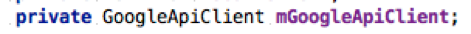

Insert the following lines of code into the class:

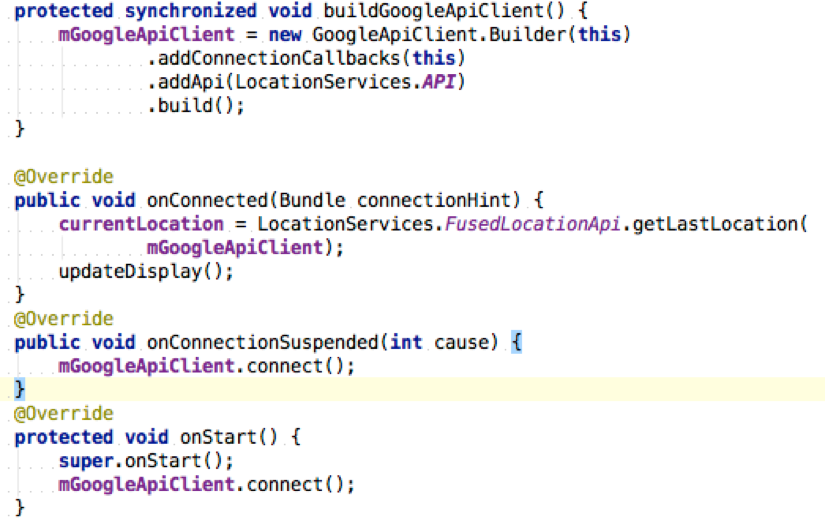

What we did here is that we create the API client and implement the onConnection interface. Detailed requirements of the interface can be seen [here](https://developer.android.com/reference/com/google/android/gms/common/api/GoogleApiClient.ConnectionCallbacks.html).

Basically we need to implement two abstract methods:

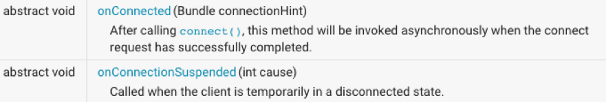

In addition, we call the `connect()` method in onStart callback. This ensures the API client starts connecting before the app appears.

Next, insert the following line into the onCreate method. This concludes the code-editing part.

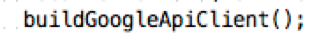

**Run the app**

Start the AVD you created targeting at Google APIs. Following instructions in the previous step to set locations of your AVD, in order to get lastKnownLocation. This can be verified when you open Google Map and see that you’re at the University.

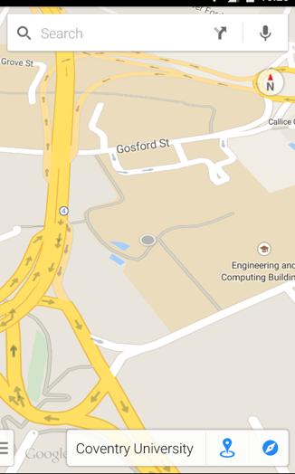

Next, if you run the app you’ll see the location info displayed the same as what you had used android.location package. But now this is done using Google Play Services. If you have a slow connection, try to press the home button and then tap your app to resume. It can take several minutes to get the connection. 

Now what we did for the Google Play Services is part of the online documentation at [here](http://developer.android.com/training/location/retrieve-current.html), the complete code examples are at [here](https://github.com/googlesamples/android-play-location/tree/master/BasicLocationSample). You can download the project and import into Android Studio to have a play around.

